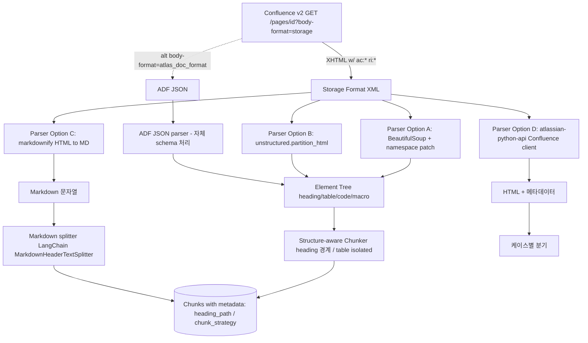
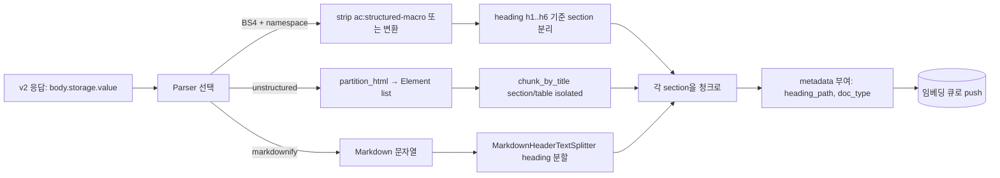

# Confluence Storage Format Parser

## 핵심 요약

Confluence Cloud REST API v2의 `body-format=storage` 응답은 **XHTML 변형 + Atlassian 전용 namespace(`ac:*`, `ri:*`)** 가 혼재한 XML이다. RAG 인덱싱 파이프라인은 본 형식에서 heading·section·table·code block 경계를 추출해 청크 분리에 사용해야 한다. 표준 HTML 파서는 `ac:structured-macro` 같은 namespace 태그에서 실패 또는 무시되므로 다음 4 후보 중 선택이 필요: BeautifulSoup direct(+ namespace 패치), unstructured 라이브러리, markdownify(HTML→MD 변환), atlassian-python-api(고수준 client). 대체 입력 경로로 `body-format=atlas_doc_format`(ADF, JSON) 사용 시 namespace 문제는 사라지나 별도 schema 처리 필요.

- **Storage format의 본질**: XML이되 XHTML "기반". `<ac:structured-macro ac:name="..."/>`, `<ri:user/>`, `<ac:layout/>` 등 Atlassian 전용 태그가 표준 HTML 안에 섞여 있음
- **표준 파서의 한계**: BeautifulSoup `lxml`/`xml`/`html.parser`는 namespace prefix(`ac:`, `ri:`) tag·attribute에서 누락/오류. 별도 패치(`beautifulsoup-for-confluence`) 또는 직접 namespace 등록 필요
- **structure-aware 청킹의 핵심 단위**: `<h1>~<h6>` heading, `<table>`, `<pre><code>`, `<ac:structured-macro ac:name="code">` (코드 macro), `<ac:layout-section>` (다단 레이아웃)
- **ADF 대안 (`atlas_doc_format`)**: JSON 트리. namespace 문제 없음. 단 schema(Atlassian Document Format)별도 학습 + Confluence 일부 macro는 ADF에서 표현이 storage format과 다를 수 있음

## 시스템 아키텍처

파이프라인은 v2 API에서 storage 또는 ADF 응답을 받아 파서를 거쳐 element tree로 변환, 이후 청킹 전략(structure-aware)에 따라 청크 경계 분리.

## 처리 흐름

대표적인 structure-aware 청킹 파이프라인. heading 계층과 표/코드 블록 경계를 보존하면서 각 청크에 `heading_path` metadata를 부여한다.

## 핵심 기능 및 서비스

| 기능 | 설명 |
|---|---|
| Namespace 태그 처리 | `ac:*`/`ri:*` 인식 — 옵션별 지원 폭 다름 |
| Heading 추출 | `<h1>~<h6>` 기반 section 분리 — RAG retrieval 정확도 직결 |
| Table 보존 | 표 행/열 구조 유지 vs 평탄화. 청크 안에서 표 형식 보존이 응답 품질에 영향 |
| Code block 보존 | `<pre><code>` 또는 `<ac:structured-macro ac:name="code">` 식별·격리 |
| Macro 처리 정책 | `info`/`warning`/`expand` 등 macro 본문을 청크에 포함 vs 제거 |
| 첨부·이미지 처리 | `<ri:attachment/>` 식별, 다운로드 URL 생성, 청크 metadata에 URL 보관 |
| ADF 대안 경로 | JSON tree로 namespace 문제 회피. schema 학습 비용 trade-off |
| heading_path metadata | 청크에 "정책 > 보안 > 접근 권한" 같은 경로 부여 — filterable metadata로 활용 |

## 유사 기술 비교

| 항목 | BeautifulSoup + namespace 패치 | unstructured (`partition_html` + `chunk_by_title`) | markdownify + Markdown splitter | atlassian-python-api |
|---|---|---|---|---|
| 특징 | 저수준 직접 제어. namespace 처리 수동 | 매니지드 HTML element 인식 + 청킹 일체화 | HTML→MD 변환 후 표준 MD 도구 활용 | Confluence 고수준 client (fetch+조회 중심) |
| Confluence macro 처리 | `beautifulsoup-for-confluence` 패치로 ac:* 인식 가능. 매크로별 정책 직접 구현 | 매크로별 인식은 일반 HTML element로 처리, 일부 위험 (예: `ac:structured-macro` 본문 누락 가능) | 변환 단계에서 macro 본문 손실 위험. 변환 전 BS4로 macro 전처리 필요 | 파싱·청킹은 본 라이브러리 영역 아님. fetch 도구로 활용 |
| Heading 보존 | 수동 (`soup.find_all(['h1',...,'h6'])`) | 자동 (`chunk_by_title` section 경계 보존) | ATX heading 변환 → MD splitter heading 인식 | N/A |
| Table 보존 | 수동 | 자동 — table은 isolated 청크 | 변환 가능 (heading_style·표 header 옵션). 복잡 표는 손실 위험 | N/A |
| 운영 부담 | 높음 — 모든 매크로·구조 직접 처리 | 중간 — 라이브러리 추가 의존 + chunking 정책 학습 | 낮음 — 변환 후 표준 MD 도구. 단 손실 위험 수동 검증 필요 | 낮음 (fetch 한정) |
| 적합 케이스 | macro별 세밀 제어, sanitize·redact 요구 | structure-aware 청킹 일체형 RAG MVP | Markdown 친화 다운스트림 (LLM·MD viewer) | Confluence fetch만 — 파싱은 별도 도구 |

## 실제 사례

### Badal.io blog — "Chat with your Confluence"
Confluence-RAG 통합 가이드에서 `unstructured` 라이브러리의 Confluence loader + `partition_html` + `chunk_by_title`로 wiki 페이지를 RAG에 적재한 사례. heading section 기준 자동 분리 + 표 isolated 처리로 retrieval 품질 향상을 보임. structure-aware 청킹의 사실상 reference implementation.

### Unstructured 공식 — Web Scraping for LLMs by Document Elements
공식 블로그에서 HTML 콘텐츠를 element 단위로 분해 → element type별(heading / paragraph / table) 청킹 정책을 분기하는 패턴 공개. Confluence storage format도 동일 패턴 적용 가능 — Confluence 전용 namespace 태그는 `partition_html`이 일반 element로 처리(macro 본문 손실 가능성은 별도 검증).

## 활용 시나리오

### 시나리오 1: MVP — 단순 BS4 + 수동 heading 분리

빠른 끝-끝 검증이 우선이라면, BeautifulSoup `html.parser` + namespace 사전 strip(`ac:structured-macro` 본문은 보존, tag wrapper만 제거) → `soup.find_all(['h1','h2','h3'])`로 heading 위치 추출 → 각 heading 사이 텍스트를 청크 단위로. 라이브러리 추가 의존 없이 검증 가능.

### 시나리오 2: 본격 단계 — unstructured 도입

문서 유형별 차별 청킹의 가이드·정책서 구현에 `unstructured.partition_html` + `chunk_by_title` 사용. table isolated 처리·heading section 자동 분리가 native. FAQ는 별도 Q-A parser와 결합(unstructured는 Q-A 패턴 인식 X).

### 시나리오 3: Markdown 친화 다운스트림 결합

LLM prompt에 Markdown 형태로 청크를 주입하는 시스템이라면 markdownify로 HTML → MD 변환 후 LangChain `MarkdownHeaderTextSplitter`로 분할. 변환 전에 BS4로 Confluence macro를 정책에 따라 처리(info/warning macro 본문 보존, code macro는 fenced code로 변환). markdownify 단독 사용은 macro 본문 손실 위험 큼.

## 장단점 및 트레이드오프

| 항목 | 내용 |
|---|---|
| 장점 (전반) | structure-aware 청킹이 fixed-size 대비 retrieval 정확도 ↑. table·code 보존으로 정책서·가이드 답변 품질 향상. heading_path metadata가 검색·debugging·citation에 직접 활용. |
| 단점 (전반) | Confluence 전용 namespace 처리는 모든 옵션에서 어느 정도의 수동 정책 필요. 매크로 다양성(`info`/`warning`/`expand`/`code`/`task`/...)에 따라 분기 로직 복잡도 ↑. |
| 트레이드오프 | unstructured = 빠른 구현 vs 내부 매크로 처리 black-box. BS4 직접 = 세밀 제어 vs 구현·테스트 비용. markdownify = 다운스트림 친화 vs 변환 손실 위험. ADF = namespace 회피 vs schema 학습. |

## 함정 및 안티패턴

- **안티패턴 1: storage format을 `lxml`로 strict XML 파싱** → namespace 미선언 또는 매크로의 비표준 attribute에서 ParseError → BS4 `html.parser` + 보강 패치 또는 lxml에 namespace map 명시 등록
- **안티패턴 2: `ac:structured-macro`를 모두 `.decompose()` 또는 strip** → `info`·`warning`·`expand`·`code` macro 본문이 wiki 콘텐츠의 핵심인 경우 다수. 일괄 제거 시 retrieval 가능 정보 손실 → macro `ac:name`별 정책 분기 (`code`는 code block으로 변환, `info`/`warning`은 본문 보존)
- **안티패턴 3: markdownify 단독 사용으로 Confluence storage format 변환** → ac:*/ri:* 태그가 변환되지 않거나 빈 줄로 처리되어 macro 본문 누락. heading은 살아남지만 table·code 일부 손실 → BS4로 macro 전처리 후 markdownify 호출
- **안티패턴 4: 표(`<table>`)를 평탄화해 청크에 흡수** → 표 헤더·값 매핑이 사라져 정책서의 "X 조건 → Y 처리" 같은 검색 정확도 큰 폭 저하 → table은 isolated 청크로 (unstructured 기본 동작) + 청크 metadata에 `is_table: true` 표시
- **안티패턴 5: heading 외 깊은 div/span 구조 무시** → Confluence는 페이지 layout에 `ac:layout-section` 등 wrapper 다수. 단순 heading 분리만으론 section 경계 누락 → layout-section을 컨테이너로 인식 후 그 안에서 heading 분리

## 참고 자료

- [Confluence Storage Format — Atlassian 공식 문서](https://confluence.atlassian.com/doc/confluence-storage-format-790796544.html) — storage format spec, ac:* / ri:* 정의
- [Confluence XHTML Syntax — XWiki documentation](https://www.xwiki.org/xwiki/bin/view/documentation/extensions/dev/confluence/xhtml-syntax/) — XHTML 변형 spec 참조
- [beautifulsoup-for-confluence — GitHub](https://github.com/nanorobocop/beautifulsoup-for-confluence) — BS4 namespace 패치 reference
- [unstructured — `chunk_by_title` 공식 문서](https://docs.unstructured.io/open-source/core-functionality/chunking) — section 경계 보존 청킹 정책
- [unstructured `partition_html` — Web Scraping for LLMs](https://unstructured.io/blog/easy-web-scraping-and-chunking-by-document-elements-for-llms) — HTML element 단위 분해 패턴
- [unstructured — Preserving Table Structure for Better Retrieval](https://unstructured.io/blog/preserving-table-structure-for-better-retrieval) — 표 isolated 청크 정책 근거
- [Chat with your Confluence — Badal.io blog (Medium)](https://medium.com/badal-io/chat-with-your-confluence-1535e661bd3f) — Confluence + unstructured RAG end-to-end 사례
- [matthewwithanm/python-markdownify — GitHub](https://github.com/matthewwithanm/python-markdownify) — heading_style·table·code block 옵션

## 관련 노트

- [[document-structured-chunking]] — 본 노트의 일반화 형태. Markdown/HTML/Code 공통 구조 마커 기반 청킹 전략
- [[recursive-chunking]] — heading section 청크가 토큰 한도 초과 시 2차 분할 fallback
- [[confluence-doc-type-classification-heuristic]] — Confluence 페이지 doc_type 분기에 따라 본 parser의 macro 처리 정책이 달라짐
- [[korean-sentence-boundary-detection]] — 코드 블록·표 placeholder 치환 후 Kss/Kiwi로 sentence split. 본 parser 출력의 후처리 단계
