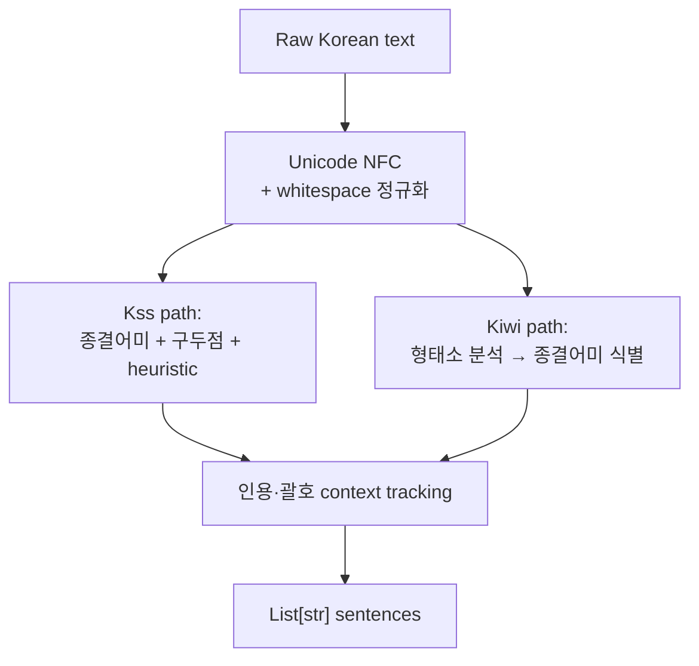
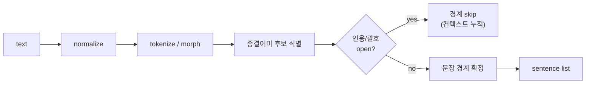

# Korean Sentence Boundary Detection (Kss vs Kiwi)

## 핵심 요약

한국어 sentence boundary detection은 (a) 다양한 종결어미(-다/-까/-요/-네 등), (b) 자유로운 인용·괄호 중첩, (c) 띄어쓰기 변동, (d) 약어·외래어로 인해 `re.split(r'[.!?]')` 류로는 불가하다. 한국어 RAG 청킹에서 정책서·가이드의 sentence-aware 분할이 필요할 때 **Kss와 Kiwi(kiwipiepy)** 두 라이브러리가 사실상 표준이다.

- **Kss (Korean Sentence Splitter)**: sentence segmentation 전용 toolkit. Normalized F1 지표 기준 자체 벤치마크 1위 — 단, Normalized F1은 Kss 프로젝트가 제안한 지표이므로 교차 검증 필요
- **Kiwi (kiwipiepy)**: 형태소 분석기 기반, `split_into_sents()` 보조 기능. 형태소 정보까지 필요할 때 강점
- **koalanlp 등 다른 옵션**은 segmentation 정확도에서 두 라이브러리에 뒤짐
- 단순 split (`.!?`) → **금지**. 한국어 종결 패턴을 거의 cover하지 못함

## 시스템 아키텍처

입력 텍스트 → unicode 정규화(NFC) → 형태소/토큰 분석 (Kiwi) 또는 종결어미·구두점 패턴 분석 (Kss) → 인용·괄호 컨텍스트 trace → 문장 경계 결정 → 문장 리스트.

## 처리 흐름

## 핵심 기능 및 서비스

| 라이브러리 | API 예시 | 백엔드 / 의존성 |
|---|---|---|
| Kss | `kss.split_sentences(text, backend="mecab"\|"pecab"\|"fast")` | mecab(빠름·외부설치) / pecab(pure python) / fast(휴리스틱) |
| Kiwi (kiwipiepy) | `Kiwi().split_into_sents(text)` 또는 `kiwi.tokenize(text)` 후 sent index 추출 | 자체 C++ 형태소 분석기 (휠로 배포, 외부 설치 불필요) |
| 공통 옵션 | num_workers, ignores(특정 패턴 무시), strip 옵션 | — |
| 출력 | `List[str]` (Kss) / `List[Sentence]`(Kiwi, span 포함) | — |

## 유사 기술 비교

| 항목 | Kss | Kiwi (kiwipiepy) | koalanlp / KoNLPy SBD | naive `re.split(r'[.!?]')` |
|---|---|---|---|---|
| 특징 | segmentation 전용 toolkit | 형태소 분석 기반 종합 NLP | wrapper 다중 backend | 정규식 단일 split |
| 장점 | Normalized F1 기준 1위(자체 벤치마크), 다중 backend | 형태소 정보 동시 활용 가능, 빠른 단일 휠 설치 | 다양한 분석기 통합 | 의존성 0 |
| 단점 | backend별 설치 필요 (mecab는 OS 의존) | sentence split은 부차 기능 | 정확도 상대적 낮음 | 한국어 종결어미 cover 안 됨 |
| 적합 케이스 | RAG 청킹·NLP 전처리·말뭉치 구축 | 청킹 + 형태소·품사 함께 필요 시 | 기존 KoNLPy 생태계 사용 시 | 영문 또는 단순 PoC만 |

## 실제 사례

### Kss 공식 벤치마크
Kss·Kiwi·koalanlp·baseline을 EM·F1·Normalized F1로 비교. Kss가 대부분 metric에서 1위, Kiwi가 근접 2위로 보고됨. **단** Normalized F1은 Kss 프로젝트가 직접 제안한 지표이므로 자체 평가 셋 기준임을 인식하고 kiwipiepy 측 교차 벤치마크도 확인 권장.

### kiwipiepy 공식 sentence_split 벤치마크
Kiwi 저자(bab2min) 측 벤치마크 디렉토리. 자체 평가 셋·코드 공개. 두 프로젝트가 서로의 벤치마크를 공개·비교하는 건전한 경쟁 구도.

## 활용 시나리오

### 시나리오 1: 정책서 청킹 — sentence boundary 보장
맥락: 정책서를 H2/H3 섹션 단위로 자르되 sentence boundary가 잘려서는 안 됨 → 선택 이유: heading split 후 마지막 토큰이 문장 중간이면 retrieval miss → 구체 적용: heading split 결과를 Kss(`fast` 또는 `pecab` backend)에 통과 → 한 청크의 끝이 항상 문장 종료 위치가 되도록 join/trim.

### 시나리오 2: FAQ Q-A 페어 sentence-level 추출
맥락: FAQ에서 Q가 여러 문장으로 구성된 경우 첫 문장만 임베딩에 활용 → 선택 이유: Q 문장 정확 식별이 retrieval 품질 좌우 → 구체 적용: Q 본문을 Kss로 split → 첫 sentence 우선 사용 + 나머지는 metadata에 보관.

### 시나리오 3: 코드·표 혼합 문서 sentence split
맥락: 가이드 문서에 코드 블록·표 혼재 → 선택 이유: 코드 안의 `.`나 `!`가 거짓 경계를 만들지 않도록 → 구체 적용: storage format 파싱 단계에서 코드 블록·표를 placeholder로 치환 → Kss/Kiwi에 본문만 통과 → placeholder 복원.

## 장단점 및 트레이드오프

| 항목 | 내용 |
|---|---|
| 장점 | Kss·Kiwi 모두 한국어 종결어미·인용 context를 합리적으로 처리, 둘 다 RAG 청킹 사전 단계에 적합 |
| 단점 | Kss `mecab` backend는 OS 의존(mecab-ko 설치), `fast`는 정확도 trade-off / Kiwi는 sentence split 외 형태소 호출이 무겁다는 인식 |
| 트레이드오프 | **정확도 vs 속도**: Kss `mecab`/`pecab` 정확, `fast` 빠름 / **의존성**: Kiwi는 단일 wheel로 설치 간단, Kss는 backend 선택 부담 / **목적**: sentence만 필요하면 Kss, 형태소·품사도 같이 쓰려면 Kiwi |

## 함정 및 안티패턴

- **안티패턴 1**: `text.split('.')`로 처리 → 종결어미(-다/-까/-요/-네) 무시, 약어·소수점에 거짓 경계 → **대안**: 항상 Kss 또는 Kiwi 사용
- **안티패턴 2**: 인용·괄호 무시 → "그는 '나는 간다.'고 말했다." 같은 문장이 잘림 → **대안**: 라이브러리 기본 동작 (인용 컨텍스트 추적) 신뢰, 추가 후처리 자제
- **안티패턴 3**: Kss `mecab` backend를 Docker 이미지 빌드 시 누락 → 런타임에 `pecab` fallback 자동 발동되어 정확도 silently 저하 → **대안**: backend 명시 지정, 이미지 빌드에 mecab-ko 포함 또는 처음부터 `pecab`/`fast` 선택
- **안티패턴 4**: 코드 블록·표를 그대로 통과 → 코드 내부 `.`/`!`가 false-positive 경계 → **대안**: 파싱 단계에서 코드 블록·표 placeholder 치환 후 split, 결과에서 복원
- **안티패턴 5**: Kss `Normalized F1`을 편향 없는 지표로 인용 → Kss 프로젝트가 제안한 지표이므로 kiwipiepy 측 벤치마크로 교차 검증 권고

## 참고 자료

- [Kss GitHub — hyunwoongko/kss (공식)](https://github.com/hyunwoongko/kss) — Kss 공식 저장소. 벤치마크·Normalized F1 정의·multi-backend 문서 1차 출처
- [Kss — PyPI 4.x](https://pypi.org/project/kss/) — 최신 릴리즈·설치·backend 옵션
- [kiwipiepy sentence_split benchmark (bab2min)](https://github.com/bab2min/kiwipiepy/tree/main/benchmark/sentence_split) — Kiwi 저자의 자체 벤치마크 디렉토리. 자체 평가 셋·코드 공개
- [korean-sentence-splitter (likejazz)](https://github.com/likejazz/korean-sentence-splitter) — 초기 heuristic 기반 한국어 splitter, 비교 baseline

## 관련 노트

- [[chunking-strategy-methodology]] — 청킹 전략 선택·측정·개선 방법론. 한국어 SBD는 sentence-aware 전략의 전처리 단계
- [[chunking-embedding-compatibility-matrix]] — 청크 길이·분포·한국어 토큰 비율과 임베딩 모델 max_seq 호환성
- [[korean-rag-embedding-selection]] — 한국어 RAG 임베딩 모델 선정. sentence split 결과가 임베딩 입력이 됨
