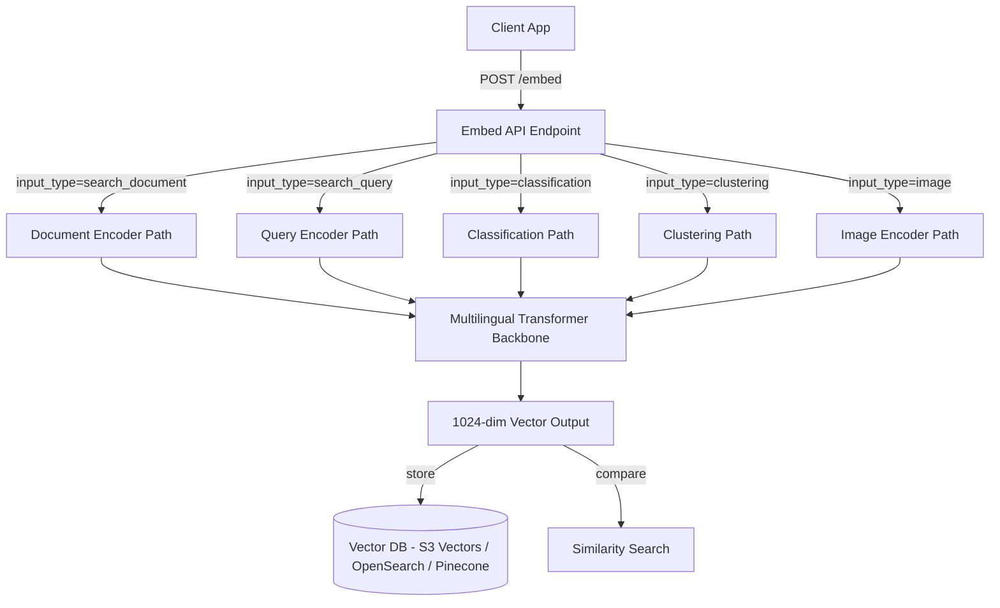
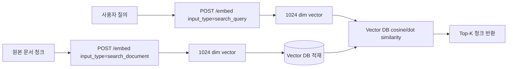

# Cohere Embed Multilingual v3

## 핵심 요약

Cohere가 2024-02-07 공개한 enterprise-grade 다국어 임베딩 모델. 100+ 언어를 단일 vector space로 매핑해 **cross-lingual retrieval** (예: 영어 query로 한국어 문서 검색)을 native 지원. 1024 dim 고정 출력 + 512 token context. 2024-10에 image 입력을 지원하는 multimodal v3.0 업데이트가 추가됐다.

- **다국어 단일 임베딩 공간**: ~1B 영어 학습 페어 + ~0.5B 비영어 학습 페어 (100+ 언어)로 학습. cross-lingual 매칭이 같은 언어 매칭과 유사 품질로 동작
- **Input type 명시 API**: `search_document` / `search_query` / `classification` / `clustering` / `image` 5종. 같은 텍스트라도 input_type에 따라 다른 vector 생성 → search 정확도 직접 향상
- **배포 채널 다양화**: Cohere direct API · AWS Bedrock · Azure AI · Oracle GenAI · Hugging Face (open weights `CohereLabs/Cohere-embed-multilingual-v3.0`) 모두 가능
- **light 변형 존재**: `embed-multilingual-light-v3.0` (384 dim) — 비용·latency 우선 시 선택

## 시스템 아키텍처

Cohere 또는 cloud provider가 모델을 호스팅하고, 클라이언트는 input_type 파라미터를 명시한 REST API로 호출한다. 응답은 1024 dim float 배열.

## 처리 흐름

대표적인 RAG 인덱싱·조회 흐름. 문서와 query에 서로 다른 `input_type`을 사용해야 retrieval 품질이 보장된다.

## 핵심 기능 및 서비스

| 기능 | 설명 |
|---|---|
| 1024 dim 출력 (standard) | multilingual v3 기본. Pinecone/Qdrant/S3 Vectors 등 주요 vector DB와 호환 |
| 384 dim 출력 (light) | `embed-multilingual-light-v3.0`. 비용·latency 1/3 수준, 일부 품질 trade-off |
| 100+ 언어 cross-lingual | 영어 query → 한국어/일본어/스페인어 문서 native 매칭 |
| Input type 5종 | search_document / search_query / classification / clustering / image |
| 512 token 입력 한도 | 한 번에 처리 가능한 최대 토큰. 긴 문서는 청킹 필요 |
| Image embedding (2024-10+) | v3 multimodal 업데이트. 텍스트·이미지 동일 vector space |
| Bedrock 통합 | `cohere.embed-multilingual-v3` model ID. AWS IAM·PrivateLink 활용 가능 |
| Pricing | $0.10 / 1M input tokens (Bedrock 기준). Cohere direct API도 동급 |

## 유사 기술 비교

| 항목 | Cohere Embed Multilingual v3 | AWS Titan Embeddings v2 | OpenAI text-embedding-3-large | multilingual-e5-large (OSS) |
|---|---|---|---|---|
| 특징 | 100+ 언어 cross-lingual, input_type 명시 | dim 가변 (256/512/1024), 영어 최적화 | 3072 dim, dim 축소 가능 (Matryoshka) | 오픈소스, BAAI/multilingual-e5, 자체 호스팅 |
| 다국어 (한국어) | 강점 — 학습 코퍼스 100+ 언어 명시 | 약점 — AWS 공식 "cross-language sub-optimal" | 다국어 지원, 한국어 평판 우수 | 다국어 strong, MTEB-multilingual 상위 |
| dim | 1024 (light: 384) | 256 / 512 / 1024 | 3072 (축소 가능) | 1024 |
| Context length | 512 token | 8000 token | 8191 token | 514 token |
| 가격 (1M tokens) | $0.10 (Bedrock) | $0.02 (Bedrock) | $0.13 (OpenAI direct) | 자체 호스팅 비용 |
| 적합 케이스 | 다국어/cross-lingual RAG, enterprise 검색 | 영어 위주 대용량 RAG, 비용 우선 | 영어·다국어 general purpose, OpenAI ecosystem | 외부 송신 금지·자체 운영 |

## 실제 사례

### Meta — content moderation
Meta의 AI 시스템이 다국어 컨텐츠 검수에 multilingual 임베딩을 활용. 100+ 언어 native 지원이 운영상 결정적 우위. Cohere가 enterprise 다국어 사례로 공개 인용.

### Enterprise multilingual customer support (Cohere 공식 케이스)
대규모 고객지원 검색·semantic recommendation 엔진에서 v3 multilingual을 production 배포. 같은 question intent의 다국어 표현이 동일 cluster로 매핑되어 cross-language FAQ 매칭 개선.

## 활용 시나리오

### 시나리오 1: 한국어 wiki RAG 인덱싱

사내 정책서·가이드·FAQ가 한국어 위주이고 AWS 공식이 Titan v2를 비영어 sub-optimal로 명시한 상황에서, Cohere v3 multilingual은 retrieval 품질 직접 향상이 기대됨. S3 Vectors 1024 dim 호환. `input_type=search_document`로 청크 적재 + `input_type=search_query`로 질의 → top-k cosine similarity 회수.

### 시나리오 2: Cross-lingual enterprise search

영어 기반 글로벌 본사 + 한국어 지사 문서가 동일 vector index에 공존. 한국어 직원이 영어 query로 본사 문서를 native 매칭하거나 그 반대. 단일 인덱스 운영으로 인프라 단순화.

### 시나리오 3: Multilingual classification / clustering 보조

문서 자동 분류(예: 정책서 vs 가이드 vs FAQ doc_type 추론) 또는 토픽 클러스터링. `input_type=classification` / `clustering`을 사용해 retrieval-optimized embedding과 다른 vector space 활용 — 같은 모델로 분류·검색 두 가지를 별도 차원으로 운영.

## 장단점 및 트레이드오프

| 항목 | 내용 |
|---|---|
| 장점 | 100+ 언어 cross-lingual native, enterprise production 검증. input_type API로 task별 최적 vector. Bedrock·Azure·Oracle·OSS weight 다채널. |
| 단점 | dim 1024 고정 (Titan v2의 256/512처럼 비용 축소 불가, light 변형은 별도 model ID). 512 token 컨텍스트 한도가 큰 청크에 제약. 가격이 Titan v2 대비 5x. |
| 트레이드오프 | dim·context 한도가 작아 청킹 전략과 결합 강함 (chunk ≤ 512 token 강제). cost는 한국어 retrieval 품질 우위로 절감 (검색 miss로 인한 사용자 신뢰 손실 회피). |

## 함정 및 안티패턴

- **안티패턴 1: 모든 호출에 `input_type` 생략 또는 동일 값** → 문서·질의를 같은 input_type으로 인코딩하면 retrieval 정확도 큰 폭 저하 → `search_document` (적재) / `search_query` (질의) 반드시 분리
- **안티패턴 2: 512 token 초과 청크를 single API 호출로 전송** → 초과분 truncation으로 정보 손실 (silent) → 청킹 단계에서 token 기준으로 ≤ 512 보장. `tiktoken`·Cohere 자체 tokenizer로 사전 측정
- **안티패턴 3: 1024 dim 벡터를 후속 reduce 없이 대용량 인덱스에 적재 후 비용 항의** → Bedrock 기준 v3 multilingual은 단일 1024 dim 출력. 비용 우선이면 처음부터 `embed-multilingual-light-v3.0` (384 dim) 채택, dim 가변이 필수면 Matryoshka 지원되는 Embed v4 또는 별도 PCA/projection 적용 (※ 일부 2026 출처가 v3에 384/768 옵션 명시 — 사용 채널의 공식 spec으로 사전 확인 권장)
- **안티패턴 4: 모델 교체 시 기존 인덱스 일부만 재임베딩** → Cohere v3와 다른 모델은 vector space가 달라 numerically 비교 무의미. 부분 교체 시 retrieval 정확도 무작위 저하. 모델 교체는 전체 재인덱싱이 원칙

## 호환 청킹 전략

본 모델의 512 token 입력 한도와 결합도가 높은 청킹 전략:

- [[fixed-size-chunking]] — token 기준 fixed-size로 ≤512 강제. 가장 안전한 기본 선택
- [[recursive-chunking]] — 자연 경계(문단·문장) 우선 분할 후 fallback. Confluence wiki·정책서에 적합
- 비추천: 단순 character-based chunking — token 환산이 불확실해 한국어 multi-byte에서 truncation 위험

## 참고 자료

- [Cohere's Embed Models — official docs](https://docs.cohere.com/docs/cohere-embed) — 공식 모델 설명, input_type 사용 가이드
- [Cohere Embed v3 — Amazon Bedrock 공식 문서](https://docs.aws.amazon.com/bedrock/latest/userguide/model-parameters-embed-v3.html) — Bedrock 경유 호출 파라미터·예제
- [Introducing Embed v3 — Cohere 공식 blog](https://cohere.com/blog/introducing-embed-v3) — 출시 시점 공식 발표
- [AWS Marketplace: Cohere Embed Model 3 — Multilingual](https://aws.amazon.com/marketplace/pp/prodview-b24wpfklozupm) — 가격·region 가용성
- [CohereLabs/Cohere-embed-multilingual-v3.0 — Hugging Face](https://huggingface.co/CohereLabs/Cohere-embed-multilingual-v3.0) — 오픈 weights, 자체 호스팅 옵션
- [embed-multilingual-v3.0 — Pinecone 통합 가이드](https://docs.pinecone.io/models/cohere-embed-multilingual-v3.0) — vector DB 호환 spec
- [The guide to embed-multilingual-v3.0 model — Zilliz](https://zilliz.com/ai-models/embed-multilingual-v3.0) — 학습 코퍼스 통계 (1B 영어 + 0.5B 비영어), 100+ 언어

## 관련 노트

- [[titan-text-embeddings-v2]] — 직접 비교 대상 (AWS 1st-party, 다국어 sub-optimal 명시)
- [[aws-bedrock-embedding]] — Bedrock 호스팅 채널 컨텍스트
- [[fixed-size-chunking]] — 512 token 한도 강제용 기본 청킹
- [[recursive-chunking]] — 자연 경계 기반 청킹 fallback
