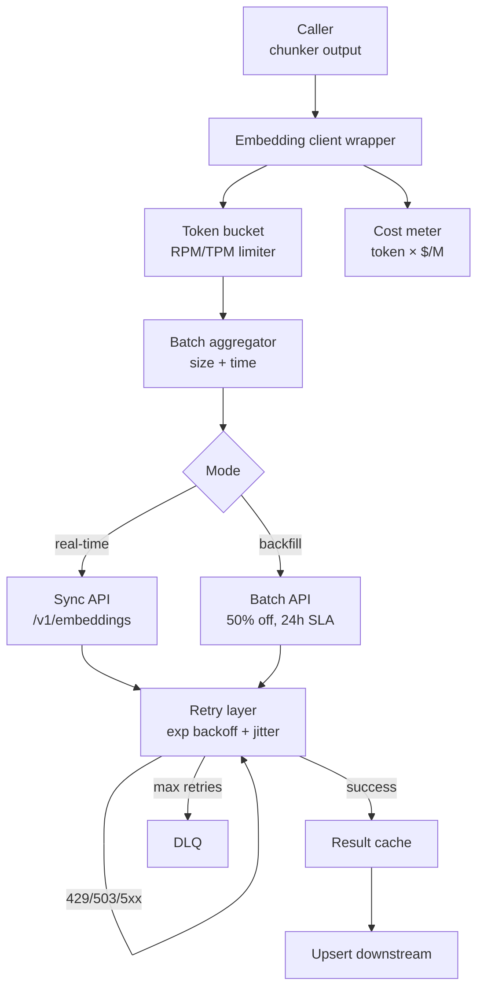
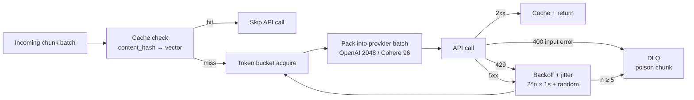

# Embedding API Client Design

## 핵심 요약

Embedding ingestion 비용의 90%는 model API 호출에서 발생한다. 본 노트는 **(1) 어떤 model을 고를까** (2) **어떻게 안정적으로·싸게 호출할까**의 두 축을 다룬다. 두 결정은 분리되지 않는다 — model마다 batch limit, rate limit, Batch API 할인 구조가 다르므로 model 선택이 곧 call 전략을 결정한다.

- **2026 model 지형**: Voyage 3-large(MTEB 65.1, 품질 1위) · OpenAI text-embedding-3-large(범용, 8191 token) · Cohere embed-v4(다국어 + rerank) · Cohere embed-multilingual-v3(Bedrock KR 제공) · Amazon Titan v2(AWS IAM 통합) · Google Gemini($0.006/M 최저가) · Jina v3(long doc, 다국어). MTEB 상위 모델 간 격차는 0.3~0.5점에 불과해 **비용·context·다국어 요구사항이 실제 선택축**.
- **호출 안정성 3요소**: (1) exponential backoff + jitter, (2) token-bucket rate limiter, (3) Batch API로 backfill 분리.
- **OpenAI Batch API**: 50% 할인 + 별도 quota + 24시간 SLA(실측 10~15분 완료 빈번). embedding은 batch당 50K input / 1M enqueued limit.
- **Batch size 차이**: OpenAI 2048 inputs/req, Cohere 96 inputs/req. 이 차이만으로 backfill throughput이 수십 배 차이 남.

> **버전 민감 항목**: MTEB 순위·가격($/M token)·batch limit·Batch API 할인율은 분기 단위로 변동. 본 노트의 수치는 2026년 상반기 기준. 최신값은 각 provider 공식 문서 및 MTEB 공식 리더보드 확인.

## 시스템 아키텍처

호출 안정성은 **client wrapper 한 곳**에서 모든 retry·rate-limit·batch 로직을 캡슐화하는 패턴이 표준. application code는 `embed(texts)`만 호출하고 나머지는 wrapper가 처리.

## 처리 흐름

각 embedding 호출이 wrapper를 통과하는 단계.

## 핵심 기능 및 서비스

| 기능 | 설명 |
|---|---|
| Model selector | workload(품질/비용/context/다국어) 기반 추천. routing layer에서 doc 유형별 다른 model 사용도 가능 |
| Token bucket limiter | provider별 RPM/TPM 제한을 client에서 사전 차단. 429 발생 자체를 줄임 |
| Exponential backoff + jitter | `2^n × base + random(0,1)s`. n ≤ 5, 최대 60s cap. jitter 없으면 다중 worker가 동시 재시도해 thundering herd 발생 |
| Batch aggregator | size threshold(provider 한계) + time threshold(예: 200ms)로 flush. 빈 batch 방지 |
| Batch API integration | OpenAI Batch(50% off), Cohere batch, Gemini batch. backfill·nightly job 전용 경로 |
| Content hash cache | 같은 텍스트 재임베딩 방지. Redis/local SQLite/object storage 어디든 |
| Cost meter | input_tokens × $/M tokens 누적. provider별, source별 tag 가능 |
| Provider fallback | 1차 provider 장애 시 2차로 routing. embedding space 호환이 안 되므로 retrieval 단계도 fallback 필요 |

## 유사 기술 비교

> **주의**: 아래 MTEB 수치·가격·batch limit은 2026년 상반기 기준이며 변동 가능. 공식 provider 문서로 최신값 재확인 권장.

| 항목 | Voyage 3-large | OpenAI text-embedding-3-large | OpenAI text-embedding-3-small | Cohere embed-v4 | Cohere embed-multilingual-v3 | Google Gemini text-embedding-004 | Amazon Titan v2 | Jina v3 |
|---|---|---|---|---|---|---|---|---|
| MTEB | 65.1 (1위) | ~64.6 | ~62.3 | ~64.5 | Multilingual 상위 | 중상위 | ~60.8 (영어 위주) | 다국어 강점 |
| Dimensions | 1024 (Matryoshka) | 3072 (256-3072 truncate) | 1536 (256-1536 truncate) | 1024/1536 | 1024 | 768 | 256/512/1024 (가변) | 1024 |
| Context | 32,000 tokens | 8,191 | 8,191 | 512 (chunk 필수) | 512 (chunk 필수) | 2,048 | 8,192 | 8,192 |
| 가격 ($/M token) | $0.06 | $0.13 | $0.02 | $0.10 | $0.10 (API) / Bedrock 과금 | $0.006 (최저) | $0.02 (Bedrock) | self-host 가능 |
| Batch limit (per req) | 128 | 2048 | 2048 | 96 | 96 | 250 | InvokeModel 단건 | self 설정 |
| Batch API 할인 | 별도 batch endpoint | 50% (Batch API) | 50% (Batch API) | batch endpoint 존재 | batch endpoint 존재 | batch API 50% | Bedrock Batch ~50% | N/A |
| 강점 | 품질 1위, code 4+점 우위, long doc | 범용, 차원 truncate 가능 | 가성비 1위(품질-가격) | rerank-v3 통합, 다국어 | 100+ 언어 cross-lingual, int8 compressed, Bedrock ap-northeast-2 | 최저가, GCP 통합 | AWS 1st-party, IAM 통합, KB 네이티브, dim 가변 | long doc, multilingual, self-host |
| 약점 | 가격 상위, latency 보고 부족 | 가격 중상위 | 품질 한계 | context 512 (long doc 부적합) | context 512, long doc 부적합 | 중하위 품질 | 비영어 sub-optimal | self-host 운영 부담 |
| 적합 케이스 | 품질 1순위, code retrieval | 범용 production | 비용 민감 PoC/MVP | rerank 결합, 다국어 | 한국어·다국어 RAG, Bedrock KR 리전 | 비용 최우선, GCP 스택 | AWS Bedrock KB 통합, 규제 산업 | 긴 문서, privacy/onprem |

## 실제 사례

### OpenAI cookbook — How to handle rate limits

OpenAI 공식 cookbook은 `tenacity` 라이브러리 기반의 exponential backoff + jitter 예제를 표준으로 제시. `wait=wait_random_exponential(min=1, max=60), stop=stop_after_attempt(6)` 패턴이 사실상 reference 구현. text-embedding-3-large의 RPM/TPM 제한에 부딪힌 사례가 OpenAI community에 다수 보고됨.

### Cohere production setup — token bucket + 3~5 retries

Cohere 공식 가이드는 429/503 발생 시 3~5회 retry + exponential backoff를 권장하며, **token-bucket rate limiter**를 client에 두어 429 발생 자체를 줄이는 패턴을 강조. embed-v4는 batch당 96 input 제한이라 OpenAI(2048)와 throughput 차이가 크다.

### Voyage 3-large + rerank-2 for code RAG

Voyage 3-large는 code retrieval에서 OpenAI text-embedding-3-large 대비 4+ MTEB 점 우위. 32K context를 활용해 함수·파일 단위 chunking 없이 long context embedding이 가능. Cursor·SourceGraph 같은 code RAG 제품군에서 채택 사례 증가.

## 활용 시나리오

### 시나리오 1: 비용 최우선 PoC (월 $50 이하 목표)

OpenAI text-embedding-3-small ($0.02/M) 또는 Gemini text-embedding-004 ($0.006/M) 선택. backfill은 Batch API로 50% off. 1M chunk × 평균 200 token = 200M token → OpenAI small은 $4, Gemini는 $1.2. 품질 차이는 ±2~3점 수준이라 PoC 단계에서는 가격이 결정적.

### 시나리오 2: 다국어 / rerank 결합 production

Cohere embed-v4 + Cohere rerank-v3. chunk size는 400~500 token으로 제한. embed-v4의 context는 512 token이지만 rerank와의 통합이 검색 품질을 결정. 다국어 ko/ja/zh corpus에서 MTEB Multilingual 1위급. 같은 vendor로 묶으면 latency·운영 단순화. AWS 환경에서는 Cohere embed-multilingual-v3 on Bedrock(ap-northeast-2)으로 대체 가능.

### 시나리오 3: 품질 1순위 / code RAG

Voyage 3-large + 자체 rerank(BGE-reranker-v2-m3) 또는 Cohere rerank. MTEB 65.1로 품질 최상위 + code retrieval +4~6점 우위. 32K context로 긴 함수·파일도 chunking 없이 embedding 가능. 가격($0.06/M)은 small 대비 3배지만 retrieval 품질이 KPI인 워크로드에서 정당화.

## 장단점 및 트레이드오프

| 항목 | 내용 |
|---|---|
| 장점 | **선택지 풍부**: 품질-비용-context 어느 축이 1순위든 fit한 model 존재. **Batch API로 50% 절감**: backfill·nightly는 거의 무조건 Batch로 분리. **token bucket으로 429 사전 차단**: 운영 안정성 크게 개선. |
| 단점 | **Embedding space 비호환**: model 교체 시 전체 re-embedding 필수. **MTEB는 reference, 실제 도메인 평가 별도 필요**: 0.3~0.5점 차이는 실제 KPI에서 역전 가능. **vendor 가격 정책 변동**: Voyage·Cohere는 가격 변동 빈번. |
| 트레이드오프 | **품질 ↔ 비용**: Voyage 3-large($0.06) vs Gemini($0.006), 10배 차이. **API 운영 zero ↔ self-host 비용·privacy**: BGE/E5/Jina 자체 GPU 운영은 H100 기준 시간당 $1~3, 대량 처리 시 자체 호스팅이 손익분기 도달. **실시간 ↔ Batch API**: latency(실시간) vs 비용(Batch 50% off). |

## 함정 및 안티패턴

- **Backfill을 실시간 API로 처리**: 1M chunk를 sync로 보내면 비용 2배 + rate limit 직격 → Batch API(OpenAI 50% off, Cohere batch)로 분리.
- **Backoff에 jitter 없이 deterministic delay**: 여러 worker가 동일 시점에 재시도해 thundering herd → `wait_random_exponential(min=1, max=60)` 같은 jitter 포함 패턴 필수.
- **Provider RPM/TPM을 모르고 429 받아서 알기**: 사후 대응 → token bucket으로 사전 throttle. provider별 limit을 매뉴얼 확인 후 80%까지만 사용.
- **Batch endpoint와 sync endpoint 한 worker가 같이 사용**: backfill batch 응답이 24시간 후 도착해 sync flow 막힘 → batch는 별도 worker/queue로 분리.
- **모든 chunk를 같은 model로 embedding**: 코드는 Voyage, 다국어 문서는 Cohere, 일반 문서는 OpenAI small 같은 routing이 가능한데도 단일 model 강제 → metadata에 doc type 두고 model routing.
- **content hash cache 없이 재실행**: 동일 chunk를 매번 재임베딩해 비용 누수 → content hash → vector cache layer 필수. Redis로 충분.
- **Provider 1개에만 의존**: provider 장애 시 ingestion 전면 중단 → 최소한 fallback provider 1개 + 호환 dimension 정렬 전략.
- **Embedding dimension을 model 최대값으로 그대로 사용**: text-embedding-3-large는 256~3072 range로 truncate 가능. 1024로 줄여도 품질 손실 < 1점이고 vector DB 저장·검색 비용 1/3 → Matryoshka representation 적극 활용.

## 참고 자료

- [OpenAI - Batch API Guide](https://developers.openai.com/api/docs/guides/batch) — embedding batch 50K input / 1M enqueued limit (High)
- [OpenAI Cookbook - How to handle rate limits](https://github.com/openai/openai-cookbook/blob/main/examples/How_to_handle_rate_limits.ipynb) — tenacity 기반 exp backoff + jitter reference (High)
- [OpenAI - Rate limits best practices](https://help.openai.com/en/articles/6891753-what-are-the-best-practices-for-managing-my-rate-limits-in-the-api) — 공식 best practice (High)
- [Mixpeek - Best Embedding Models in 2026 (Tested & Ranked)](https://mixpeek.com/curated-lists/best-embedding-models) — 2026 model 비교 종합 (Mid)
- [Awesome Agents - MTEB Leaderboard March 2026](https://awesomeagents.ai/leaderboards/embedding-model-leaderboard-mteb-march-2026/) — MTEB 최신 순위 (Mid)
- [Markaicode - Cohere Production Setup: Rate Limits and Error Handling](https://markaicode.com/tutorial/cohere-tutorial-production-setup-guide/) — token-bucket + 3~5 retry 패턴 (Mid)
- [TokenMix - Text Embedding Models 2026: Google $0.006/M vs OpenAI vs Voyage](https://tokenmix.ai/blog/text-embedding-models-comparison) — 가격 비교 (Mid)
- [EmbeddingCost - OpenAI Embedding Pricing 2026](https://embeddingcost.com/openai) — OpenAI 3개 model 가격 (Mid)

## 관련 노트

- [[rag-embedding-generation]] — GPU/API 처리량 최적화: adaptive batching·length sorting·idempotency (본 노트의 call stability 위에 놓이는 throughput 레이어)
- [[embedding-model-lock-in]] — 모델 교체 시 전체 re-embedding 비용: 본 노트의 "model 선택 → 고정" 결정의 비가역성
- [[embedding-incremental-cdc-ingestion]] — 증분 임베딩 / CDC: call stability 패턴이 증분 ingestion에 어떻게 적용되는지
- [[korean-rag-embedding-selection]] — 한국어 RAG 특화 임베딩 모델 선정 프레임워크 (본 노트의 다국어 선택 축 심화)
- [[cohere-embed-multilingual-v3]] — Cohere 다국어 임베딩 모델 상세 스펙
- [[titan-text-embeddings-v2]] — Amazon Titan v2 임베딩 모델 상세 스펙 (AWS Bedrock 통합)
