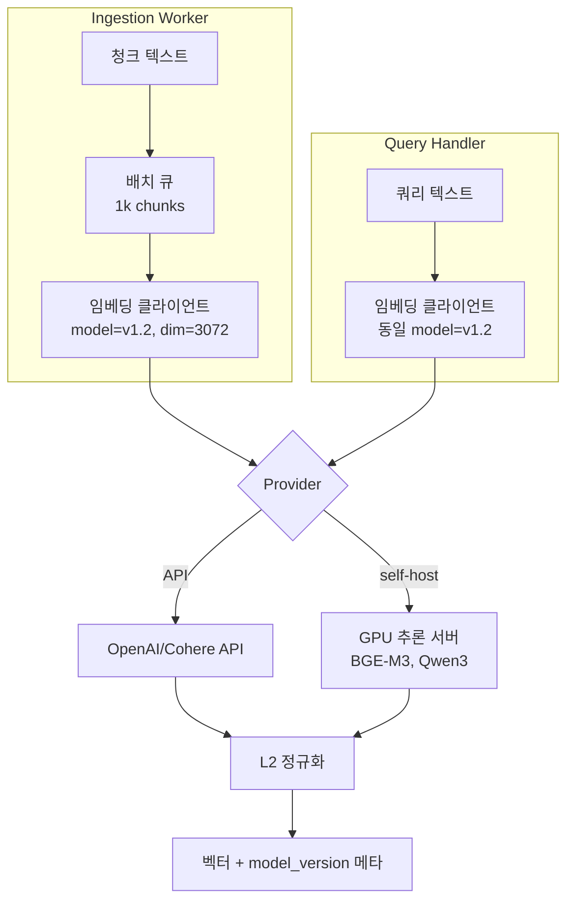
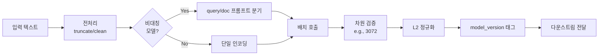

# RAG Embedding Layer

## 핵심 요약

RAG vector index의 embedding layer는 검색 계층의 **벡터 생성 책임**을 담당한다. 모델 선택(품질·언어·도메인), 임베딩 호출 패턴(API vs self-host), 차원·정규화 정책, 모델 버전 관리가 핵심 의사결정 축이다. 임베딩 공간은 모델별로 호환되지 않기 때문에 "어떤 모델을 골랐는가"는 인덱스 수명 전체를 좌우한다.

- **벡터 공간 비호환성**: 모델 A와 B의 출력 벡터는 동일 차원이라도 의미가 다르다. 혼용 불가.
- **품질·비용 트레이드오프**: API(OpenAI text-embedding-3, Cohere embed-v4)는 운영 단순성, self-host(BGE-M3, Qwen3-Embedding-8B)는 비용·데이터 주권에서 우위.
- **비대칭 임베딩**: 일부 모델은 query와 document에 서로 다른 인코더/프롬프트를 적용해 검색 품질을 끌어올린다 (Cohere embed-v3 이상).

> **버전 민감 항목**: MTEB 순위·가격($/M token)·차원 default·batch limit·비대칭 인코딩 지원 여부는 분기 단위로 변동. 본 노트의 수치는 2026년 상반기 기준. 최신값은 MTEB 공식 리더보드 및 각 provider 공식 문서 확인.

## 시스템 아키텍처

임베딩 layer는 인제스션 워커와 쿼리 핸들러 양쪽에서 호출되며, 모델 버전·차원·정규화 정책을 공유한다.

## 처리 흐름

## 핵심 기능 및 서비스

| 기능 | 설명 |
|---|---|
| 모델 호출 추상화 | LangChain/LlamaIndex/직접 SDK 등으로 provider-agnostic 인터페이스 제공 |
| 배치 임베딩 | 토큰·비용 한도 내에서 청크를 묶어 호출 (OpenAI는 보통 8k~100k 토큰/요청) |
| 차원 축소(Matryoshka) | text-embedding-3는 `dimensions` 파라미터로 256~3072 축소 가능 |
| 정규화 | L2 정규화로 cosine ≡ dot product 등가, 인덱스 성능 향상 |
| 모델 버전 태깅 | 모든 출력 벡터에 `model_version` 메타 첨부, 인덱스 정합성 보장 |
| 비대칭 인코딩 | query/document 별도 프롬프트로 retrieval 품질 개선 |

## 유사 기술 비교

| 항목 | OpenAI text-embedding-3 | Cohere embed-v4 | BGE-M3 (self-host) | Qwen3-Embedding-8B |
|---|---|---|---|---|
| MTEB 점수 | 64.6 (large) | 65.2 | 63.0 | 70.6 |
| 차원 | 1536/3072 (Matryoshka) | 가변 | 1024 (dense), 다중 출력 | 4096 |
| 다국어 | 강함 | 매우 강함 | 매우 강함 (100+ 언어) | 강함 |
| 비대칭 | 약함 | 지원 (`input_type`) | 지원 (dense+sparse+multi-vec) | 지원 |
| 적합 케이스 | 프로토타입·중소 볼륨 | 다국어·고품질 API | 자체 호스팅·데이터 주권 | GPU 보유·최고 품질 |
| 비용 | $0.13/1M tok (large) | API 과금 | GPU + 운영비 | GPU + 운영비 |

> 수치 출처: MTEB 점수는 [MTEB 공식 리더보드](https://huggingface.co/spaces/mteb/leaderboard) 2026년 상반기 스냅샷. 차원·비대칭 지원·가격은 각 provider 공식 문서 (OpenAI Embeddings docs, Cohere Embed v4 docs, BAAI BGE-M3 model card, Qwen3-Embedding-8B model card). MTEB 리더보드는 신규 모델 추가로 순위가 자주 바뀌므로 운영 도입 시점에 재조회 권장.

## 실제 사례

### Notion
워크스페이스 페이지 인덱싱 시 블록 구조 기반 청킹 + 임베딩 모델로 벡터 생성. 키워드 검색과 벡터 검색을 하이브리드로 결합해, 임베딩 모델만으로 잡지 못하는 정확 키워드 쿼리를 보완.

### Perplexity (pplx-embed)
일반 임베딩이 청크 단위로만 의미를 잡아 주변 컨텍스트를 잃는 문제를 해결하기 위해 InSeNT(in-sequence/in-batch contrastive loss) 학습 방법으로 컨텍스트 인지 임베딩 모델을 자체 학습하고 오픈소스화. 학습 데이터는 ConTEB 벤치마크(EMNLP 2025) 기반. 모델 사용법은 Perplexity 공식 cookbook(`docs.perplexity.ai`)에서 제공.

## 활용 시나리오

### 시나리오 1: 다국어 고객지원 RAG
**맥락**: 한국어·일본어·영어 매뉴얼이 섞인 코퍼스. **선택 이유**: 단일 영어 임베딩은 한국어 검색 품질 떨어짐. **적용**: Cohere embed-v4 또는 BGE-M3로 통일된 다국어 임베딩 공간 구축, query/document 프롬프트 분리.

### 시나리오 2: 데이터 주권이 필요한 사내 검색
**맥락**: 보안 정책상 외부 API에 사내 문서 전송 불가. **선택 이유**: OpenAI/Cohere 차단. **적용**: BGE-M3을 ONNX/vLLM으로 self-host, A10G/L4 GPU 1대로 시작해 트래픽 따라 스케일링.

### 시나리오 3: 비용 민감 프로토타입
**맥락**: 월 5M 토큰 미만 PoC. **선택 이유**: 자체 호스팅보다 API가 압도적으로 저렴. **적용**: OpenAI text-embedding-3-small(`dimensions=512`로 축소)로 시작, Matryoshka 활용해 인덱스 메모리 절감.

## 장단점 및 트레이드오프

| 항목 | 내용 |
|---|---|
| 장점 | 의미 기반 검색·다국어·멀티모달, Matryoshka로 차원·비용 조절 가능 |
| 단점 | 모델 변경 시 전체 재임베딩(시간·비용 ↑), API 의존 시 rate limit·데이터 전송 제약 |
| 트레이드오프 | API ↔ self-host (운영 단순성 vs 비용·주권), 차원 ↑ (품질) ↔ 차원 ↓ (메모리·속도), 단일 인코더 ↔ 비대칭 인코더 (단순성 vs 검색 품질) |

## 함정 및 안티패턴

- **모델 혼용**: 동일 인덱스에 서로 다른 임베딩 모델의 벡터를 함께 저장 → 거리 비교 무의미. **대안**: `model_version` 메타데이터로 분리, 인덱스 자체를 모델별로 분리. ([[embedding-model-lock-in]] 참조)
- **정규화 누락**: cosine 메트릭을 쓰면서 L2 정규화 안 하면 인덱스 알고리즘이 가정한 거리 함수와 불일치. **대안**: 임베딩 직후 강제 정규화 단계 삽입.
- **query·document 동일 입력**: 비대칭 모델인데 query에도 document 프롬프트를 쓰면 MTEB 점수 대비 실제 retrieval 품질이 떨어짐. **대안**: provider 문서에 따른 프롬프트 분리 (Cohere `input_type`, BGE query instruction 등).
- **차원 무한 확장**: "큰 차원 = 좋은 품질" 가정으로 무조건 3072 차원 선택 → 메모리·latency 폭증. **대안**: MTEB 평가에서 차원별 품질 곡선 확인, 보통 1024~1536이 최적점.

## 참고 자료

### High 신뢰도 (공식 문서·벤치마크·모델 카드)

- [MTEB 공식 리더보드 (Hugging Face Space)](https://huggingface.co/spaces/mteb/leaderboard) — MTEB 점수·차원·언어 1차 출처
- [OpenAI Embeddings 공식 문서](https://platform.openai.com/docs/guides/embeddings) — text-embedding-3 차원(Matryoshka `dimensions` 파라미터)·pricing·정규화 가이드
- [Cohere Embed 공식 문서](https://docs.cohere.com/docs/cohere-embed) — embed-v4 비대칭(`input_type`: `search_query` / `search_document`)·다국어 지원
- [BAAI BGE-M3 모델 카드 (Hugging Face)](https://huggingface.co/BAAI/bge-m3) — dense + sparse + multi-vector 출력·100+ 언어 학습 코퍼스
- [Qwen3-Embedding-8B 모델 카드 (Hugging Face)](https://huggingface.co/Qwen/Qwen3-Embedding-8B) — 차원 4096·MTEB 점수·라이선스
- [RAG with Perplexity Embeddings (공식 cookbook)](https://docs.perplexity.ai/docs/cookbook/articles/embeddings-rag/README) — pplx-embed 사용법

### Medium 신뢰도 (가이드·비교 블로그)

- [Best Embedding Models 2025: MTEB Scores & Leaderboard](https://app.ailog.fr/en/blog/guides/choosing-embedding-models) — Cohere/OpenAI/BGE MTEB 비교
- [Embedding Models for RAG: Choosing Between OpenAI, Cohere, and Open-Source](https://callsphere.ai/blog/embedding-models-rag-openai-cohere-open-source-comparison) — 선택 가이드
- [Embedding Models 2026: Benchmark and Comparison](https://app.ailog.fr/en/blog/news/embedding-models-2026) — Qwen3 등 오픈소스 추월 동향
- [Perplexity's Context-Aware Embeddings (pplx-embed)](https://karanprasad.com/blog/perplexity-pplx-embed-context-aware-embeddings-rag) — InSeNT 학습 방법론

## 관련 노트

- [[embedding-api-client-design]] — embedding API 호출 패턴(retry·rate-limit·Batch API). 본 노트는 모델 선택·인코딩 정책 축, 그 노트는 호출 안정성 축
- [[embedding-model-lock-in]] — 모델 교체·재임베딩 운영. 본 노트는 정책 수립 시점에서 호환성을 다루고, 그 노트는 lock-in이 발생한 이후의 마이그레이션 전략
- [[rag-embedding-generation]] — 대규모 배치 throughput 튜닝(adaptive batching·length sorting). 본 노트는 layer 책임 정의, 그 노트는 배치 성능 최적화
- [[korean-rag-embedding-selection]] — 한국어·code-switching 특화 모델 선택. 본 노트는 언어 중립 일반 프레임, 그 노트는 한국어 도메인 적용
- [[cohere-embed-multilingual-v3]] — 본 노트 비교표의 Cohere 계열 1차 후보
- [[aws-bedrock-embedding]] — Bedrock 호스팅 채널을 통한 임베딩 호출
- [[chunking-embedding-compatibility-matrix]] — 청킹 전략과 임베딩 모델 호환성 매트릭스
