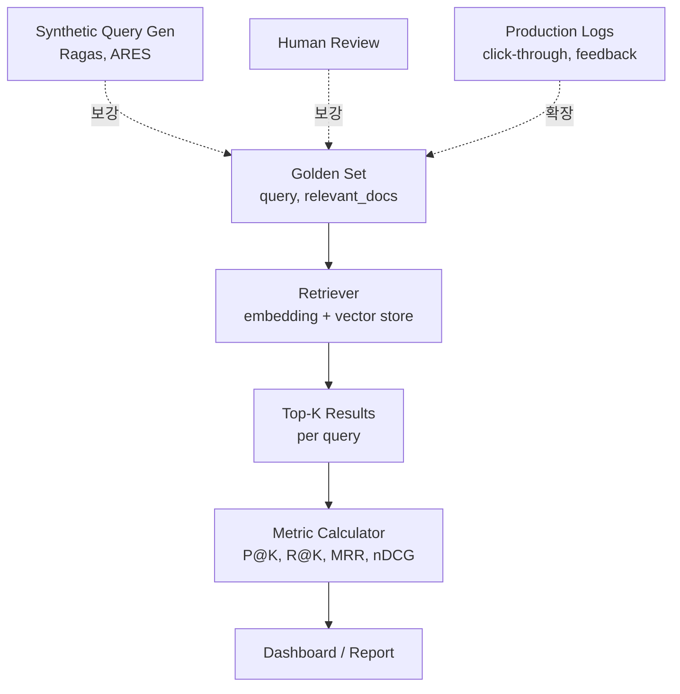
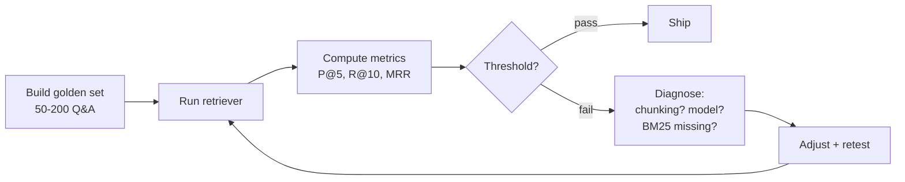

# Retrieval Quality Metrics

## 핵심 요약

RAG embedding 단계의 품질을 **수치로 측정하고 의사결정에 연결**하는 체계다. retrieval 지표(P@K / Recall@K / MRR / nDCG / Hit Rate@K), 외부 benchmark(MTEB), domain-specific golden set 구축이 핵심이다.

- **외부 benchmark는 시작점일 뿐**: MTEB는 일반화된 점수 — 도메인 적합도와 다를 수 있음. 결정은 domain golden set으로
- **Retrieval 지표가 1순위**: end-to-end answer 품질은 retrieval에 의해 상한선이 결정됨 — chunk가 안 잡히면 LLM은 답할 수 없음
- **Golden set은 작아도 좋음**: 도메인 Q&A 50~200건이 첫 측정에 충분
- **MTEB v2(2026)는 v1과 직접 비교 불가** — 모델 비교 시 동일 버전에서만

> **버전 민감 항목**: MTEB는 버전별 task 구성이 다름. 최신 리더보드 스냅샷은 공식 사이트 확인.

## 시스템 아키텍처

평가 시스템은 golden set + retriever + metric calculator + 결과 대시보드의 4 부분이다.

## 처리 흐름

Golden set 구축 → 측정 → 진단 → 조치의 4단계다.

1. **Golden set 구축**: 도메인 전문가가 query + 정답 chunk(들)를 50~200건 작성. synthetic(Ragas/ARES)과 human review 혼합
2. **Retriever 실행**: 후보 모델/설정으로 top-K 결과 수집
3. **Metric 계산**: Precision@5, Recall@10, MRR, nDCG 등을 후보별로 산출
4. **임계 판단**: 사전 정의 threshold(예: P@5 ≥ 0.7) 미달 시 진단 단계
5. **진단**: chunking 문제인지 / embedding 문제인지 / sparse 누락인지 분류 — 같은 query를 다른 retriever에 흘려 비교

## 핵심 기능 및 서비스

| Metric | 정의 | 답하는 질문 | 사용 시점 |
|---|---|---|---|
| Precision@K | top-K 중 relevant 비율 | top-K 결과가 얼마나 깨끗한가? | K가 LLM에 주입할 chunk 수 |
| Recall@K | relevant 중 top-K에 포함된 비율 | 정답을 다 끌어왔는가? | corpus가 다소 클 때 |
| MRR | 첫 relevant의 reciprocal rank 평균 | 첫 정답이 얼마나 위에 있는가? | top-1 정렬 품질 |
| nDCG@K | 순위 가중 누적 이득 정규화 | 순위가 의미 있는가? | 다단계 relevance |
| Hit Rate@K | top-K 안에 relevant 1개 이상 포함된 비율 | 최소 1건이라도 잡았나? | binary 찾았다/못찾았다 |
| MTEB | 56 task / 8 카테고리 외부 benchmark | 일반화된 모델 품질? | 후보 1차 컷 (참고) |
| Ragas / ARES | LLM 기반 자동 평가 + 합성 query 생성 | 사람 평가 부족 시 보강 | golden set 확장 |

## 유사 기술 비교

| 항목 | MTEB (외부 benchmark) | Domain Golden Set | Production Logs |
|---|---|---|---|
| 특성 | 56 task, 표준화된 점수 | 도메인 Q&A 50~200건 | 클릭/피드백 시그널 |
| 장점 | 모델 후보 빠르게 비교, 객관 점수 | 도메인 적합도 직접 측정, 결정 근거 | 실사용 시그널 |
| 단점 | 도메인 차이 반영 X, v1↔v2 비교 불가 | 구축 비용, 편향 가능 | 노이즈 큼, 정답 라벨 부재 |
| 적합 케이스 | 후보 1차 컷 | 출시 전 의사결정 | 운영 중 회귀 감지 |

## 실제 사례

### Ragas / ARES — Synthetic + LLM 자동 평가
LLM이 corpus에서 query를 합성하고 다른 LLM이 retrieval 결과를 평가하는 frameworks. golden set 구축 비용을 낮추는 사실상 표준 도구. 단, LLM 평가자의 편향을 사람이 한 번 검수해야 함.

### NVIDIA NV-Embed — MTEB 69.32 사례
MTEB English 56 task에서 SOTA를 기록한 사례. 하지만 어떤 점이 retrieval 품질에 직접 기여했는지는 도메인 평가에서 별도 검증 필요 — MTEB 한계의 대표 예시.

## 활용 시나리오

### 시나리오 1: 모델 후보 좁히기 (5개 → 2개)
MTEB v2 점수로 후보 2개 컷 → 도메인 golden set 100건 작성 → 후보 2개로 P@5, MRR 측정 → 차이 < 2%p면 단가/lock-in으로 결정, > 5%p면 품질 우선.

### 시나리오 2: 운영 중 retrieval 회귀 감지
모델 교체 후 golden set을 새/구 인덱스 둘 다에서 실행 → P@5, MRR delta 확인 → 회귀가 특정 도메인에 클러스터링되어 있으면 모델 적합도 문제, 분산되어 있으면 chunking/parsing 문제.

### 시나리오 3: 도메인 fine-tuning 효과 검증
동일 golden set으로 baseline(BGE-M3 vanilla) vs fine-tuned 비교 → P@5/MRR 향상 정도 측정 → 일반 query에서 회귀가 없는지 확인(catastrophic forgetting 체크).

## 장단점 및 트레이드오프

| 항목 | 내용 |
|---|---|
| 장점 | 객관 지표로 의사결정 합의 쉬움. retrieval 단독 평가로 LLM 비용 없이 빠르게 회귀 감지. Ragas/ARES로 golden set 구축 비용 절감 가능. Production logs로 평가 set 점진 확장 |
| 단점 | Golden set 편향 — 작성자/도메인 좁으면 일반화 어려움. MTEB는 일반 도메인 위주. Synthetic eval은 LLM 평가자 편향. 평가 자체가 비용(특히 LLM 기반) |
| 트레이드오프 | **Golden set 크기**: 작음 = 빠름·편향↑ / 큼 = 신뢰↑·구축비용↑. **Synthetic vs Human**: 합성 = 양·편향 / 사람 = 정확·비용. **Retrieval vs E2E**: retrieval만 = 빠름 / E2E = 사용자 체감 정확·비용↑ |

## 함정 및 안티패턴

- **안티패턴 1: MTEB 1위 모델 무조건 채택** → 도메인 적합도가 다르면 실 retrieval은 더 나쁠 수 있음 → MTEB는 후보 컷에만, 결정은 domain golden set.
- **안티패턴 2: 평가 set이 학습/튜닝 set과 오염** → 점수가 부풀려짐 → split을 명시(시점·소스 기반), leak 검증 의무화.
- **안티패턴 3: Hit Rate@10만 보고 만족** → 정답이 10등에 있어도 LLM context에 top-5만 들어가면 무용 → 실제 K 값과 일치하는 P@K, MRR 함께 보기.
- **안티패턴 4: MTEB v1 ↔ v2 점수 직접 비교** → 비교 불가(벤치 task 구성 변경) → 같은 버전 안에서만 비교, 버전 표기 확인.
- **안티패턴 5: LLM 기반 자동 평가만 사용** → LLM 평가자가 특정 응답 스타일을 favor → 자동 평가 + 표본 human review 병행.
- **안티패턴 6: retrieval 단독 평가 없이 end-to-end만 평가** → 회귀 원인 분리 불가(chunking? embedding? LLM?) → retrieval 메트릭과 end-to-end 메트릭을 분리해 추적.

## 참고 자료

- [How to Evaluate Retrieval Quality in RAG Pipelines: P@K, R@K, F1@K (Towards Data Science)](https://towardsdatascience.com/how-to-evaluate-retrieval-quality-in-rag-pipelines-precisionk-recallk-and-f1k/) — 기본 지표 정의와 계산
- [How to Evaluate Retrieval Quality Part 2: MRR & AP (Towards Data Science)](https://towardsdatascience.com/how-to-evaluate-retrieval-quality-in-rag-pipelines-part-2-mean-reciprocal-rank-mrr-and-average-precision-ap/) — 순위 기반 지표
- [RAG Evaluation: 2026 Metrics and Benchmarks (Label Your Data)](https://labelyourdata.com/articles/llm-fine-tuning/rag-evaluation) — 종합 지표 매트릭스
- [MTEB Leaderboard March 2026 (Awesome Agents)](https://awesomeagents.ai/leaderboards/embedding-model-leaderboard-mteb-march-2026/) — 최신 스냅샷
- [MTEB Leaderboard (Modal)](https://modal.com/blog/mteb-leaderboard-article) — MTEB 구성 / v1↔v2 차이 해설
- [Retrieval Metrics Tutorial: Recall@k and MRR Explained](https://medium.com/@rajnish_khatri/retrieval-metrics-tutorial-recall-k-and-mrr-explained-d2f12afb9c89) — 입문용 정리
- [The aRt of RAG Part 4: Retrieval evaluation](https://medium.com/@rossashman/the-art-of-rag-part-4-retrieval-evaluation-427bb5db0475) — 실무 평가 시나리오

## 관련 노트

- [[rag-ingestion-quality-monitoring]] — ingestion-side 품질 신호(chunk 분포·embedding drift·freshness SLO) — 본 노트의 retrieval 메트릭과 분리된 측정 채널
- [[rag-embedding-model-selection]] — 모델 선정 시 golden set 기반 P@K·MRR 비교가 최종 의사결정 근거
- [[korean-rag-embedding-selection]] — 한국어 RAG 특화 임베딩 모델 선정 — 도메인 golden set 평가 방법론 공유
- [[embedding-model-lock-in]] — 모델 교체 비용(re-embedding)이 평가 강도를 높이는 이유
- [[rag-embedding-generation]] — 대규모 배치 임베딩 처리. 본 노트의 품질 평가 결과가 모델 선정 입력
