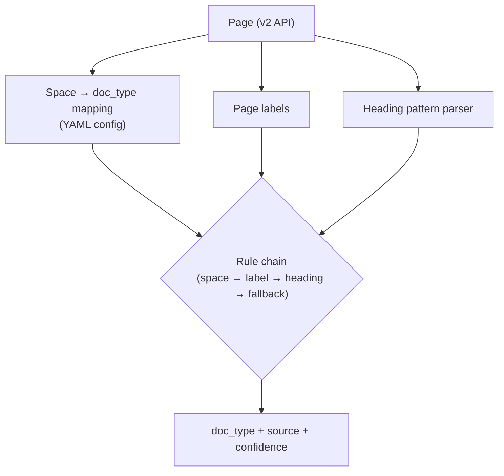
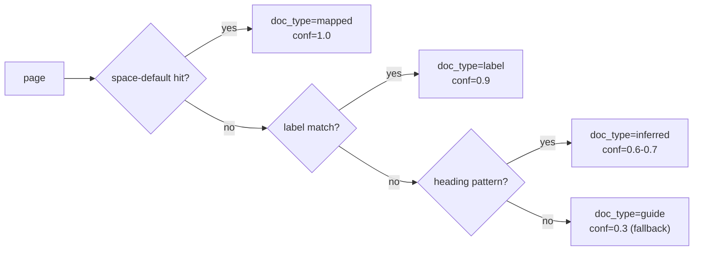

# Confluence Document Type Classification Heuristic

## 핵심 요약

Confluence 페이지를 `faq` / `guide` / `policy` 3종 `doc_type`으로 구분하는 **4단계 rule-based heuristic chain**. doc_type은 청킹 단위·크기·overlap을 유형별로 달리 적용하기 위한 전처리 메타데이터이자, retrieval 단의 **filterable metadata**로도 활용되므로 분류 정확도가 청킹·검색 양쪽 품질에 직결된다.

- **결정론적 fallback chain**: space-default → page label → heading pattern → 최종 fallback 순으로 첫 hit에서 결정, 결정 단계와 confidence를 함께 저장
- **학습 데이터 0-shot**: 라벨링된 훈련셋 없이 즉시 운영 가능. ML/LLM 기반 분류기 대비 운영 단순성·디버그 용이성 우위
- **분류 결과 audit 가능**: `doc_type`, `doc_type_source`(`space`/`label`/`heading`/`fallback`), `doc_type_confidence` 3개 필드를 filterable metadata로 저장해 재분류 및 품질 모니터링 지원

## 컴포넌트 다이어그램

페이지 메타(공간·라벨)와 본문 heading 패턴을 입력으로 받아 rule chain을 순차 통과시키는 단방향 분류기. 외부 학습 모델·embedding 비용 없음.

## 적용 단계

1. **Space-default lookup**: 페이지의 `space_id`로 사전 정의 YAML(`space_id → doc_type`) 조회. hit이면 confidence 1.0, source=`space`
2. **Label fallback**: space miss 시 `labels` 배열에 `policy`/`faq`/`guide` 직접 매치. 다중 라벨 충돌 시 우선순위(`policy > faq > guide`). hit이면 confidence 0.9, source=`label`
3. **Heading pattern heuristic**:
   - **FAQ**: `Q[숫자]?[.:)\s]`, `Q\. `, `### Q`, 또는 첫 H2가 의문형(`?` 종결)이고 이후 H2/paragraph 반복 → confidence 0.7, source=`heading`
   - **Policy**: `제[0-9]+조`, `제[0-9]+항`, `정책`, `규정`, `보안 정책`, `접근 권한` 키워드 H1/H2 → confidence 0.7, source=`heading`
   - **Guide**: 위 둘 모두 miss + step-by-step 패턴(`### Step`, `## 1\.`, 명령형 동사 시작) → confidence 0.6, source=`heading`
4. **최종 fallback**: 모두 miss → `doc_type=guide`, confidence 0.3, source=`fallback`
5. 결과를 vector record metadata에 저장 (`doc_type`, `doc_type_source`, `doc_type_confidence` — filterable)

## 핵심 기능 및 서비스

| 요소 | 설명 |
|---|---|
| Space mapping config | YAML/JSON. `space_id → doc_type` 사전 매핑. wiki admin이 큐레이션 |
| Label resolver | v2 API `GET /pages/{id}/labels` 또는 `expand=labels` 활용. 라벨 우선순위 룰 |
| Heading parser | storage format 파싱 결과의 H1/H2/H3 리스트 + 첫 paragraph 일부 |
| Confidence score | 단계별 고정 confidence. ML 도입 시 동일 필드에 학습 모델 score overwrite 가능 |
| `doc_type_source` | `space` / `label` / `heading` / `fallback` — audit·재분류 기반 |
| Override hook | `doc_type` 수동 강제 라벨 (예: `label:doc_type/policy`) — 휴리스틱 오분류 보정용 |

## 유사 기술 비교

| 항목 | Rule-based heuristic chain | Naive Bayes / sklearn 분류기 | BERT 임베딩 + 분류 head | LLM zero-shot classifier |
|---|---|---|---|---|
| 특징 | 결정론적 fallback chain | 통계적 분류기 | 사전학습 임베딩 + 헤드 fine-tune | LLM 프롬프트로 분류 |
| 장점 | 0-shot, 학습 셋 불필요, 디버그 용이 | 학습 빠르고 가벼움 | 정확도 높음 | 데이터셋 없이 즉시 적용 |
| 단점 | label 누락·heading 변형에 취약 | 데이터셋 라벨링 필요 | 학습·재학습 운영 부담 | LLM 호출 비용·latency |
| 적합 케이스 | MVP, 도메인 라벨 일관성 높을 때 | 수백~수천 라벨 데이터 확보 시 | 정확도 임계 높을 때 | 분류 기준 자주 변경 시 |

## 실제 사례

### 사내 wiki RAG — label 큐레이션 운영
대부분의 사내 wiki 운영 사례에서 (a) admin이 정책서·FAQ space를 미리 분리하고 (b) 페이지 라벨로 `policy`/`faq`/`guide`를 강제하도록 거버넌스 → 휴리스틱 chain의 정확도 95%+ 달성. 라벨 hygiene이 약하면 heading fallback 의존도가 커지고 정확도가 떨어짐.

### Generic document classification heuristics (6+1 categories)
deterministic rule / regex / keyword spotting / metadata 필드 / 패턴 매칭 / 외부 lookup의 6종 + ML 보조의 1종으로 분류 휴리스틱을 카테고리화한 패턴 — 본 chain 설계와 동형 구조.

## 활용 시나리오

### 시나리오 1: MVP 분류 (M1)
학습 데이터 없이 즉시 RAG 파이프라인에 doc_type 분류를 도입. `space_id → doc_type` YAML 5-10건 + 라벨 fallback 활성, heading heuristic은 logging만(분류는 fallback). 분류 결과를 metadata에 기록해 M2 품질 검증의 기반 마련.

### 시나리오 2: 분류 정확도 검증 (M2)
heuristic 운영 후 sample 100건 manual 검증으로 false positive·negative 측정. confusion matrix를 `space` / `label` / `heading` 단계별로 분해해 어느 단계의 정확도가 낮은지 식별 후 regex 업데이트 또는 label 거버넌스 강화.

### 시나리오 3: 휴리스틱 vs LLM hybrid (v2)
heuristic 정확도가 60% 미만이고 label hygiene 개선이 불가한 경우, fallback step(step 4)을 LLM zero-shot 호출로 교체. nightly batch에서 비용·latency 수용 가능 여부 확인 후 적용.

## 장단점 및 트레이드오프

| 항목 | 내용 |
|---|---|
| 장점 | 학습 데이터 0, 즉시 운영, 디버그 가능, 분류 결정 단계가 metadata에 남아 audit 가능 |
| 단점 | label 누락·heading 변형에 취약, 다국어·다언어 Confluence 환경에서 heading 패턴 다양화 부담 |
| 트레이드오프 | **정확도 vs 운영 단순성**: ML/LLM이 정확도 높지만 운영 부담·비용 / **rigid vs adaptive**: rule chain은 변화에 취약하나 변화 추적이 명시적 / **fallback 보수성**: `guide`로 fallback하면 정책서·FAQ가 guide 청킹으로 잘못 처리될 risk → confidence 낮은 케이스를 별도 큐로 분리해 사후 검토 |

## 함정 및 안티패턴

- **label 단일 룰만 적용**: label 미입력 페이지 전수 미분류 → **대안**: fallback chain 4-stage 필수 (space → label → heading → default)
- **heading pattern hard-coded regex**: wiki 가이드라인 변경·다언어 도입 시 silent 정확도 저하 → **대안**: regex set을 YAML config로 분리, M2 audit 시 갱신
- **분류 결과 metadata 미저장**: 잘못 분류된 청크를 vector store에서 추적·재분류 불가 → **대안**: `doc_type`/`doc_type_source`/`doc_type_confidence` 3개 필드 반드시 filterable metadata로 저장
- **단일 confidence threshold 일괄 적용**: 단계별 정확도가 다른데 일괄 threshold 적용 시 false negative 다발 → **대안**: 단계별 confidence 그대로 유지, retrieval 단에서 `doc_type_confidence < 0.5` vector에 별도 가중치 적용
- **doc_type 변경 시 무조건 re-embed**: filterable metadata 변경만으로 retrieval 동작 변경 가능 → **대안**: doc_type 변경이 청킹 단위 변경을 동반할 때만 재인덱싱. metadata-only 변경은 re-embed 불필요

## 참고 자료

- [Minimally Supervised Categorization of Text with Metadata (arXiv 2020)](https://arxiv.org/pdf/2005.00624) — 라벨·메타데이터 활용 약지도 분류 연구
- [Beyond Text — Incorporating Metadata and Label Structure (EMNLP 2021)](https://aclanthology.org/2021.emnlp-main.253/) — heterogeneous graph 기반 multi-label 분류 (v2 ML 이월 시 참고)
- [AI Document Classification: A Practical Guide (LlamaIndex)](https://www.llamaindex.ai/blog/ai-document-classification) — rule → ML → LLM 진화 단계 실용 가이드
- [6 (+1) types of heuristics to automate your labeling process (DEV)](https://dev.to/meetkern/6-1-types-of-heuristics-to-automate-your-labeling-process-323d) — heuristic 6+1 카테고리화
- [Document Classification: End-to-End ML Workflow (Label Your Data)](https://labelyourdata.com/articles/document-classification) — 분류 워크플로 전반

## 관련 노트

- [[confluence-REST-API-v2]] — 분류기가 labels·space 정보를 가져오는 Confluence v2 API
