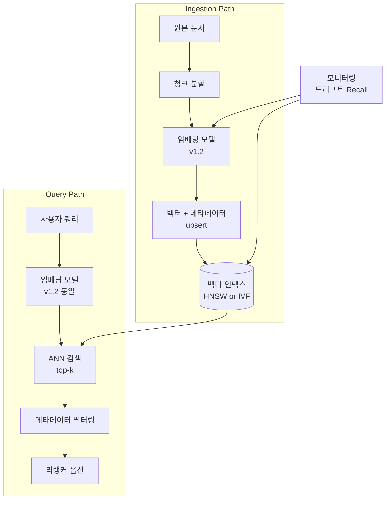
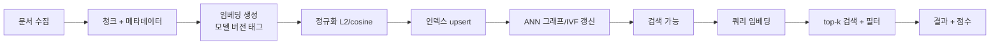

# Embedding × Vector Index Coupling

## 핵심 요약

임베딩 모델은 텍스트·이미지 등 원시 데이터를 고차원 벡터(보통 384~3072차원)로 변환하고, 벡터 인덱스는 이 벡터들을 ANN(Approximate Nearest Neighbor) 알고리즘으로 빠르게 검색 가능하도록 보관·구조화한다. 두 요소는 RAG·시맨틱 검색 시스템의 **검색 계층(retrieval layer)**을 구성하며 서로 강하게 결합되어 있어, 한쪽의 변경이 다른 쪽 전체 재구축을 강제한다.

- **강한 결합도(coupling)**: 임베딩 모델이 바뀌면 벡터 공간 자체가 달라져 기존 인덱스는 무효화된다. 모델·인덱스 버전을 한 쌍으로 묶어 운영하는 것이 핵심.
- **다중 트레이드오프 축**: Recall ↔ Latency ↔ Memory ↔ Cost가 모델 선택·인덱스 알고리즘·하드웨어 단에서 동시에 작용.
- **운영 부담의 분산**: 임베딩 비용(API 호출 또는 GPU 추론), 인덱스 메모리(HNSW는 평벡터 대비 2~5×, HNSW 논문·Qdrant 문서 기준), 재인덱싱 시간 등 세 축이 별도의 운영 과제.

> **버전 민감 항목**: MTEB 순위·벡터 DB 가격·HNSW 메모리 배수·서버리스 인덱스 latency SLA·관리형 제품 기능셋(Pinecone serverless, Cohere embed-v4 등)은 분기 단위로 변동. 본 노트의 수치는 2026년 상반기 기준. 최신값은 MTEB 공식 리더보드·각 vector DB 공식 문서·HNSW/Faiss 1차 자료에서 재확인 권장.

## 시스템 아키텍처

RAG 검색 계층은 인제스션 경로(쓰기)와 쿼리 경로(읽기)가 동일한 임베딩 모델·인덱스 페어를 공유한다.

## 처리 흐름

## 핵심 기능 및 서비스

| 기능 | 설명 |
|---|---|
| 임베딩 생성 | 텍스트·이미지를 고정 차원 벡터로 변환. 대표 차원: MiniLM 384, BGE-base 768, OpenAI text-embedding-3-large 3072 (각 모델 카드 기준) |
| 벡터 저장 | 벡터 + 페이로드(메타데이터) 영속화 (Pinecone, Qdrant, Weaviate, pgvector) |
| ANN 검색 | HNSW·IVF·PQ 기반 근사 최근접 이웃 탐색. Faiss/ann-benchmarks 보고 기준 일반적으로 brute force 대비 수십~수백 배 가속하며 90%+ Recall을 유지하는 운영 포인트가 표준 |
| 메타데이터 필터링 | 벡터 검색과 동시에 카테고리·날짜 등 구조화 필터 적용 |
| 모델·인덱스 버전 관리 | alias 기반 blue/green 전환, A/B 비교, 롤백 경로 확보 |
| 드리프트·품질 모니터링 | Recall@k, 임베딩 분포 시프트, latency 분포 추적 |

> 수치 출처: 차원 값은 각 모델 카드 (MiniLM·BGE·OpenAI Embeddings 공식 문서). HNSW 메모리 배수와 ANN 가속비는 [HNSW 원논문 (Malkov & Yashunin, 2018)](https://arxiv.org/abs/1603.09320) 및 [ann-benchmarks.com](https://ann-benchmarks.com/) 비교. 운영 시점의 실제 수치는 코퍼스 규모·차원·인덱스 파라미터(M·ef)에 크게 의존하므로 자체 벤치마크 필수.

## 유사 기술 비교

| 항목 | 임베딩+벡터인덱스 (시맨틱) | 키워드 검색 (BM25/Lucene) | 하이브리드 검색 |
|---|---|---|---|
| 특징 | 의미 기반 유사도 (벡터 공간) | 토큰 일치·TF-IDF | 양쪽 점수 결합 (RRF 등) |
| 장점 | 동의어·문맥 이해 | 정확한 키워드·낮은 메모리 | 쿼리 분포 전반 커버 |
| 단점 | 키워드 정확 일치 약함, 메모리·비용↑ | 의미 매칭 불가 | 운영 복잡도 2배 |
| 적합 케이스 | Q&A·시맨틱 검색·RAG | 코드·ID·정확 검색 | 프로덕션 RAG (Notion·Perplexity·Glean 등) |

## 실제 사례

### Notion AI Q&A
워크스페이스 페이지와 데이터베이스를 인제스트할 때 블록 구조를 인지한 청킹을 적용한다. 헤딩과 그에 연결된 콘텐츠가 자연스러운 청크 경계가 되도록 설계해, 검색 시 컨텍스트 일관성을 유지한다. 키워드 검색과 벡터 검색을 하이브리드로 결합해 사용자 쿼리 분포 전반을 커버.

### Perplexity (Context-Aware Embeddings)
일반 임베딩이 청크의 주변 컨텍스트를 잃는 문제를 해결하기 위해 InSeNT(in-sequence/in-batch contrastive) 학습 방법으로 컨텍스트 인지 임베딩을 자체 학습. 동일 데이터 레이크(Hudi-on-S3) 위에 벡터 인덱스와 ElasticSearch 역색인을 시블링으로 두고 운영.

## 활용 시나리오

### 시나리오 1: 사내 문서 시맨틱 검색
**맥락**: 위키·노션·드라이브에 흩어진 사내 지식을 통합 검색. **선택 이유**: 키워드 검색만으로는 표현 다양성을 못 잡음. **적용**: BGE-M3 또는 OpenAI text-embedding-3-large + Qdrant HNSW + 하이브리드 검색 결합.

### 시나리오 2: 고객 지원 RAG 챗봇
**맥락**: FAQ·매뉴얼·티켓 이력을 기반으로 응답 생성. **선택 이유**: 빠른 latency(p99 < 200ms)와 메타데이터 필터(제품·언어·날짜) 필요. **적용**: Cohere embed-v4 + Pinecone serverless + 카테고리 필터 + 리랭커.

### 시나리오 3: 모델 업그레이드 시 무중단 전환
**맥락**: 임베딩 모델을 v3-small에서 v3-large로 교체. **선택 이유**: 벡터 공간 불일치로 인덱스 전체 재구축 필요. **적용**: blue/green 인덱스 (`docs_index_v2_2026-03-01`) 병렬 빌드 → 평가 → alias 원자적 스왑.

## 장단점 및 트레이드오프

| 항목 | 내용 |
|---|---|
| 장점 | 의미 기반 검색·다국어·멀티모달 지원, ANN으로 대용량에서도 ms 단위 응답 |
| 단점 | 임베딩 모델 변경 시 인덱스 전체 재구축, 메모리·저장소 비용 ↑, 정확 키워드 매칭 약함 |
| 트레이드오프 | API(OpenAI 등) ↔ self-host(BGE/Qwen3): 운영 단순성 vs 비용·주권 / HNSW ↔ IVF-PQ: 메모리 vs 정확도 / 단일 인덱스 ↔ blue-green: 비용 vs 무중단 |

## 함정 및 안티패턴

- **모델·인덱스 버전 분리 운영 없음**: 모델 업그레이드 시 어느 청크가 신·구 모델로 임베딩됐는지 추적 불가 → 검색 품질 저하. **대안**: 모든 벡터에 `model_version` 메타데이터 태그, alias 기반 blue/green 전환. ([[embedding-model-lock-in]] 참조)
- **L2 정규화 누락**: cosine 유사도를 쓰면서 정규화를 빼면 점수가 왜곡됨. **대안**: 인덱스 빌드 시점에 정규화 강제. ([[rag-embedding-layer]] 정규화 정책 참조)
- **단일 인덱스 가정**: 운영 중 단일 인덱스만 두면 재인덱싱 윈도우 동안 검색 품질이 무너짐. **대안**: 최소 한 버전 이전 인덱스를 함께 유지.
- **메타데이터 필터링 비용 무시**: 카디널리티 높은 필터를 무계획으로 적용하면 HNSW 그래프 탐색이 비효율적. **대안**: 사전 파티셔닝 또는 페이로드 인덱스 별도 구성. ([[recall-vs-filter-tradeoff]] 참조)

## 참고 자료

### High 신뢰도 (1차 출처·공식 문서·논문)

- [HNSW 원논문 (Malkov & Yashunin, arXiv:1603.09320)](https://arxiv.org/abs/1603.09320) — Hierarchical Navigable Small World 알고리즘 복잡도·메모리·Recall 곡선 1차 출처
- [Faiss 공식 문서 (Meta AI)](https://faiss.ai/) — IVF·PQ·Quantization·GPU 인덱스 1차 출처
- [Qdrant 공식 문서 — Indexing & HNSW Parameters](https://qdrant.tech/documentation/concepts/indexing/) — production HNSW 파라미터(`m`·`ef_construct`·`ef`) 튜닝 가이드
- [Pinecone 공식 문서 — Hybrid Search & RRF](https://docs.pinecone.io/guides/data/understanding-hybrid-search) — sparse+dense 결합·RRF 알고리즘 1차 출처
- [MTEB 공식 리더보드 (Hugging Face Space)](https://huggingface.co/spaces/mteb/leaderboard) — 임베딩 모델 벤치마크 1차 출처
- [ann-benchmarks.com](https://ann-benchmarks.com/) — HNSW/IVF/PQ 등 ANN 알고리즘 Recall–QPS 벤치마크
- [Monitoring Embedding/Vector Drift Using Euclidean Distance — Arize AI](https://arize.com/blog-course/embedding-drift-euclidean-distance/) — 임베딩 드리프트 검출 방법 (first-party engineering)

### Medium 신뢰도 (가이드·비교 블로그)

- [Best Embedding Models 2025: MTEB Scores & Leaderboard](https://app.ailog.fr/en/blog/guides/choosing-embedding-models) — 모델별 MTEB 벤치마크와 선택 가이드
- [HNSW vs IVFFlat: How to Choose the Right Vector Index](https://bigdataboutique.com/blog/hnsw-vs-ivfflat-how-to-choose-the-right-vector-index) — 인덱스 알고리즘 트레이드오프 분석
- [Embedding Models in Production: Selection, Versioning, and the Index Drift Problem](https://tianpan.co/blog/2026-04-09-embedding-models-production-versioning-index-drift) — blue/green 인덱스 패턴
- [Vector Database Comparison & Benchmarks 2025](https://inductivee.com/blog/vector-database-performance-benchmarks-2025) — Pinecone/Qdrant/Weaviate/Milvus/pgvector 벤치마크

## 관련 노트

- [[rag-embedding-layer]] — embedding layer 단일 책임(모델 선택·정규화·비대칭 인코딩 정책). 본 노트는 embedding × vector index 통합 framing
- [[vector-store-decision-matrix]] — vector store 제품 비교(S3V/Pinecone/Qdrant/pgvector). 본 노트는 retrieval layer 추상 개요
- [[recall-vs-filter-tradeoff]] — ANN+메타데이터 필터 한계. 본 노트는 trade-off 축 일반론
- [[opensearch-knn-vector-search]] — OpenSearch k-NN 구체 구현. 본 노트는 모든 vector DB에 공통된 통합 framing
- [[embedding-model-lock-in]] — 모델 교체 시 벡터 공간 불일치·재임베딩 운영. 본 노트의 "강한 결합도" 원리의 직접 귀결
- [[rag-embedding-generation]] — 대규모 배치 임베딩 throughput 튜닝
- [[chunking-embedding-compatibility-matrix]] — 청킹 전략과 임베딩 모델 호환성. 본 노트의 "ingestion path" 직전 단계
- [[hybrid-search-optimization]] — BM25+Vector hybrid retrieval 최적화 상세 (RRF·α-weighted·reranker). 본 노트의 "하이브리드 검색" 비교 행 확장
