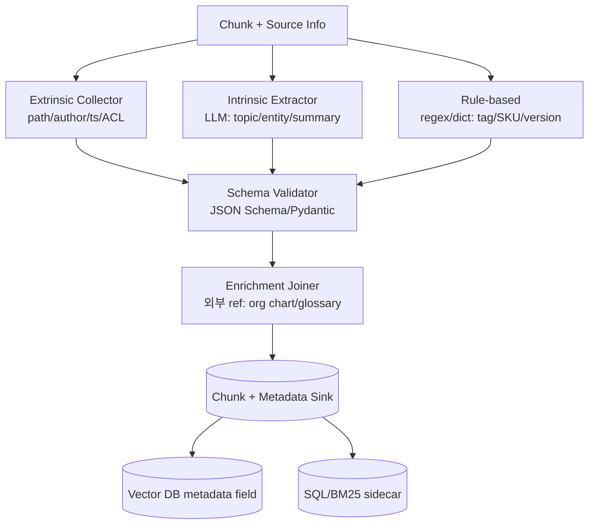
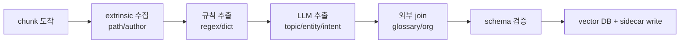

# RAG Chunk Metadata Extraction

## 핵심 요약

Metadata Extraction은 chunk에 **vector embedding 외 구조화된 속성**을 부여하는 ingestion 단계다. 메타데이터는 (1) retrieval 단의 hard filter (e.g., `tenant=X AND year>=2024`), (2) ranking signal (e.g., recency·authority), (3) 답변 시 인용·접근 통제의 기반이 된다. 잘 설계된 metadata는 vector recall을 보완해 **end-to-end RAG 정확도를 10~30%p 향상**시키는 가장 비용 효율적 레버다.

- **두 종류의 metadata**: extrinsic(파일 경로/저자/timestamp 등 시스템이 아는 것) vs intrinsic(문서 내용으로부터 추출 — 주제·엔티티·요약)
- **LLM 기반 추출의 대두**: 정규식·규칙으로 어려운 의미 메타데이터(주제·intent·확신도)를 LLM이 ingestion 시점에 1회 생성
- **Schema-first 설계 필수**: 후행 추가 시 backfill 비용·일관성 문제 발생
- **메타데이터는 vector와 같은 lifecycle**: schema 변경은 reindex 트리거 — [[rag-vector-index-lifecycle]] 참조.

## 시스템 아키텍처

Metadata 파이프라인은 **Extrinsic Collector → Intrinsic Extractor (LLM/Rule) → Schema Validator → Enrichment Joiner → Sink** 5단계로 구성된다. LLM extractor는 비용 최적화 위해 batch + cache 필수.

## 처리 흐름

chunk가 도착하면 시스템 정보(extrinsic)를 채우고, 규칙·LLM·외부 join을 거쳐 schema 검증 후 vector DB metadata 및 sidecar 저장소에 적재한다.

## 핵심 기능 및 서비스

| 기능/도구 | 설명 |
|---|---|
| LlamaIndex MetadataExtractor | `TitleExtractor`, `KeywordExtractor`, `QuestionsAnsweredExtractor` 등 builtin extractor 체인 |
| LangChain create_metadata_tagger | LLM + Pydantic schema 기반 자동 태깅 chain |
| Instructor / Outlines / pydantic-ai | 구조화 출력 강제, LLM hallucination 메타데이터 차단 |
| OpenAI structured outputs / Anthropic tool use | 모델 native JSON schema 강제로 추출 신뢰도 향상 |
| spaCy / Stanza NER | 빠르고 저렴한 entity 추출 (PERSON/ORG/LOC) |
| Apache Tika metadata | 파일 system metadata(저자/생성일/MIME) 표준 추출 |
| Unstructured ElementMetadata | parser 단에서 page/coordinates/category 메타 동시 생산 |
| Weaviate generative module | retrieval-time generative metadata enrichment |

## 유사 기술 비교

| 항목 | 규칙 기반 (regex/dict) | NER (spaCy/Stanza) | LLM 추출 (Claude/GPT) | Hybrid |
|---|---|---|---|---|
| 특징 | 결정적, 패턴 매칭 | 통계적 entity 분류 | 의미 이해 + 자유 schema | 단계별 라우팅 |
| 장점 | 비용 0, 빠름, 재현 가능 | 안정적, 다국어 모델 | 의미·요약·intent 가능 | 비용/품질 균형 |
| 단점 | maintenance 비용, 도메인 종속 | label 종류 제한 | 비용·지연 큼, hallucination | 복잡도 |
| 적합 케이스 | SKU/버전/IP 추출 | 고유명사 표지 | 주제/요약/Q-A 생성 | 대규모 production |

## 실제 사례

### Anthropic Contextual Retrieval
Anthropic은 각 chunk에 대해 Claude를 1회 호출해 "이 chunk가 전체 문서 맥락에서 어떤 정보인지" 50~100토큰 prefix를 LLM-generated metadata로 부착, retrieval failure rate를 35% 감소시켰다. ingestion 단계의 LLM metadata가 retrieval 성능에 직접 기여한 대표 사례.

### LinkedIn - LLM-based metadata for skill graph
LinkedIn은 직무 문서 ingestion 시 LLM으로 (skill, seniority, domain) 메타데이터를 동시 추출, 검색 personalization에 사용. 규칙 기반 대비 coverage 3배.

### Glean - Document metadata graph
Glean은 엔터프라이즈 검색에서 문서 metadata를 ingest 시 ACL·owner·관련 문서·생성 channel까지 그래프로 추출, 검색 시 사용자 컨텍스트와 join해 personalized retrieval을 구현. metadata가 retrieval의 first-class 시민.

## 활용 시나리오

### 시나리오 1: 멀티 테넌트 SaaS RAG
- **맥락**: 100개 tenant 데이터가 동일 vector DB에 혼재, 격리 필수
- **선택**: extrinsic metadata `tenant_id` + `acl_users` 강제
- **적용**: 모든 retrieval 쿼리에 `filter={tenant_id: $tid}` 강제 (코드 단에서 inject), schema에서 `tenant_id: required`, 누락 시 ingest 거부

### 시나리오 2: 최신성이 중요한 뉴스/규정 RAG
- **맥락**: 동일 주제 문서가 시간순으로 다수 존재, 최신본만 답변에 사용해야 함
- **선택**: extrinsic `published_at` + LLM 추출 `superseded_by`
- **적용**: retrieval 시 `published_at` 기준 ranking boost, LLM이 "이 문서는 X를 대체"라고 명시한 경우 metadata 부착, generation 단에서 superseded 문서 제외

### 시나리오 3: 답변 인용 + audit trail
- **맥락**: 규제 산업, 모든 답변이 인용 가능해야 함
- **선택**: chunk 단위 `doc_id`, `page`, `section_path`, `confidence` 메타 필수
- **적용**: generation prompt에 metadata 함께 주입 → 모델이 인용 인라인 생성, retrieval log에 metadata snapshot 저장해 사후 audit

## 장단점 및 트레이드오프

| 항목 | 내용 |
|---|---|
| 장점 | filter로 search space 축소 → recall·precision 동시 향상, retrieval에 도메인 지식 주입, audit/compliance 기반 |
| 단점 | LLM 추출 시 ingestion 비용 2~5배, schema 변경 시 backfill, hallucination 위험 |
| 트레이드오프 | **표현력 vs 추출 비용**(자유 schema vs enum), **자동 vs 수동**(LLM 추출 vs human-in-loop label), **저장 위치**(vector DB metadata vs sidecar — filter 성능 vs join 유연성) |

## 함정 및 안티패턴

- **안티패턴 1**: schema 없이 metadata 자유 입력 → 동일 의미 다른 key 난립(`author` vs `created_by`) → filter 누락 → **대안**: Pydantic/JSON Schema로 strict validation, enum 강제.
- **안티패턴 2**: LLM 추출 결과 검증 없음 → hallucinated topic/entity가 retrieval filter 오염 → **대안**: structured output (Instructor/Outlines/tool use)으로 enum 강제, schema validation.
- **안티패턴 3**: 모든 chunk에 LLM 호출 → 비용 폭증 → **대안**: chunk hash cache, 동일 chunk 재호출 방지, batch API 사용.
- **안티패턴 4**: vector DB metadata field에 모든 데이터 적재 → filter 성능 저하, 인덱스 크기 폭증 → **대안**: filter용 핵심 5~10개만 vector DB에, 나머지는 sidecar(SQL/Document)에서 join. metadata filter 모드별 트레이드오프는 [[recall-vs-filter-tradeoff]] 참조.
- **안티패턴 5**: timestamp/owner 같은 extrinsic도 LLM으로 추출 → 비용·오류 → **대안**: extrinsic은 항상 source system에서 직접 가져옴.
- **안티패턴 6**: ACL을 metadata에만 의존, application 단 강제 없음 → filter 누락 시 데이터 누출 → **대안**: ACL은 retrieval 직전 강제 inject + tenant_id index partition.
- **안티패턴 7**: schema 진화 시 기존 chunk backfill 안 함 → 일부에는 field 있고 일부엔 없어 filter 결과 비결정적 → **대안**: schema 변경 시 backfill 또는 default 값 보장, schema version metadata 부착. 전체 reindex는 [[rag-vector-index-lifecycle]]의 blue-green 패턴 적용.

## 참고 자료

- [Anthropic - Contextual Retrieval](https://www.anthropic.com/news/contextual-retrieval) - LLM 생성 chunk-level metadata 사례
- [LlamaIndex - Metadata Extraction](https://docs.llamaindex.ai/en/stable/module_guides/loading/documents_and_nodes/usage_metadata_extractor/) - 빌트인 extractor 카탈로그
- [LangChain - create_metadata_tagger](https://python.langchain.com/docs/integrations/document_transformers/openai_metadata_tagger) - LLM 자동 태깅 chain
- [Instructor](https://python.useinstructor.com/) - 구조화 출력 라이브러리
- [Anthropic - Tool Use](https://docs.anthropic.com/en/docs/build-with-claude/tool-use) - native structured output
- [Unstructured - Element Metadata](https://docs.unstructured.io/api-reference/api-services/document-elements#element-metadata) - parser 단 metadata
- [Weaviate - Filter Performance](https://weaviate.io/blog/speed-up-filtered-vector-search) - metadata filter 성능 가이드

## 출처 fleeting

- `fl-2026-06-02-rag-ingestion-metadata-extraction` (cluster: `rag-ingestion`, 2026-06-06 promote)

## 관련 노트

- [[rag-vector-index-lifecycle]] — sibling: metadata schema 변경 → reindex 트리거
- [[rag-preprocessing-cleaning]] — sibling: cleaning 이후 chunk에 metadata 부착 순서
- [[rag-deletion-propagation]] — sibling: tenant_id metadata가 삭제 propagation의 filter 키
- [[rag-multi-modal-ingestion]] — sibling: modality별 metadata schema 통일
- [[rag-document-loading]] — parser 단에서 extrinsic metadata 1차 수집
- [[chunking-strategy-methodology]] — chunk 단위가 metadata 부착의 atomicity 결정
- [[recall-vs-filter-tradeoff]] — pre/post/efficient filter 모드 비교의 일반론
