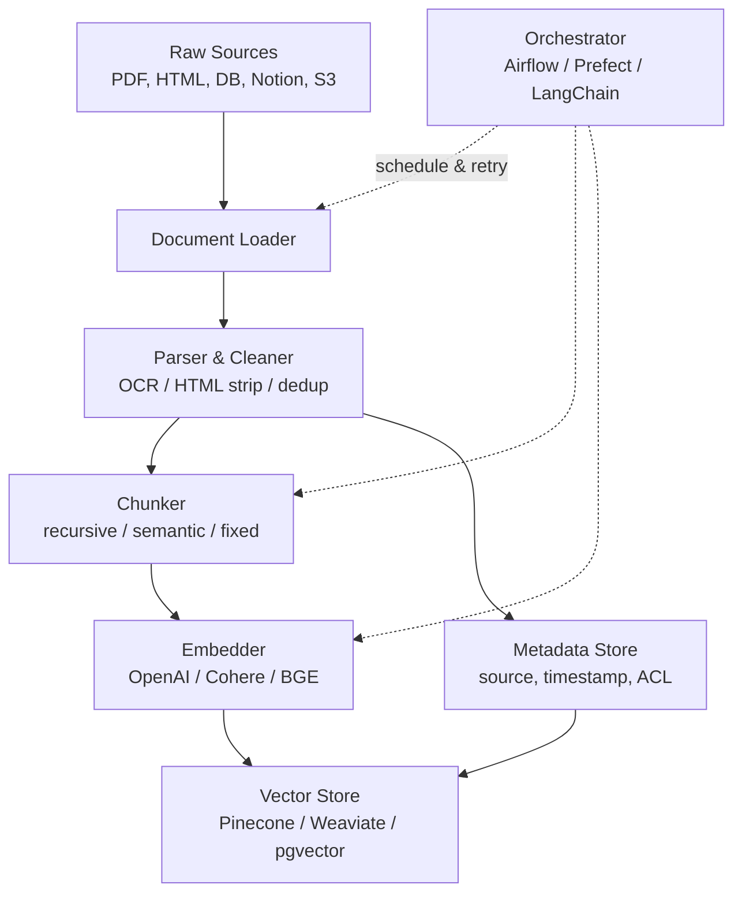
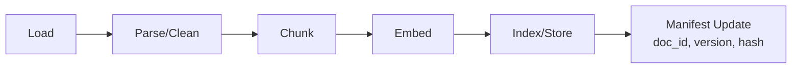

# RAG Ingestion Overview

> 본 노트는 RAG ingestion 파이프라인의 5단계 구조·핵심 원칙·anti-pattern을 개관한다. 개별 단계의 심화 내용은 단계별 노트 참조. 프레임워크 선정 기준은 [[rag-framework-comparison]] 참조.

## 핵심 요약

RAG(Retrieval-Augmented Generation) 시스템에서 외부 지식 소스를 검색 가능한 vector index 형태로 변환·적재하는 **offline 입력 파이프라인 단계**다. Document Loader → Chunking → Embedding → Vector Store 순서로 진행되며, retrieval 품질의 1차 결정 요인이다.

- **Offline 단계**: 사용자 query와 무관하게 사전 처리됨. Query-time retrieval/generation과 명확히 분리
- **GIGO 원칙 강함**: retriever는 noise와 signal을 구분하지 못하므로 ingestion 품질이 곧 시스템 품질
- **Chunking 전략 의존**: chunk size·overlap·split 방식이 recall/precision 분포를 결정 — 예외 없이 조용히 품질이 떨어지는 특성
- **Freshness 책임**: 원본 문서 변경/삭제 시 vector index 동기화를 ingestion layer가 담당(doc_id + version 분리, 이전 버전 비활성화)

## 시스템 아키텍처

Source connector → parser/cleaner → chunker → embedder → vector store 어댑터의 5개 컴포넌트와 메타데이터 store가 병렬로 연결된 구조다.

## 처리 흐름

Raw document에서 query-ready vector index에 도달하기까지의 5단계 처리 흐름이다.

1. **Load**: source connector가 원본을 stream 또는 batch로 fetch
2. **Parse/Clean**: 포맷별 텍스트 추출(PDF OCR, HTML tag strip, 표 보존), encoding 정규화, dedup
3. **Chunk**: 토큰 한도와 semantic 경계 사이의 trade-off를 적용해 분할(보통 400~1,000 tokens + 10~20% overlap)
4. **Embed**: 각 chunk를 dense vector로 변환. 메타데이터(source, section, timestamp)는 별도 필드로 부착
5. **Index/Store**: vector + metadata를 vector DB에 upsert. doc_id/version으로 idempotency 보장

## 핵심 기능 및 서비스

| 기능 | 설명 |
|---|---|
| Document Loaders | PDF·Word·HTML·Markdown·DB row·SaaS(Notion, Confluence) 등 포맷별 connector. LlamaHub 160+ connector |
| Text Splitters / Chunkers | Fixed-size, Recursive Character, Semantic, Parent-Document 등 전략 선택. [[rag-chunk-metadata-extraction]] 참조 |
| Embedding Models | text-embedding-3-large(OpenAI), Cohere Embed v3, BGE, E5 등. 선정 기준은 [[rag-embedding-model-selection]] 참조 |
| Vector Stores | Pinecone, Weaviate, Qdrant, Milvus, pgvector — HNSW/IVF 등 ANN index. 비교는 [[vector-store-decision-matrix]] 참조 |
| Metadata Filtering | source·tag·timestamp·ACL을 vector와 함께 저장해 filtered retrieval 지원 |
| Hybrid Index | BM25 sparse index를 vector와 병행 적재해 keyword + semantic 결합 검색 |
| Incremental Sync | doc_id + version + content hash로 변경분만 re-embed. 상세는 [[embedding-incremental-cdc-ingestion]] 참조 |

## 유사 기술 비교

| 항목 | RAG Data Ingestion | Traditional ETL (Airbyte/Fivetran) | Search Indexing (Elasticsearch) |
|---|---|---|---|
| Output | Dense vector + metadata | Structured tables (row/column) | Inverted index (term → docs) |
| Primary use | Semantic similarity search | Analytics / BI / Data warehouse | Keyword full-text search |
| 장점 | 의미 기반 검색, LLM 직접 연결 | 검증된 connector 생태계, 트랜잭션 일관성 | 빠른 keyword 매칭, 성숙한 도구 |
| 단점 | Chunk 손실, 임베딩 비용, freshness 어려움 | 비정형 텍스트에 부적합 | 동의어·의미 매칭 약함 |
| 적합 케이스 | LLM 컨텍스트 주입용 지식베이스 | 정형 데이터 분석/리포팅 | 정확한 용어 검색 |

## 실제 사례

### LlamaIndex IngestionPipeline (오픈소스 표준)
LlamaIndex는 ingestion을 1급 시민으로 다루며 `IngestionPipeline` 추상화를 제공한다. LlamaHub 160+ connector로 PDF/Notion/DB row를 통합 처리하고, transformation chain(metadata extractor → chunker → embedder)을 선언적으로 구성한다. 프레임워크 비교는 [[rag-framework-comparison]] 참조.

### Unstructured.io (Parsing 특화)
PDF·Word·이메일 등 비정형 문서의 parsing 단계만 전문화한 서비스. 표·이미지·heading 구조를 보존하면서 chunk-ready 텍스트로 변환해 ingestion 파이프라인의 "parse" 단계 품질을 끌어올린다.

## 활용 시나리오

### 시나리오 1: 사내 위키 기반 Q&A 봇
Notion/Confluence connector로 일 1회 incremental sync → recursive chunking(500 tokens, overlap 50) → text-embedding-3-large → Pinecone. ACL 메타데이터로 부서별 filtered retrieval. ACL 설계는 [[rag-policy-filter]] 참조.

### 시나리오 2: API 레퍼런스 versioning
doc_id + version 분리 저장, 각 버전을 metadata field로 보존. Query 시 `version=latest` filter. 구버전은 즉시 삭제하지 않고 `active=false`로 soft-deprecate. lifecycle 관리는 [[rag-vector-index-lifecycle]] 참조.

### 시나리오 3: 법률·의료 등 정확도 critical 도메인
Semantic chunking + parent-document retrieval(작은 chunk로 검색하되 retrieval 시 부모 section 반환), section heading·page number를 메타데이터로 부착해 citation에 활용.

## 장단점 및 트레이드오프

| 항목 | 내용 |
|---|---|
| 장점 | LLM에 도메인 지식 주입 가능(fine-tuning 없이 최신/사내 데이터 활용). Citation 가능. Update 비용 저렴(re-train 대신 re-embed) |
| 단점 | Chunk 단위로 컨텍스트 손실. Embedding API/compute 비용 누적. 데이터 변경 시 freshness 관리 복잡. Garbage-in 시 retriever가 noise를 signal로 오인 |
| 트레이드오프 | **Chunk 크기**: 작으면 precision↑·recall↓, 크면 반대. **Semantic vs Recursive chunking**: 정확도 ↑ but embedding 비용·latency ↑. **Sync 주기**: 실시간 CDC는 freshness↑ but 인프라 복잡도↑ |

## 함정 및 안티패턴

- **안티패턴 1: 단일 chunk size 고정** → 도메인별·문서 유형별 최적 size가 다른데 한 값으로 통일 → 도메인별 evaluation으로 size·overlap을 결정하고 문서 유형별로 다른 splitter 적용.
- **안티패턴 2: 메타데이터 누락한 채 vector만 저장** → filtered retrieval/citation 불가, 버전 구분 불능 → source·timestamp·section·doc_id·version·ACL을 vector 저장 시점에 함께 upsert.
- **안티패턴 3: BM25 등 sparse index를 함께 두지 않음** → 제품명·인명·코드 토큰 같은 정확 매칭 query에서 누락 → hybrid search(vector + BM25) 기본 채택. [[hybrid-search-optimization]] 참조.
- **안티패턴 4: Full re-index만 운영** → 데이터 증가 시 비용·시간 폭증, freshness 지연 → content hash 기반 incremental update + doc_id versioning.
- **안티패턴 5: Parsing 단계를 가볍게 처리** → 표·heading·코드 블록이 망가져 retriever가 의미를 잃음 → 비정형 문서는 Unstructured.io 같은 전문 parser로 구조 보존.
- **안티패턴 6: Ingestion 품질을 측정하지 않음** → chunking·embedding 변경의 영향이 invisible → golden Q&A set으로 P@K, Recall@K, MRR을 정기 측정. [[retrieval-quality-metrics]] 참조.

## 참고 자료

- [RAG Pipeline Deep Dive: Ingestion, Chunking, Embedding, and Vector Search (DEV)](https://dev.to/derrickryangiggs/rag-pipeline-deep-dive-ingestion-chunking-embedding-and-vector-search-2877) — ingestion 4단계 구조
- [Best Chunking Strategies for RAG Pipelines (Redis)](https://redis.io/blog/chunking-strategy-rag-pipelines/) — chunking 비교
- [Common Challenges in RAG and How to Solve Them in Production (Unstructured)](https://unstructured.io/insights/rag-pipeline-challenges-from-data-ingestion-to-retrieval) — 실패 모드와 해결책
- [RAG Anti-Patterns: 7 Failure Modes Engineering Guide 2026](https://www.digitalapplied.com/blog/rag-anti-patterns-7-failure-modes-2026-engineering-guide) — production RAG 7가지 anti-pattern
- [How to Build a RAG Pipeline from Scratch in 2026 (kapa.ai)](https://www.kapa.ai/blog/how-to-build-a-rag-pipeline-from-scratch-in-2026) — 2026년 기준 파이프라인 구축 가이드

## 관련 노트

- [[rag-document-loading]] — ingestion 1단계: 포맷별 파서·레이아웃 보존·element 정규화
- [[rag-preprocessing-cleaning]] — 2단계: normalize·boilerplate strip·quality filter·PII redact·dedup
- [[rag-chunk-metadata-extraction]] — chunk 메타 부착 5단계 + schema-first filter 설계
- [[rag-embedding-generation]] — 4단계: 대규모 배치 임베딩 처리량·지연·비용 튜닝
- [[rag-vector-index-lifecycle]] — 5단계: blue-green namespace·alias swap·schema versioning으로 무중단 reindex
- [[rag-ingestion-production-ops]] — DLQ·span tracing·cost attribution 운영 평면
- [[rag-framework-comparison]] — LlamaIndex/LangChain/Haystack/DSPy 프레임워크 선정 기준
