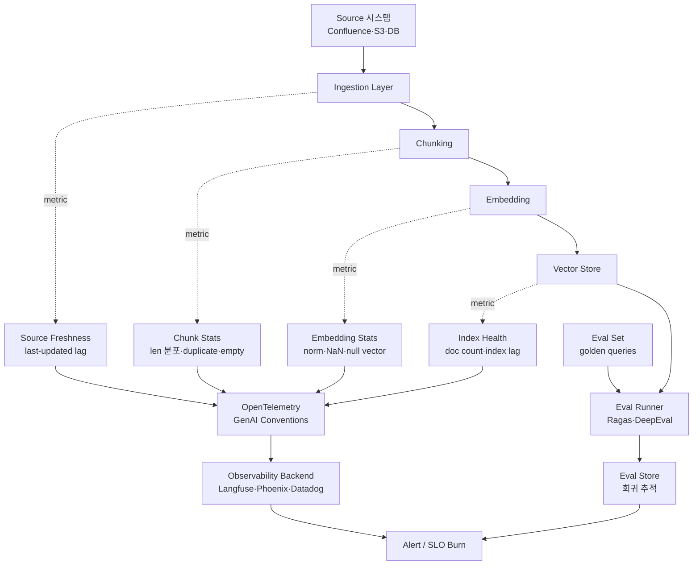
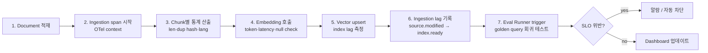

# RAG Ingestion Quality & Monitoring

> 본 노트는 **ingestion-side 품질 신호**(chunk·embedding·source freshness·drift)에 집중한다. DLQ·span tracing·cost attribution 같은 운영 평면은 [[rag-ingestion-production-ops]] 참조.

## 핵심 요약

Ingestion 직후의 품질 및 모니터링은 적재된 chunk·embedding·index가 검색 단계에서 **재현 가능한 신뢰도**를 갖추도록 보장하는 관측 체계다. Generation-side eval(Ragas·DeepEval)만으로는 "0.95 faithfulness인데 답이 틀린" 상황을 설명할 수 없어, ingestion-side에서 chunk quality·source freshness·embedding drift를 독립적으로 추적해야 한다.

- **이중 신호 추적**: ingestion 신호(chunk 분포·duplicate 비율·freshness lag)와 retrieval 신호(recall@k·MRR·nDCG)를 분리 측정. 회귀 발생 위치를 파이프라인 레이어로 분해.
- **Eval ≠ Monitoring**: Ragas·DeepEval은 inference-time 출력 측정. ingestion 품질은 chunk-level 통계와 source provenance로 별도 채널에서 본다.
- **Drift 3종**: data drift(원본 분포 변화) / embedding drift(모델 버전·재학습 영향) / retrieval drift(질의 분포 변화). 셋을 분리해야 원인 추적 가능.
- **Freshness SLO**: ingestion lag (source 변경 → 인덱스 반영 지연)는 사용자 noticed staleness의 직접 원인. p95·p99로 SLI 정의 권장.

> **버전 민감 항목**: OpenTelemetry GenAI Semantic Conventions는 2026-06 기준 experimental. 표준 attribute 명세는 변동 가능 — OTel spec 최신 버전 확인.

## 시스템 아키텍처

품질·모니터링 파이프라인은 ingestion pipeline의 각 단계에서 telemetry를 흘리고, 별도 evaluation store와 observability backend에서 집계한다.

## 처리 흐름

신규 문서 1건이 적재된 후 품질 신호가 알람까지 도달하는 흐름.

## 핵심 기능 및 서비스

| 기능 | 설명 |
|---|---|
| Ingestion lag SLI | source `last_modified` → index `ready_at` 시간 차. p95·p99 추적 |
| Chunk quality metric | 길이 분포(p50/p95), duplicate rate(SimHash·MinHash), empty/whitespace 비율 |
| Embedding integrity | NaN/Inf 검출, L2 norm 분포(이상 vector 탐지), 모델 버전 태깅 |
| Embedding drift | 새 batch의 centroid 이동(이전 N일 대비 cosine distance), KS-test 분포 비교 |
| Source provenance | chunk → 원본 doc·section·offset 역추적. faithfulness 회귀 시 원인 식별 |
| Eval set (golden) | 50–200 질문 + 기대 chunk·답변. 매 ingestion 후 회귀 |
| Ragas | reference-free LLM-judge 메트릭(faithfulness, context precision, recall), synthetic test set 생성 |
| DeepEval | Pytest 통합, CI/CD quality gate, 메트릭 카탈로그 + custom metric |
| TruLens | feedback function + OpenTelemetry tracing. monitoring 통합 강점 |
| Langfuse / Phoenix | RAG trace 단위 observability. session·user·chunk attribution |
| OTel GenAI Conventions | LLM trace attribute·event 표준(experimental, 2026 기준). vendor-neutral telemetry |
| 80-point audit | ingestion·chunking·embedding·retrieval·grounding·observability 6레이어 점검표 |

## 유사 기술 비교

| 항목 | Ragas | DeepEval | TruLens | Langfuse |
|---|---|---|---|---|
| 위치 | offline/CI eval | CI/CD gate | runtime feedback + trace | trace observability |
| ground truth | 불필요 (LLM-judge) | 옵션 | feedback function | 옵션 |
| Ingestion 신호 | 간접 (context precision) | 간접 (RAGAS metric 재사용) | retrieval node feedback | chunk metadata에 의존 |
| 강점 | synthetic test set, 가벼움 | Pytest CI 통합, 메트릭 풍부 | OTel trace + eval 결합 | UI·session 단위 분석 |
| 약점 | 메트릭 수 적음 | runtime monitoring 약함 | 학습 곡선 | eval 직접 실행 X (외부 의존) |

## 실제 사례

### Anthropic (Contextual Retrieval, 2024)
Chunk에 LLM 기반 context summary 부착 후, retrieval failure rate를 약 49% 감소(BM25+embedding 조합 기준)시켰다. 평가 셋 회귀 추적을 통해 chunk 단위 품질 개선이 ingestion 변경의 핵심 KPI임을 입증.

### LlamaIndex / Anyscale workshop pipeline
Ingestion 단계에서 chunk size 256/512/1024를 A/B로 색인 후 동일 eval set으로 비교. 1024가 context precision은 높지만 noise 증가로 faithfulness 하락 — chunk size 결정은 한 축이 아닌 멀티 메트릭 trade-off임을 보임.

## 활용 시나리오

### 시나리오 1: 신규 source 추가 시 회귀 게이트
새 Confluence space를 색인하면 CI에서 DeepEval Pytest suite 실행. faithfulness·context precision 임계값(예: 0.85) 미달 시 인덱스 promotion 차단. 원본 분포가 기존과 다른지 chunk 길이 분포 KS-test로 동시 검사.

### 시나리오 2: Embedding 모델 교체 마이그레이션
Titan v2 → Cohere v3 교체 시, 동일 코퍼스를 양쪽으로 색인한 dual-index 상태에서 동일 eval set으로 비교. retrieval recall@10·MRR·평균 latency·월 비용을 동시 dashboard에. 합격 시 그림자 트래픽 → cutover. 마이그레이션 실행 패턴은 [[rag-vector-index-lifecycle]] 참조.

### 시나리오 3: 운영 중 staleness 알람
source 변경 → 인덱스 반영 lag p95가 SLO(예: 1h) 초과 시 PagerDuty. 동시에 freshness-sensitive 쿼리(`최신`·`오늘`·`이번 분기`)에 대한 검색 결과의 source 날짜 분포를 모니터링해 사용자 영향 추정.

## 장단점 및 트레이드오프

| 항목 | 내용 |
|---|---|
| 장점 | 회귀 원인을 ingestion/retrieval/generation 레이어로 분해해 MTTR 단축. 자동 회귀 게이트로 무결한 reindex 보장 |
| 단점 | Eval set 구축·유지 비용 큼(domain expert 시간). LLM-judge 메트릭은 judge 모델 의존성·비용 |
| 트레이드오프 | 측정 빈도 ↑ → 신뢰도 ↑이나 비용·복잡도 ↑. golden set 정기 갱신 안 하면 metric overfit |

## 함정 및 안티패턴

- **안티패턴 1**: generation-side eval(faithfulness만) → ingestion-side stale data 미탐지 → ingestion lag·freshness 별도 SLI 추가.
- **안티패턴 2**: eval set을 한 번 만들고 동결 → 운영 distribution 변화 미반영(metric overfit) → 분기마다 production query 샘플로 보강.
- **안티패턴 3**: chunk·embedding 변경 후 전체 reindex 없이 부분 갱신 → 모델·버전 mixed index → 모든 vector에 `model_version` 메타 부착 + 일관성 검증. 의미공간 비호환은 [[embedding-model-lock-in]] 참조.
- **안티패턴 4**: alert를 ingestion error에만 거는 것 → silent quality regression(에러 없는데 recall만 하락) 누락 → SLO burn 기반 알람으로 전환.

## 참고 자료

- [RAG Evaluation: Metrics, Frameworks & Testing (2026)](https://blog.premai.io/rag-evaluation-metrics-frameworks-testing-2026/) — 4대 메트릭과 프레임워크 비교
- [RAG System Audit: An 80-Point Quality Scorecard 2026](https://www.digitalapplied.com/blog/rag-system-audit-80-point-quality-scorecard-2026) — 6레이어 80개 점검 포인트
- [RAG Monitoring Tools Benchmark in 2026](https://research.aimultiple.com/rag-monitoring/) — 도구별 latency·기능 비교
- [RAGAS, TruLens, DeepEval: LLM Evaluation Frameworks (2026)](https://atlan.com/know/llm-evaluation-frameworks-compared/) — 프레임워크 trade-off
- [RAG evaluation | Anyscale Docs](https://docs.anyscale.com/rag/evaluation) — 실제 파이프라인 evaluation 예시
- [Mastering RAG Evaluation: Best Practices & Tools for 2026](https://orq.ai/blog/rag-evaluation) — 메트릭 분류 및 운영 가이드

## 관련 노트

- [[rag-ingestion-production-ops]] — DLQ·span tracing·cost attribution 운영 평면 (운영 ↔ 품질의 상호 보완)
- [[rag-vector-index-lifecycle]] — eval 회귀 게이트를 blue-green cutover 통과 조건으로 활용
- [[rag-chunk-metadata-extraction]] — `model_version` / `chunker_version` 메타가 drift 추적의 토대
- [[embedding-model-lock-in]] — 모델 교체 시 의미공간 비호환과 drift 측정의 본질적 한계
- [[rag-guardrail]] — faithfulness 메트릭이 contextual grounding 임계값 설정의 근거
- [[rag-pii-handling]] — PII 마스킹이 retrieval 정확도에 미치는 영향 별도 측정 필요
- [[rag-multi-turn-session]] — session별 retrieval recall 추적으로 rewriter 품질 측정
- [[rag-policy-filter]] — ACL metadata filter 추가 시 ANN recall 감소를 eval set으로 검증
