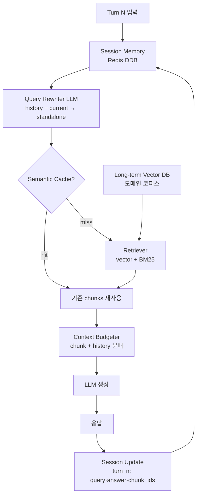
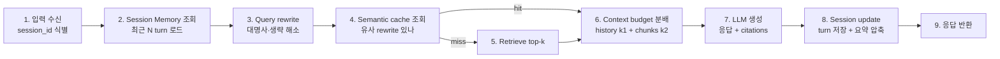

# Conversational RAG: Multi-turn Session Handling

## 핵심 요약

Multi-turn 세션 처리는 동일 세션 내에서 사용자 자연어 유입이 여러 번 발생할 때, **이전 turn의 맥락(주제·대명사·생략된 주어·이전 검색 결과)을 다음 turn의 retrieval에 반영**하는 시스템이다. Naive RAG는 매 turn 독립 검색이므로 "그거 가격은?" 같은 follow-up에서 retrieve가 무너진다. 핵심 기법은 conversation history를 활용한 query rewriting(decontextualization), session memory 4계층(immediate / working / session / long-term), 그리고 ingestion 단계에서 색인된 chunk를 효율적으로 재참조하는 캐시 전략이다. production에서 후속 메시지의 **60% 이상이 미해소 대명사·암묵적 맥락**을 포함한다는 보고.

- **Query Rewriting (decontextualization)**: 직전 N turn + 현재 질의 → standalone query로 재작성 후 retrieval. 가장 가성비 높은 단일 개선.
- **Memory 4계층**: immediate(system + current query) / working(retrieved chunks) / session(history in Redis·DDB) / long-term(vector DB). 각각 다른 저장소·TTL.
- **History 활용 모드**: rewrite-only / history-as-context / dynamic 재구성(DH-RAG). retrieval 정확도 vs 비용 trade-off.
- **Context window 수식**: `Available = ModelLimit − (System + Query + ExpectedOutput)`. 남은 예산을 retrieved chunks와 history에 분배하는 정책 필수.

> **버전 민감 항목**: NVIDIA RAG Blueprint의 `CONVERSATION_HISTORY` 권장값(3-5), DH-RAG·SemEval 2026 평가 방법론 등 시점 의존 정보는 각 공식 docs와 latest paper 재확인.

## 시스템 아키텍처

multi-turn RAG는 단일 retrieve 호출에 conversation memory store, query rewriter, optional semantic cache가 추가된다.

## 처리 흐름

Turn N(예: 3번째 질의)이 처리되는 순서.

## 핵심 기능 및 서비스

| 기능 | 설명 |
|---|---|
| Query rewriter | 대명사 해소("그거"→"X"), topic 보존, intent 유지. LLM 추가 호출(50–300ms) |
| Session memory store | Redis(빠른 R/W) + DynamoDB(영속). key = `session_id`, value = turn 리스트 |
| History compression | turn 누적 → token 초과. 오래된 turn은 LLM 요약·entity 추출로 압축 |
| Working memory | 직전 turn의 retrieved chunks. 같은 주제 후속에서 재사용 가능 |
| Semantic cache | 의미적으로 유사한 rewritten query에 대해 retrieval·response 재사용. Redis-vector·GPTCache |
| Conversation turn 개수 | `CONVERSATION_HISTORY=3–5` 권장. 너무 길면 token + noise, 너무 짧으면 맥락 단절 |
| Context window budgeter | `Model_Limit − (Prompt + Query + ExpectedOutput)` 잔여를 chunk와 history에 분배 |
| Session policy/PII 인계 | 직전 turn의 권한·PII 마스킹 상태를 다음 turn에도 일관 유지 |
| Topic shift 감지 | 새 turn의 embedding이 이전 turn과 cosine distance 큼 → history clear 또는 새 thread |

## 유사 기술 비교

| 항목 | Rewrite-only | History-as-Context | DH-RAG (dynamic) | Semantic Cache 결합 |
|---|---|---|---|---|
| 동작 | history 요약 → standalone query | history를 LLM 입력에 그대로 | history-aware query 재구성 + 동적 갱신 | rewrite + 결과 캐시 |
| Retrieval 호출 | 매 turn 1회 | 매 turn 1회 | 매 turn 1회 (재구성 추가) | cache hit 시 0회 |
| 정확도 | 중–상 | 중 (긴 history 시 약화) | 상 (실험적) | 캐시 hit에 의존 |
| 비용 | LLM rewrite 1회 추가 | 추가 토큰 크게 증가 | rewrite + 재구성 LLM | 캐시 hit 시 절감 |
| 적합 케이스 | production default | history 짧고 단순 | 연구·복잡 대화 | 동일 주제 반복 follow-up |

## 실제 사례

### NVIDIA RAG Blueprint — multi-turn 설정
공식 blueprint에서 `CONVERSATION_HISTORY` 환경변수(>0)로 활성화. 권장 3–5 turn. 내부적으로 query reformulation 단계가 추가되며 retrieval은 reformulated query 기반. 가이드 문서에서 이 단계 없이는 follow-up 질문 정확도가 급락한다고 명시.

### DH-RAG (arXiv 2502.13847)
History-Learning Query Reconstruction + Dynamic History Updating 모듈. 단순 rewrite보다 multi-turn 정답률 개선. 다만 매 turn 추가 LLM 호출 비용 발생. production에서는 핵심 도메인 챗봇 일부 채택.

## 활용 시나리오

### 시나리오 1: 사내 위키 챗봇 follow-up
첫 질문 "Bedrock guardrails란?" → 다음 질문 "그거 PII는 어떻게 처리해?". rewrite가 "그거" → "Bedrock guardrails" 해소 후 PII 관련 chunk 재검색. session memory에 직전 turn `topic: bedrock-guardrails` 저장.

### 시나리오 2: 동일 주제 반복 follow-up — semantic cache 활용
사용자가 같은 문서를 5번 다른 각도로 질문. 의미적으로 유사한 rewrite는 Redis-vector cache에서 retrieval 결과 재사용. retrieval latency·embedding 비용 모두 절감.

### 시나리오 3: Topic shift 감지로 session reset
사용자가 "Bedrock guardrails" 대화 중 갑자기 "회의실 예약 방법은?" 질문. topic embedding distance > 임계값 → history clear 또는 새 thread 분기. 무관한 history가 다음 retrieval을 오염시키는 것 방지.

## 장단점 및 트레이드오프

| 항목 | 내용 |
|---|---|
| 장점 | follow-up 정확도 대폭 개선. session 단위 일관성·UX 개선. 캐시 통한 비용 절감 가능 |
| 단점 | rewrite 추가 LLM 호출로 latency·비용 ↑. session memory store 운영 부담. 잘못된 rewrite가 검색을 망칠 위험 |
| 트레이드오프 | history 길이 ↑ → 맥락 ↑·noise·token ↑. cache TTL ↑ → 비용 절감·stale 위험. rewrite 모델 큼 → 정확도 ↑·latency ↑ |

## 함정 및 안티패턴

- **안티패턴 1**: 매 turn 독립 검색(no rewrite) → 대명사·생략 follow-up 실패 → query rewriter 도입.
- **안티패턴 2**: 전체 history를 매 turn LLM 컨텍스트에 raw 삽입 → token 폭발·noise → 요약·entity 압축.
- **안티패턴 3**: session memory에 retrieved chunk·rewritten query 안 저장 → 디버깅 불가 → turn 단위로 전부 기록. monitoring은 [[rag-ingestion-quality-monitoring]] 참조.
- **안티패턴 4**: cache key를 raw query로 → 같은 의미 다른 표현 hit 안 됨 → rewritten query의 embedding 기반 semantic key.
- **안티패턴 5**: topic shift 무시 → 무관 history가 다음 검색 오염 → embedding distance·LLM-judge로 shift 감지 후 reset.
- **안티패턴 6**: 직전 turn의 권한(tenant·role)·PII 마스킹 상태 미인계 → 후속 turn에서 정책 위반 가능 → session metadata에 권한·PII context 영속화. ACL 일반론은 [[rag-policy-filter]] 참조.

## 참고 자료

- [RAG Query Rewriting: 4 Layers That Fix Multi-Turn Retrieval | Alhena](https://alhena.ai/blog/query-rewriting-before-retrieval-multi-turn-rag/) — 60%+ follow-up이 미해소 맥락 보고
- [Multi-Turn Conversation Support for NVIDIA RAG Blueprint](https://docs.nvidia.com/rag/2.4.0/multiturn.html) — `CONVERSATION_HISTORY` 운영 가이드
- [Conversational RAG Systems: Building Multi-Turn Dialogue with Document Retrieval](https://zenvanriel.com/ai-engineer-blog/conversational-rag-systems/) — 메모리 계층 설계
- [DH-RAG: A Dynamic Historical Context-Powered RAG Method for Multi-Turn Dialogue (arXiv)](https://arxiv.org/pdf/2502.13847) — 동적 history 재구성 연구
- [Memory Systems for Conversational RAG | Elegant Software](https://www.elegantsoftwaresolutions.com/blog/building-rag-systems-memory) — 4계층 메모리 아키텍처
- [How to Build a Production-Ready RAG with LangChain's Memory Management](https://ragaboutit.com/how-to-build-a-production-ready-rag-system-with-langchains-new-memory-management-solving-context-window-limitations/) — context window 분배 패턴
- [AILS-NTUA at SemEval-2026 Task 8: Evaluating Multi-Turn RAG Conversations](https://arxiv.org/html/2603.10524) — multi-turn 평가 방법론

## 관련 노트

- [[rag-policy-filter]] — session metadata에 tenant·role context 영속화 필요
- [[rag-guardrail]] — input/retrieval/output rail이 rewrite·history에도 적용되어야 함
- [[rag-pii-handling]] — 세션 내 PII context 영속화 — 직전 turn 마스킹 상태를 다음 turn에 인계
- [[rag-ingestion-quality-monitoring]] — session별 retrieval recall 추적으로 rewriter 품질 측정
- [[hybrid-search-optimization]] — rewritten query를 BM25+vector hybrid retrieval에 통합하는 패턴
