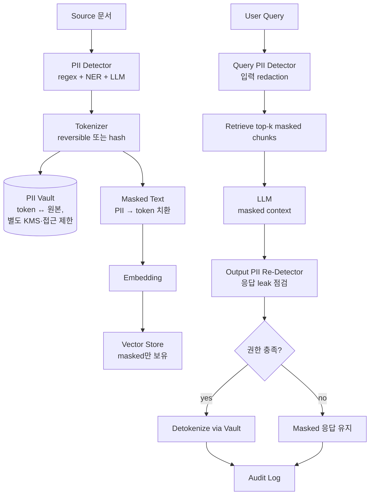
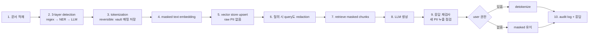

# RAG PII Handling

## 핵심 요약

RAG에서 PII 처리는 **ingestion · retrieval · generation 3단계에 일관된 detection·masking·audit 정책**을 부착하는 일이다. 가장 흔한 오해는 "embedding은 인간이 읽을 수 없으니 안전하다" — 실제로 embedding inversion attack으로 원문 복원이 가능함이 학술적으로 입증되어 있어, raw PII가 vector store에 들어가는 순간 leakage 표면이 된다. 올바른 패턴은 ingestion 직전에 reversible tokenization으로 PII를 마스킹한 텍스트를 embedding하고, 토큰화된 원본은 별도의 권한 분리된 vault에 저장하는 것이다. 2026년 표준은 3-layer detection(regex+checksum / NER / LLM-judge), DPDPA·GDPR·HIPAA·PCI-DSS 규제 팩, 그리고 retrieval·response 모든 이벤트의 audit 의무화로 정리된다.

- **Embedding ≠ 안전**: inversion attack으로 원문 부분 복원 가능. raw PII는 절대 embedding 입력에 들어가면 안 됨.
- **Reversible tokenization**: 의미 보존(`John Doe` → `<PERSON_001>`) 후 별도 vault에 매핑 저장. 권한 있는 사용자에게만 응답 시 역치환.
- **3-layer detection**: (1) regex+checksum(SSN·카드), (2) DeBERTa·Presidio NER(이름·주소), (3) LLM-judge(맥락적 민감정보). 각각 false positive/negative 보완.
- **Audit 의무**: 모든 retrieval·response에 user·query·chunk·redaction 상태 로그. GDPR DSAR, HIPAA breach notification 필수 요건.

## 시스템 아키텍처

PII handling은 ingestion 직전 redaction → vector store(masked만 보유) → retrieval → 응답 직전 역치환(권한 시) 구조로 분리된다.

## 처리 흐름

Source 문서 1건이 PII 안전성을 유지하며 끝까지 흐르는 순서.

## 핵심 기능 및 서비스

| 기능 | 설명 |
|---|---|
| Detection — regex/checksum | SSN, 신용카드(Luhn), 전화번호, 이메일. 빠르고 결정론적 |
| Detection — NER | Presidio(MS), spaCy, DeBERTa. 이름·주소·기관 같은 자유형 entity |
| Detection — LLM-judge | 맥락적 민감정보(의료·금융 sentence). 비용↑·정확도↑ |
| Reversible tokenization | 의미 보존, vault 매핑 필요. 예: `<PERSON_001>` |
| Format-preserving encryption | 형식 유지하며 암호화(예: 신용카드 번호 동일 길이). 일부 처리 호환 |
| Salted hash / deterministic HMAC | irreversible. group-by·join 가능하나 복호 불가 |
| PII Vault | token ↔ 원본 매핑 저장소. KMS 키 분리, RBAC 엄격 |
| Query-side redaction | 사용자 질의에도 PII 검출 → 로그·응답·검색에 raw 미포함 |
| Output post-check | LLM이 history나 chunk 조합으로 새로 누출하는지 응답에 다시 detector 적용 |
| Audit log | `user, query, redaction_events, returned_chunk_ids, detokenized_fields, regulation_tag` |
| Regulatory pack | GDPR(EU), HIPAA(미국 의료), DPDPA(인도), PCI-DSS(카드). 각각 엔티티·보존 요건 다름 |
| Encryption at rest | vector DB 암호화. 2026 권장(미적용 시 noncompliant 사례 다수) |

## 유사 기술 비교

| 항목 | Presidio | AWS Comprehend PII | Bedrock Guardrails Sensitive Info | Snowflake AI_REDACT |
|---|---|---|---|---|
| 형태 | OSS 라이브러리 | AWS API | Bedrock 정책 | Snowflake SQL 함수 |
| 검출 방식 | NER + regex + custom | 매니지드 NER | 빌트인 PII + 정규식 | LLM 기반 |
| Tokenization | 외부 vault 필요 | 외부 vault 필요 | BLOCK / ANONYMIZE 마스킹 | 인라인 마스킹 |
| RAG 통합 | LlamaIndex 어댑터 | Lambda·SDK 통합 | Bedrock 호출에 attach | DW 내부 |
| 운영 부담 | self-host | 매니지드 | 매니지드 | DW 자체 |
| 적합 케이스 | 풀 커스텀·온프레미스 | AWS 중심·간단 | Bedrock 사용 중 | DW에서 ingestion |

## 실제 사례

### AWS — Bedrock Knowledge Bases + Comprehend PII redaction (공식 패턴)
AWS 공식 블로그(2024)는 ingestion 람다에서 Comprehend PII 검출 → 마스킹 → S3 저장 → Bedrock KB 색인의 reference pattern을 제시. Bedrock Guardrails는 query·response 측 PII anonymize를 추가 layer로 운영.

### Elastic + LlamaIndex + Presidio
Elastic 공식 블로그에서 LlamaIndex `PIINodePostprocessor`로 retrieved chunks의 PII를 LLM 입력 전에 마스킹하는 패턴 시연. ingestion에서 누락된 PII가 retrieval-time에 한 번 더 걸러지는 defense in depth.

## 활용 시나리오

### 시나리오 1: 의료 챗봇 — HIPAA 준수
환자 진료 노트 RAG. ingestion에서 Presidio NER + 의료 LLM-judge로 환자식별정보 검출 → `<PHI_xxx>` 치환 후 embedding. 의사 사용자(권한)만 vault detokenize. 모든 retrieval·detokenize 이벤트는 7년 audit retention(HIPAA breach notification 준수).

### 시나리오 2: 금융 고객 응대 RAG — PCI-DSS
신용카드 번호는 Luhn checksum + regex로 즉시 검출 → format-preserving encryption. 마지막 4자리만 응답에 노출, 나머지는 마스킹. vector store에는 카드번호 원본 일체 없음.

### 시나리오 3: 다국가 SaaS — 규제 팩 라우팅
EU tenant는 GDPR pack(엄격한 detection + 30일 retention), 인도 tenant는 DPDPA pack, 미국은 HIPAA(의료) / 일반. ingestion 파이프라인이 tenant region에 따라 다른 detector 정책·retention TTL 적용. tenant 격리는 [[rag-policy-filter]] 참조.

## 장단점 및 트레이드오프

| 항목 | 내용 |
|---|---|
| 장점 | inversion attack 표면 제거. compliance 증빙(audit log). 권한별 detokenize로 UX 보존 |
| 단점 | 3-layer detection 계산 비용↑(LLM-judge 특히). vault 운영(키 관리·고가용성) 별도 시스템. PII 마스킹이 retrieval 정확도 일부 저하 |
| 트레이드오프 | reversible(편의·유출 위험) vs irreversible(안전·이용 제한). detection 임계값 ↑ → false positive로 의미 손상 / ↓ → leakage 위험 |

## 함정 및 안티패턴

- **안티패턴 1**: raw PII를 그대로 embedding → inversion attack 노출. → ingestion 직전 redaction 필수.
- **안티패턴 2**: vector store만 보호하고 PII vault는 동일 권한 → vault 자체가 단일 실패점. → vault에 별도 KMS + 별도 RBAC + 접근 알람.
- **안티패턴 3**: regex만으로 PII 검출 → 이름·주소·non-format 데이터 누락. → NER + 맥락 LLM-judge 병행.
- **안티패턴 4**: ingestion에서만 redact, query·response 측 누락 → 사용자가 PII 포함 질의 시 system prompt나 로그에 leak. → query·response 모두 detector 통과.
- **안티패턴 5**: detokenize를 응답 후처리에서 모두에게 적용 → 권한 없는 사용자에게도 원문 노출. → 권한 검증 후에만 vault 호출.
- **안티패턴 6**: audit log에 raw PII를 그대로 기록 → log 자체가 PII 저장소. → log에는 token만 기록, 원문은 vault에만.
- **안티패턴 7**: 규제별 retention 정책 미반영 → "삭제 요청"이 vector store에 반영 안 됨(right to be forgotten 위반). → tenant·document 단위 deletion API 필수.
- **안티패턴 8**: 모델·embedding 교체 시 ingestion 정책 버전 불일치 → 일부 chunk masked, 일부 raw. → `pii_policy_version` 메타와 reindex 절차.

## 참고 자료

- [Protect sensitive data in RAG applications with Amazon Bedrock | AWS](https://aws.amazon.com/blogs/machine-learning/protect-sensitive-data-in-rag-applications-with-amazon-bedrock/) — AWS 공식 reference pattern
- [PII Detector for RAG: Presidio Masking Guide | LlamaIndex](https://www.llamaindex.ai/blog/pii-detector-hacking-privacy-in-rag) — LlamaIndex PIINodePostprocessor
- [RAG: How to protect sensitive and PII info with Elasticsearch & LlamaIndex | Elastic](https://www.elastic.co/search-labs/blog/rag-security-masking-pii) — retrieval-time 마스킹
- [How RAG System Embeddings Silently Expose Your Sensitive Data | Protecto](https://www.protecto.ai/blog/how-rag-systems-sliently-expose-pii/) — embedding inversion attack
- [PII Redaction Pipeline for LLM Workloads (2026) | AppScale](https://appscale.blog/en/blog/pii-redaction-pipeline-llm-presidio-ner-reversible-tokenisation-2026) — 3-layer detection + 4 tokenization tiers
- [The complete guide to PII detection and redaction tools for AI pipelines in regulated industries | Prediction Guard](https://predictionguard.com/blog/pii-detection-redaction-llm-pipelines-regulated-industries) — 규제별 도구·요건
- [Privacy-Aware RAG: How to Stop Sensitive Data Leaks in AI (2026 Guide)](https://brics-econ.org/privacy-aware-rag-how-to-stop-sensitive-data-leaks-in-ai-2026-guide) — defense-in-depth 가이드

## 관련 노트

- [[rag-guardrail]] — output guardrail에서 PII 재검사(defense in depth). PII 마스킹은 output rail의 사전 조건
- [[rag-policy-filter]] — 권한에 따른 detokenize 분기는 policy filter와 연동. tenant 격리 정책 공유
- [[rag-multi-turn-session]] — 세션 내 PII context 영속화 — 직전 turn 마스킹 상태를 다음 turn에 인계
- [[rag-ingestion-quality-monitoring]] — PII 마스킹이 retrieval 정확도에 미치는 영향 별도 측정 필요
