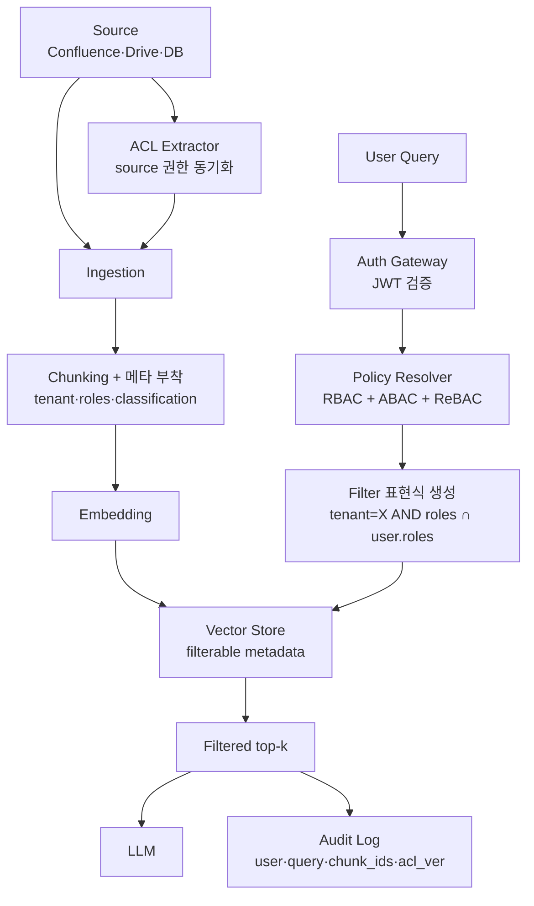
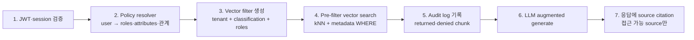

# RAG Policy Filter

## 핵심 요약

RAG policy filter는 사용자가 **볼 권한이 없는 chunk를 retrieval 단계에서 원천 차단**하는 권한 enforcement 레이어다. 핵심 원칙은 "vector search → ACL post-filter" 순서가 아닌 "ACL pre-filter → vector search" 순서여야 한다는 것 — 후자만이 top-k가 모두 차단된 결과 0건이 되는 사일런트 실패를 막을 수 있고, 무엇보다 cross-tenant exposure 자체를 원천 차단한다. Ingestion 단계에서 모든 chunk에 access metadata(tenant, role, classification, source ACL)를 부착하는 것이 전제 조건이며, 운영 중에는 ACL 변경의 즉시 반영(propagation lag)이 별도 SLI다.

- **Pre-filter 원칙**: vector query에 ACL metadata filter를 결합. post-filter는 cross-tenant leakage 위험과 top-k 부족 문제 동시 발생.
- **Ingestion에서 메타 부착**: `tenant_id`, `allowed_roles`, `classification`, `source_acl_version`을 chunk 단위에 기록. source 권한 변경 시 reindex/upsert.
- **모델 다양성**: RBAC(베이스라인) + ABAC(속성 기반 동적 검사) + ReBAC(그래프 관계) 조합이 2026 enterprise 표준. 단일 모델로 부족한 경우가 많음.
- **Guardrail과 분리**: guardrail은 콘텐츠 안전성(toxicity·hallucination), policy filter는 접근 권한. 두 layer를 한 도구로 합치면 정책 표현이 모호해짐.

## 시스템 아키텍처

권한 메타데이터는 ingestion에서 채워지고, retrieval에서 vector filter로 결합되며, 모든 조회는 audit log로 남는다.

## 처리 흐름

질의 1건이 권한 평가를 거쳐 결과를 받는 순서.

## 핵심 기능 및 서비스

| 기능 | 설명 |
|---|---|
| Pre-filter metadata search | vector index가 metadata WHERE를 native 지원(pgvector RLS, Milvus partition, Pinecone filter, OpenSearch knn + filter) |
| ACL extractor | source(Confluence space ACL, Drive sharing, SharePoint group)에서 권한 동기화. 주기/이벤트 기반 |
| Tenant isolation | (a) 단일 인덱스 + 강제 `tenant_id` filter, (b) tenant당 별도 인덱스/namespace, (c) tenant당 별도 collection |
| Policy resolver | OPA·Cerbos·Casbin 등 외부 PDP로 분리. RBAC/ABAC/ReBAC 표현 |
| Row-Level Security | pgvector + Postgres RLS, Milvus bitmap RBAC. DB engine에 권한 enforcement 위임 |
| ACL propagation | source 권한 변경 → 인덱스 메타 갱신 lag SLI. CDC 또는 webhook 기반 |
| Audit log | `user_id, query_hash, returned_chunk_ids, denied_chunk_ids, acl_version` 필수 |
| Classification labels | `public`/`internal`/`confidential`/`restricted` 등 라벨로 다층 정책 |

## 유사 기술 비교

| 항목 | 단일 인덱스 + metadata filter | Tenant별 별도 index | DB-level RLS (pgvector) | 외부 PDP (Cerbos·OPA) |
|---|---|---|---|---|
| 격리 강도 | 중 (코드 실수 위험) | 강 (물리 격리) | 강 (DB enforcement) | 강 (정책 분리) |
| 비용 | 낮음 | 인덱스 수 비례 ↑ | 중 | PDP 호출 latency |
| 다대다 tenant 적합 | ◎ | △ (인덱스 폭발) | ◎ | ◎ |
| ABAC/ReBAC 표현 | △ (filter 한계) | △ | ◯ | ◎ |
| 적합 케이스 | SaaS 다수 tenant, 메타 단순 | 대형 tenant 소수·계약상 격리 요구 | Postgres 중심 stack | 복잡 정책·여러 시스템 공유 |

## 실제 사례

### Amazon Bedrock Knowledge Bases — multi-tenant metadata filtering
단일 KB에 모든 tenant 문서를 색인하고, 각 query에 `tenant_id` metadata filter를 강제 결합. AWS 권장 패턴(2024). 인덱스 폭발 방지하지만 application 계층에서 filter 누락 시 cross-tenant leakage 위험 — gateway에서 filter 자동 주입 필수.

### Databricks Mosaic AI Vector Search — ACL + metadata filtering
Vector Search index에 source의 ACL(Unity Catalog grants)을 메타로 부착하고, 모든 검색 호출에 user identity를 전달해 자동으로 ACL aware filter 적용. application 코드의 filter 실수 가능성을 platform-level로 차단.

## 활용 시나리오

### 시나리오 1: 사내 위키 RAG — 부서별 격리
HR·Finance·Engineering 공간별로 viewer/editor role. ingestion 시 Confluence space ACL을 chunk metadata에 그대로 복제. 사용자 토큰의 group claim을 retrieval filter로 변환(`allowed_groups ∩ user.groups != empty`). 부서 이동 시 source ACL 변경 → CDC가 1h 내 metadata 갱신.

### 시나리오 2: SaaS multi-tenant 챗봇
단일 vector collection, 모든 chunk에 `tenant_id`. API Gateway가 JWT에서 tenant 추출 → vector query에 강제 주입. 추가로 OPA가 plan(`free`/`pro`/`enterprise`)별 chunk classification 접근 권한 평가(ABAC).

### 시나리오 3: 분류 라벨 기반 다층 정책
문서 라벨(`public`/`confidential`/`restricted`). user clearance level(0–3). retrieval filter: `classification.level <= user.clearance`. 추가로 restricted chunk는 응답에 citation을 raw 텍스트가 아닌 doc ID로만 노출.

## 장단점 및 트레이드오프

| 항목 | 내용 |
|---|---|
| 장점 | 보안 boundary가 retrieval에 박혀 application 계층 실수 영향 최소. audit log로 회수·증명 가능 |
| 단점 | metadata filter가 추가되면 ANN 인덱스의 recall 감소(post-filter ANN의 일반 trade-off). 정책 변경 propagation lag 운영 |
| 트레이드오프 | 격리 강도 ↑(별도 index) → 비용·운영 ↑. 정책 표현력 ↑(외부 PDP) → latency 추가. classification 세분화 ↑ → ingestion 메타 비용 ↑ |

## 함정 및 안티패턴

- **안티패턴 1**: post-filter ACL (검색 후 권한 확인) → cross-tenant exposure + top-k 부족(권한 없는 chunk가 결과를 잠식). → pre-filter로 전환.
- **안티패턴 2**: ingestion 시점에 ACL 기록하고 source 권한 변경 시 인덱스 업데이트 누락 → stale permission. → source CDC 또는 webhook 연동.
- **안티패턴 3**: application 코드가 filter를 매 호출 직접 작성 → 누락 가능. → gateway·SDK가 user context에서 filter 자동 주입.
- **안티패턴 4**: policy filter와 guardrail을 한 도구에 욱여넣기 → 정책 의미 모호. → 권한(policy filter)과 콘텐츠 안전(guardrail) layer 분리.
- **안티패턴 5**: audit log에 query 텍스트는 기록하면서 returned chunk ID 누락 → 사후 추적 불가. → `returned/denied chunk_ids` + `acl_version` 의무화.
- **안티패턴 6**: classification 라벨이 source에는 있지만 chunk 단위로 안 내려가는 경우 → 일부 chunk가 무라벨로 누락. → 모든 chunk default classification 강제(`unknown` → restricted 취급).

## 참고 자료

- [Permission-Aware Retrieval: Why Access Control in Enterprise RAG Must Live in the Vector Layer](https://tianpan.co/blog/2026-05-04-permission-aware-retrieval-enterprise-rag-access-control) — vector layer 원칙
- [Secure RAG: Authorisation-Aware Retrieval and Row-Level Security](https://photokheecher.medium.com/secure-rag-authorisation-aware-retrieval-and-row-level-security-c6542500ec21) — RLS·RBAC·ABAC 구현
- [Document-Level RBAC for RAG Pipelines: 2026 Enterprise Architecture Guide | Truto](https://truto.one/blog/how-to-maintain-document-level-rbac-in-enterprise-rag-pipelines/) — 문서·청크 단위 RBAC
- [Multi-tenancy in RAG with Bedrock Knowledge Base metadata filtering | AWS](https://aws.amazon.com/blogs/machine-learning/multi-tenancy-in-rag-applications-in-a-single-amazon-bedrock-knowledge-base-with-metadata-filtering/) — 단일 KB 다중 tenant
- [Mastering RAG Chatbot Security: ACL and Metadata Filtering with Mosaic AI](https://community.databricks.com/t5/technical-blog/mastering-rag-chatbot-security-acl-and-metadata-filtering-with/ba-p/101946) — Unity Catalog ACL 통합
- [Secure RAG: Implement LLM Access Control With Cerbos](https://www.cerbos.dev/blog/access-control-for-rag-llms) — 외부 PDP 패턴
- [Design a Secure Multitenant RAG Inferencing Solution | Microsoft Learn](https://learn.microsoft.com/en-us/azure/architecture/ai-ml/guide/secure-multitenant-rag) — Azure 다중 tenant reference architecture

## 관련 노트

- [[rag-guardrail]] — 접근 권한(본 노트)과 콘텐츠 안전(guardrail) layer 분리 원칙
- [[rag-pii-handling]] — PII vault RBAC가 policy filter의 detokenize 권한과 연동
- [[rag-multi-turn-session]] — session metadata에 tenant·role context 영속화 필요
- [[recall-vs-filter-tradeoff]] — pre-filter metadata search에서 ANN recall이 감소하는 원리
- [[vector-store-decision-matrix]] — native metadata filter 지원 수준이 policy 설계를 좌우
