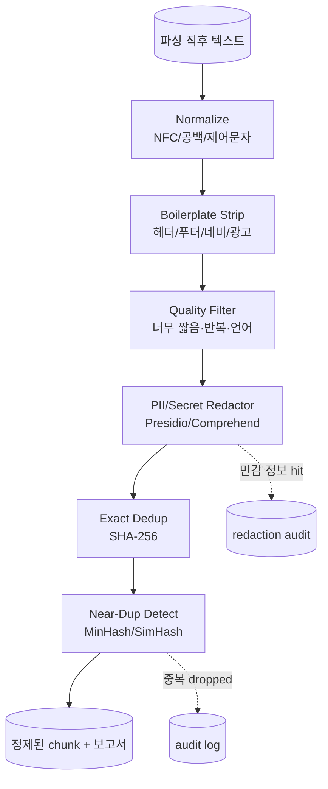
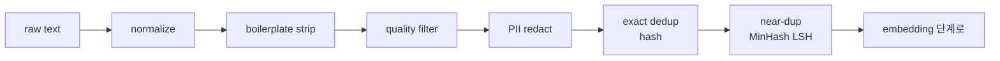

# RAG Preprocessing & Cleaning

## 핵심 요약

Preprocessing은 parsing 직후·chunking 직전에 텍스트를 **정규화·탈민감화·중복제거**하는 단계다. 부재 시 retrieval은 boilerplate·중복·노이즈를 ranking 상위로 끌어올리고, LLM 답변에 PII가 유출되며, 인덱스 크기는 30~70% 부풀려진다. RAG에서 가장 저비용으로 품질·비용·보안을 동시 개선하는 레버다.

- **3대 축**: cleaning(노이즈 제거) / dedup(중복 제거) / redaction(PII·secret 제거)
- **중복은 정확도와 비용 모두를 갉아먹음**: near-duplicate가 retrieval top-k를 점령하면 컨텍스트 다양성 손실
- **정규화는 검색·임베딩 안정성의 기반**: NFC/공백/대소문자/제로폭문자 처리 누락 시 동일 쿼리가 다른 결과 반환
- **PII redaction은 ingestion에서만 가능**: vector에 임베딩된 후엔 추출 불가, 사후 삭제 비싸고 부정확

## 시스템 아키텍처

전형적인 preprocessing 파이프라인은 **Normalize → Boilerplate Strip → Language/Quality Filter → PII Redactor → Dedup (exact + near)** 5단계. 각 단계는 멱등이어야 retry 안전.

## 처리 흐름

raw 텍스트를 NFC 정규화 → 보일러플레이트·저품질 필터 → PII 마스킹 → exact/near dedup 순으로 통과시키며, 모든 drop 결정은 audit log에 기록한다.

## 핵심 기능 및 서비스

| 기능/도구 | 설명 |
|---|---|
| Unicode NFC + ftfy | 정규화/깨진 인코딩 복구 (smart quotes, mojibake) |
| Trafilatura / Readability | HTML 본문 추출 (광고·네비 제거) |
| jusText / dragnet | 보일러플레이트 제거 휴리스틱 |
| Microsoft Presidio | PII 탐지·익명화 (이름/카드/SSN/이메일 등) |
| AWS Comprehend PII | 관리형 PII 탐지, 한국어 지원 |
| Google DLP | 관리형 PII + 의료/금융 infoType |
| TruffleHog / detect-secrets | 코드·문서 내 secret 탐지 |
| datasketch (MinHash/LSH) | near-duplicate 탐지 표준 라이브러리 |
| simhash-py | SimHash 기반 유사 문서 탐지 |
| Apache Spark / Beam | 대규모 dedup pipeline 분산 처리 |
| fastText langid / lingua-py | 언어 식별로 quality filter |
| dolma (AI2) / datatrove (HF) | 대규모 LLM 학습용 cleaning 파이프라인 (RAG에 재활용 가능) |

## 유사 기술 비교

| 항목 | Exact dedup (SHA-256) | MinHash + LSH | SimHash | Semantic dedup (embedding) |
|---|---|---|---|---|
| 특징 | byte-identical 제거 | Jaccard 유사도 근사 | Hamming distance 기반 | embedding cosine 유사 |
| 장점 | O(1), 결정적 | 대규모 친화, Jaccard 정확 근사 | 64bit 단일 hash로 빠름 | 의미 중복 잡음 |
| 단점 | 한 글자만 달라도 miss | shingle 크기 튜닝 | 짧은 텍스트 정확도 낮음 | 비용·임베딩 의존 |
| 적합 케이스 | 동일 파일 mirror | 웹 코퍼스 near-dup | 짧은 텍스트·실시간 | 의미 중복 (paraphrase) |

## 실제 사례

### Common Crawl / CCNet
CommonCrawl 기반 LLM 학습 데이터는 MinHash + LSH로 near-duplicate를 50%+ 제거하는 것이 표준. RAG ingestion도 동일 코퍼스 사용 시 같은 dedup 단계가 필요. Meta의 CCNet 파이프라인이 reference.

### Allen AI - Dolma
AI2가 공개한 Dolma 파이프라인은 boilerplate 제거·언어 필터·PII 마스킹·dedup의 표준 구현으로 공개됨. RAG ingestion에 그대로 재사용 가능한 오픈소스.

### Microsoft - Copilot Enterprise PII handling
Microsoft Copilot은 Graph 데이터 ingestion 시 Presidio 기반 PII detection을 단계 1로 두고, 탐지된 fields는 IDs로 마스킹 후 embedding하는 것을 공개. 인덱스에 raw PII 미보존.

## 활용 시나리오

### 시나리오 1: 사내 wiki + 메일 ingestion에서 PII 차단
- **맥락**: 사내 wiki(Confluence) + 메일 아카이브, 주민번호·카드번호·고객명 산재
- **선택**: Presidio (다국어 + custom recognizer) + 한국어 주민번호 regex
- **적용**: ingestion 단에서 PII 탐지 → `<NAME>` / `<RRN>` 토큰으로 치환, redaction map은 audit DB에만, 임베딩되는 텍스트엔 절대 raw PII 없음

### 시나리오 2: 웹 크롤 데이터 near-duplicate 제거
- **맥락**: 외부 웹 크롤 5000만 페이지, 미러·번역·재게시 다수
- **선택**: MinHash + LSH (shingle=5, bands=20, rows=5)
- **적용**: Spark로 분산 LSH, 클러스터 내 longest/canonical 1개만 보존, 약 60% 데이터 감소 → 임베딩 비용 60% 절감

### 시나리오 3: 동일 문서 재게시 boilerplate 제거
- **맥락**: 사내 정책 문서가 매 페이지 푸터에 "Confidential - 회사명" 반복
- **선택**: Trafilatura + 페이지간 공통 라인 검출 휴리스틱
- **적용**: 동일 문서군에서 N% 이상 페이지 공통 라인은 boilerplate로 자동 분류·제거, retrieval 노이즈 감소

## 장단점 및 트레이드오프

| 항목 | 내용 |
|---|---|
| 장점 | 인덱스 크기 30~70% 감소, retrieval 다양성 향상, PII 사고 차단, 비용 절감 |
| 단점 | preprocessing 자체 CPU·메모리 비용, false positive 시 정보 손실, 정규화 차이로 incremental sync 시 ID 불일치 |
| 트레이드오프 | **정확도 vs 보수성**(공격적 dedup은 의도된 중복까지 삭제), **PII recall vs precision**(과탐지로 답변 품질 저하), **결정성 vs 적응성**(휴리스틱 vs LLM cleaner) |

## 함정 및 안티패턴

- **안티패턴 1**: dedup을 chunking 후에 수행 → chunk 경계 차이로 동일 문장이 다른 hash → exact dedup 효과 거의 없음 → **대안**: 문서/문단 단위 dedup을 chunking 전에 수행. chunking 일반론은 [[chunking-strategy-methodology]] 참조.
- **안티패턴 2**: PII redaction을 retrieval 단에서만 수행 → 이미 임베딩에 PII 정보 leak → **대안**: 항상 ingestion 단에서 redact, 임베딩되는 텍스트엔 PII 없음.
- **안티패턴 3**: 정규화 누락 → 같은 단어가 NFC/NFD/제로폭 등으로 다른 vector → retrieval 분산 → **대안**: pipeline 최초 단계에 Unicode NFC + ftfy 강제, lowercase는 도메인에 따라 결정.
- **안티패턴 4**: near-dup 임계값 너무 공격적(Jaccard 0.5) → 의도된 변형(번역·다국어판)까지 제거 → **대안**: 임계값 sweep + 도메인별 튜닝, language pair 보존.
- **안티패턴 5**: PII 마스킹 후 원본 미보관 → 사고 시 추적 불가 → **대안**: 원본은 별도 encrypted store에 보관(redaction map), ACL 강화.
- **안티패턴 6**: cleaning 결과 비결정적(LLM 사용) → 같은 입력이 다른 출력 → reproducibility 0 → **대안**: 결정적 단계 위주, LLM cleaner는 temperature=0 + 결과 caching.
- **안티패턴 7**: dedup audit log 없음 → 어떤 데이터가 왜 dropped됐는지 불명 → **대안**: drop 결정은 항상 (rule, doc_id, hash, reason) 기록.

## 참고 자료

- [Microsoft Presidio](https://microsoft.github.io/presidio/) - 오픈소스 PII 탐지·익명화
- [AWS Comprehend - PII Detection](https://docs.aws.amazon.com/comprehend/latest/dg/how-pii.html) - 관리형 PII 탐지 (한국어 지원)
- [datasketch - MinHash LSH](http://ekzhu.com/datasketch/lsh.html) - near-duplicate 표준 라이브러리
- [Trafilatura](https://trafilatura.readthedocs.io/) - HTML 본문 추출 / boilerplate 제거
- [Allen AI - Dolma](https://github.com/allenai/dolma) - 오픈소스 cleaning pipeline 레퍼런스
- [HuggingFace - datatrove](https://github.com/huggingface/datatrove) - 대규모 텍스트 처리 프레임워크
- [TruffleHog](https://github.com/trufflesecurity/trufflehog) - secret/credential 탐지
- [CCNet (Meta)](https://github.com/facebookresearch/cc_net) - 웹 코퍼스 cleaning 레퍼런스

## 출처 fleeting

- `fl-2026-06-02-rag-ingestion-preprocessing-cleaning` (cluster: `rag-ingestion`, 2026-06-06 promote)

## 관련 노트

- [[rag-vector-index-lifecycle]] — sibling: cleaning 정책 변경 → chunk hash 변동 → blue-green reindex
- [[rag-chunk-metadata-extraction]] — sibling: cleaning 이후 chunk에 metadata 부착
- [[rag-deletion-propagation]] — sibling: PII redaction과 GDPR 삭제 의무의 결합
- [[rag-multi-modal-ingestion]] — sibling: modality별 cleaning 정책 (caption·transcript 별도)
- [[rag-document-loading]] — parser 출력이 본 cleaning 단의 입력
- [[chunking-strategy-methodology]] — cleaning 직후 chunking 전략 선택
