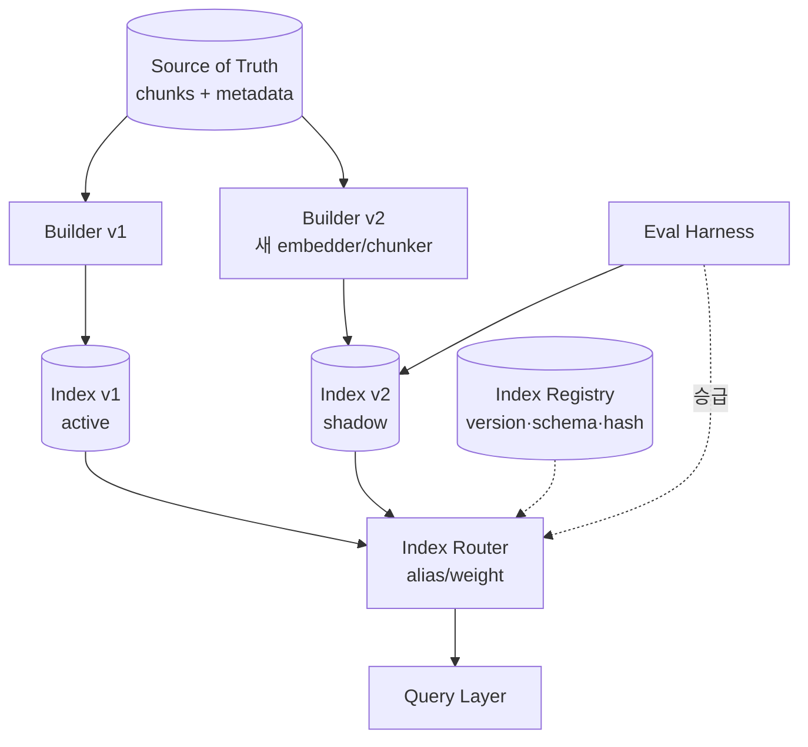
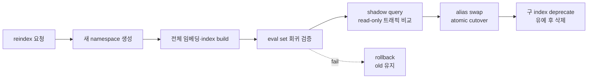

# RAG Vector Index Lifecycle

> 본 노트는 vector DB 비교·인덱스 파라미터 튜닝이 아닌 **인덱스 생명주기·마이그레이션·버전 관리** 관점에 초점을 둔다. 인덱스 파라미터·검색 성능 통합 시각은 [[embedding-vector-index-coupling]] 참조.

## 핵심 요약

Vector index는 정적이지 않다. **임베딩 모델 업그레이드, chunking 정책 변경, schema 진화, 인덱스 알고리즘 교체**가 모두 인덱스 재구축을 강요한다. 운영 환경에서 무중단 reindex 전략 없이 RAG를 운영하면 매 변경이 다운타임 또는 품질 회귀를 동반한다.

- **임베딩 모델 변경 = 전체 reindex**: 차원/공간이 다르므로 vector 호환성 0, 부분 갱신 불가. 의미공간 비호환 자체는 [[embedding-model-lock-in]] 참조.
- **Blue-green 인덱스가 사실상 표준**: 별도 인덱스에 새 데이터 build → atomic alias swap → 구 인덱스 deprecate
- **인덱스에는 명시적 버전과 schema가 필요**: 어느 chunker·parser·embedder로 만들었는지 추적 필수
- **Cost of reindexing**: 임베딩 비용 + 저장 더블 + 인덱스 build CPU/메모리, 운영 캘린더 핵심 이벤트

## 시스템 아키텍처

Lifecycle 관리 시스템은 **Source of Truth Store → Index Builder → Index Registry → Router (alias) → Query Layer** 구조다. blue-green을 위해 Builder와 Registry가 분리되어야 한다.

## 처리 흐름

신규 인덱스 build 시 별도 namespace에 적재, eval harness로 품질 회귀 검증, 통과 시 alias 전환으로 무중단 cutover. 실패 시 alias rollback.

## 핵심 기능 및 서비스

| 기능 | 설명 |
|---|---|
| Namespace/collection 분리 | 동일 vector DB 내 v1/v2 격리 build (Pinecone namespace, Weaviate class, OpenSearch index) |
| Alias 전환 | 쿼리는 alias로 호출 → atomic switch로 다운타임 0 (OpenSearch alias, Pinecone collection rename) |
| Snapshot/restore | build 완료 후 snapshot 저장 → rollback 시 복원 시간 단축 |
| Schema versioning | metadata field 추가/변경 시 schema version 기록, 호환성 정책 명시 |
| Index registry | 어느 version이 어느 embedder/chunker/parser hash로 만들어졌는지 단일 진실 |
| Shadow query | 신규 인덱스에 read 트래픽 미러링 → live 비교 |
| Phased cutover | weighted routing으로 10/50/100% 단계 전환 |

## 유사 기술 비교

| 항목 | OpenSearch (k-NN) | Pinecone | Weaviate | pgvector |
|---|---|---|---|---|
| 특징 | alias 기반 인덱스 전환 native | namespace/collection 분리 | class/tenant 분리 | SQL 트랜잭션 친화 |
| 장점 | blue-green 무중단 표준 워크플로 | 관리형, 빠른 namespace 생성 | multi-tenant 격리 강함 | DB 트랜잭션과 동일 라이프사이클 |
| 단점 | 인덱스 capacity 사전 산정 필요 | 비용 단가 높음 | 자체 호스팅 복잡도 | 인덱스 size 한계, HNSW build 느림 |
| 적합 케이스 | 엔터프라이즈 자체 호스팅 + 잦은 reindex | 관리형 + 빠른 실험 | multi-tenant SaaS | OLTP 데이터와 동거 |

## 실제 사례

### Notion - Pinecone reindexing
Notion이 자사 RAG 업그레이드 시 Pinecone에 새 namespace를 만들어 전체 임베딩을 새 모델로 다시 적재한 후 alias 전환으로 무중단 cutover한 사례가 Pinecone 블로그에 소개됨. 구 namespace는 30일 유예 후 삭제.

### Elastic - Reindex API + alias 전환
Elasticsearch/OpenSearch는 기본 alias + reindex API가 vector workload에도 그대로 적용된다. 신규 인덱스에 reindex → `actions: [add, remove]` atomic alias swap → 구 인덱스 close. 운영 표준 패턴.

### Cohere - Embed v2 → v3 migration 가이드
Cohere는 v2 → v3 임베딩 마이그레이션 시 (1) v3 차원 별도 컬렉션 생성 (2) 청크 단위 정합성 비교 (3) 쿼리 트래픽 ramp 10→100% (4) v2 deprecate 가이드를 공식 제공. embedding 모델 교체의 표준 절차.

## 활용 시나리오

### 시나리오 1: 임베딩 모델 업그레이드 (text-embedding-3-small → large)
- **맥락**: 차원 1536 → 3072, 1000만 chunk
- **선택**: blue-green namespace
- **적용**: v2 namespace 생성, 전체 chunk를 large로 reembed (배치 API로 비용 절감), eval set으로 nDCG 비교 → +3% 확인 후 alias 전환, v1은 14일 유예

### 시나리오 2: chunking 정책 전체 변경
- **맥락**: fixed → contextual chunking 전환, 청크 boundary가 완전히 달라짐
- **선택**: 신규 schema version + 동일 vector DB 내 별도 collection
- **적용**: 청크 ID 충돌 방지 위해 `chunker_version` namespace prefix, 청크 hash 변경 → 전수 reembed → blue-green cutover, retrieval recall 회귀 없음 확인

### 시나리오 3: metadata schema 추가
- **맥락**: 기존 vector에 새 metadata field 추가 (e.g., `confidentiality`)
- **선택**: in-place backfill (가능 시) 또는 reindex
- **적용**: Pinecone update by ID로 incremental backfill, 신규 ingest는 새 schema로 직접 작성, 모든 vector에 field 존재 보장 후 query에서 filter 사용 시작

## 장단점 및 트레이드오프

| 항목 | 내용 |
|---|---|
| 장점 | 무중단 reindex 가능, rollback 안전, 품질 회귀 사전 차단, 변경의 추적 가능성 |
| 단점 | 빌드 중 저장·임베딩 비용 2배, 운영 절차 복잡, eval harness·shadow 인프라 필수 |
| 트레이드오프 | **속도 vs 안전**(즉시 swap vs phased rollout), **비용 vs 가용성**(blue-green 더블 비용), **자동화 vs 통제**(자동 cutover가 빠르지만 회귀 위험 큼) |

## 함정 및 안티패턴

- **안티패턴 1**: in-place upsert로 임베딩 모델 교체 → 일시적으로 v1/v2 vector 혼재, retrieval ranking 깨짐 → **대안**: 항상 별도 namespace에 build 후 alias 전환.
- **안티패턴 2**: index version 기록 없음 → 어느 vector가 어느 embedder/chunker로 만든 것인지 불명 → reproducibility 0 → **대안**: `index_registry` 테이블에 (parser_hash, chunker_config, embedder_id, model_version) 명시.
- **안티패턴 3**: source-of-truth chunk store 없이 vector DB가 유일 저장소 → reindex 시 원본 문서에서 처음부터 다시 ingest 필요, 시간/비용 폭증 → **대안**: chunk + metadata는 항상 S3/RDS에 보관, vector DB는 derived.
- **안티패턴 4**: cutover 시 eval set 없음 → 회귀를 prod 사용자가 발견 → **대안**: 100~500 golden QA + Recall@k/nDCG metric을 cutover 게이트로.
- **안티패턴 5**: 구 인덱스 즉시 삭제 → 회귀 발견 후 rollback 불가 → **대안**: 최소 7~30일 유예 후 삭제, 비용 acceptable.
- **안티패턴 6**: alias 전환 후 client cache 무효화 안 함 → 일부 클라이언트가 오래된 인덱스 직접 참조 → **대안**: 클라이언트는 항상 alias 사용, hardcoded index name 금지.
- **안티패턴 7**: 부분 reindex만 수행 (예: 신규 chunker로 변경분만) → boundary가 다른 v1/v2 chunk 공존, retrieval 결과 일관성 깨짐 → **대안**: chunker 변경은 항상 전체 reindex 트리거.

## 참고 자료

- [OpenSearch - Index Aliases](https://opensearch.org/docs/latest/api-reference/index-apis/alias/) - blue-green 패턴의 표준 메커니즘
- [Pinecone - Migrating to a New Embedding Model](https://docs.pinecone.io/guides/data/migrate-to-a-new-embedding-model) - 임베딩 마이그레이션 공식 가이드
- [Cohere - Migrating from v2 to v3](https://docs.cohere.com/docs/migration-v2-to-v3) - 모델 업그레이드 절차
- [Weaviate - Collections & Tenants](https://weaviate.io/developers/weaviate/manage-data/multi-tenancy) - tenant 분리 기반 lifecycle
- [pgvector - Index Build Tuning](https://github.com/pgvector/pgvector#index-tuning) - HNSW/IVFFlat build 가이드
- [Elasticsearch - Reindex API](https://www.elastic.co/guide/en/elasticsearch/reference/current/docs-reindex.html) - reindex + alias 패턴

## 출처 fleeting

- `fl-2026-06-02-rag-ingestion-vector-storage-indexing` (cluster: `rag-ingestion`, 2026-06-06 promote)

## 관련 노트

- [[rag-chunk-metadata-extraction]] — sibling: metadata schema 변경이 reindex 트리거가 되는 결합점
- [[rag-preprocessing-cleaning]] — sibling: cleaning 정책 변경 시 chunk hash 변동 → blue-green 대상
- [[rag-deletion-propagation]] — sibling: incremental 삭제와 reindex 시점의 일관성 조율
- [[rag-multi-modal-ingestion]] — sibling: modality별 인덱스 lifecycle 분리 운영
- [[embedding-model-lock-in]] — 모델 교체 비호환의 본질적 원인과 drift-adapter 대안
- [[embedding-vector-index-coupling]] — embedding × vector index 강한 결합도와 운영 패턴
- [[rag-embedding-generation]] — reindex 시점의 대규모 배치 임베딩 throughput 튜닝
