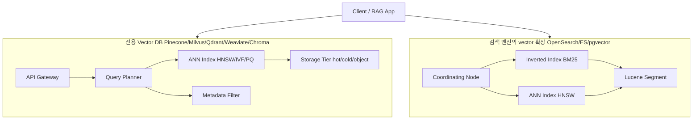
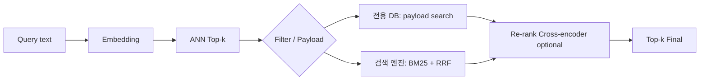

# Vector Database Comparison

## 핵심 요약

Vector DB는 ANN 인덱스(주로 HNSW)를 핵심 자산으로 하는 데이터 스토어로, 2024–2026 기간 동안 **전용 제품(Pinecone, Milvus, Qdrant, Weaviate, Chroma)** 과 **기존 검색 엔진의 vector 확장(OpenSearch, Elasticsearch, pgvector)** 두 흐름으로 양분됐다. 제품 선택은 단순 latency가 아니라 **운영 모델(managed vs self-host)·기존 스택 정합성·하이브리드 검색 필요 여부·비용 모델**의 조합으로 결정해야 한다.

- **운영 모델 축**: Pinecone(managed only), Qdrant/Milvus/Weaviate(open + cloud), Chroma(임베디드 친화), pgvector(Postgres 확장), OpenSearch/Elasticsearch(범용 검색 엔진의 vector 확장)
- **성능 축**: Milvus/Zilliz Cloud가 저지연 벤치마크 선두, Pinecone·Qdrant 근접. OpenSearch 3.0(2025-05)에서 vector engine 최대 9.5x 개선
- **기능 축**: 하이브리드 검색(BM25 + vector)·필터링·multi-tenant·페이로드 검색·full-text 결합 가능 여부가 갈림
- **비용 축**: 사용량 기반(Pinecone, Zilliz), 클러스터 인스턴스 기반(자체호스팅), Postgres 통합(pgvector) — RAG 트래픽 패턴에 맞는 모델 선택이 TCO 결정

자매 노트: OpenSearch 특화는 [[opensearch-knn-vector-search]], 아키텍처 설계 절차는 [[vector-search-architecture]], 운영(재인덱싱·모니터링)은 [[vector-search-operations]].

## 시스템 아키텍처

전용 vector DB는 ANN 인덱스를 storage layer의 1급 시민으로 두고, 메타데이터 필터·shard·replication·multi-tenant를 자체 컴포넌트로 노출한다. 검색 엔진 기반 제품은 기존 inverted index와 같은 노드에 ANN 인덱스를 공존시킨다.

## 처리 흐름

대표적인 쿼리 흐름은 query embedding → ANN top-k → 필터/페이로드/리랭킹. 검색 엔진 기반에선 BM25 retriever와 결합이 추가된다.

## 핵심 기능 및 서비스

| 기능 | 설명 |
|---|---|
| ANN 알고리즘 | HNSW(공통) / IVF·PQ(Milvus, Faiss) / DiskANN(Milvus, Qdrant 옵션) |
| Hybrid Search | OpenSearch/ES(RRF), Weaviate(BM25+vector), Qdrant(sparse+dense), pgvector(SQL JOIN) |
| Filter | Pinecone metadata filter, Qdrant payload filter, OpenSearch query DSL |
| Multi-tenancy | Pinecone namespace, Weaviate tenant 격리, Qdrant collection |
| Storage Tier | Pinecone serverless / Milvus storage 분리 / OpenSearch hot-warm-cold |
| Quantization | Milvus(IVF_PQ), OpenSearch(2x~32x), Qdrant(scalar/PQ/BQ) |
| 임베디드 모드 | Chroma in-process, pgvector Postgres 내장 |
| Managed 옵션 | Pinecone(only), Zilliz Cloud(Milvus), Weaviate Cloud, Qdrant Cloud, OpenSearch Service |

## 유사 기술 비교

| 항목 | Pinecone | Milvus / Zilliz | Qdrant | Weaviate | Chroma | OpenSearch k-NN | pgvector |
|---|---|---|---|---|---|---|---|
| 운영 모델 | Managed only | OSS + Zilliz Cloud | OSS + Cloud | OSS + Cloud | OSS, embedded | OSS + AWS Service | Postgres extension |
| 강점 | zero-ops, serverless | 초저지연 벤치마크 | payload filter 강력 | 모듈러(임베딩 자동) | 임베디드 단순 | lexical+vector 통합 | SQL 통합 |
| 약점 | 비용 빠르게 증가 | 운영 복잡 | managed 작음 | 멀티테넌트 한계 | 대규모 부적합 | 별도 vector DB 대비 운영 부담 | 대규모 ANN 한계 |
| Hybrid Search | 별도 sparse-dense | 가능 | sparse+dense | 내장 | 제한 | RRF 내장 | pg_search 등 결합 |
| 적합 케이스 | 빠른 PoC, zero-ops | 초고규모 production | 정교한 filter RAG | 모듈러 RAG | 로컬·노트북 | 기존 OpenSearch 사용처 | Postgres 일체 |

## 실제 사례

### Pinecone Serverless의 zero-ops 패턴
스타트업이 RAG PoC를 1주일 내 띄울 때 자주 선택. 인덱스 생성·shard 관리·노드 사이징을 모두 제거. 트래픽 증가 시 비용이 빠르게 증가해 매출 모델과 align 필요.

### Milvus / Zilliz Cloud의 초고규모
Zilliz의 자체 벤치마크와 third-party 비교에서 저지연 부문 선두. 10B+ vectors 규모에서도 HNSW + IVF_PQ 조합으로 운영. 대신 self-host는 etcd, Pulsar/Kafka, MinIO/S3 등 의존성 관리 필요.

### Postgres 일체 운영 (pgvector)
이미 Postgres 기반 SaaS가 새 RAG 기능을 추가할 때 별도 stack 없이 `CREATE EXTENSION vector;` 만으로 도입. JOIN으로 메타데이터·권한·트랜잭션을 일체화. 단점은 ANN 인덱스가 수억 vectors 규모에서 한계.

### OpenSearch k-NN의 클러스터 재사용
사내 로그 검색용 OpenSearch에 vector 인덱스를 추가해 RAG 기능을 같은 운영 인력·CI로 운영. 자세한 내용은 [[opensearch-knn-vector-search]].

## 활용 시나리오

### 시나리오 1: 빠른 PoC → 트래픽 검증 후 이관
초기에는 Pinecone serverless로 zero-ops PoC → 사용량 검증 후 비용 급증 임계점에서 Qdrant/Milvus self-host 또는 OpenSearch 통합으로 이관. 임베딩 모델·차원·metric을 PoC 시점에 동결해 두면 마이그레이션 비용 통제.

### 시나리오 2: SQL 일체형 SaaS RAG
이미 Postgres + Supabase/Neon을 쓰는 SaaS가 신규 RAG 기능 도입 → pgvector로 트랜잭션·권한·JOIN을 한곳에서 처리. 수억 vector 미만 규모에서 단순/일관성/저운영 비용이 압도적 장점.

### 시나리오 3: Hybrid Search 필수 (정확 식별자 + 시맨틱)
e-commerce·법률·의료처럼 정확 토큰 매칭(상품코드, 법령 번호)과 시맨틱 검색이 모두 필요 → OpenSearch k-NN(RRF) 또는 Weaviate(BM25+vector) 채택. 자세한 RRF 동작은 [[opensearch-knn-vector-search]].

## 장단점 및 트레이드오프

| 항목 | 내용 |
|---|---|
| 장점 | 워크로드 특성에 따라 zero-ops부터 self-host까지 스펙트럼 선택 가능. hybrid·filter·multi-tenant 등 RAG 부가 기능 차별화. |
| 단점 | 제품 간 마이그레이션 비용 큼(API·distance metric·필터 문법 상이). managed 제품은 비용 가시성/통제 어려움. |
| 트레이드오프 | Managed(빠른 도입, 비용↑) ↔ Self-host(운영↑, 비용 통제↑). 전용 DB(성능·기능↑) ↔ 검색 엔진(스택 단순↑). 임베디드(개발 단순) ↔ 분산(확장성↑). |

## 함정 및 안티패턴

- **안티패턴 1: 벤치마크 latency만 보고 선정** → 동일 워크로드/데이터 분포가 아니면 무의미 → 자사 데이터·필터·트래픽 패턴으로 PoC 측정
- **안티패턴 2: 마이그레이션 비용 무시한 managed 선택** → 트래픽 증가 후 비용 급증 + lock-in으로 이관 어려움 → 임베딩 모델·metric·필터 추상화 layer를 클라이언트에 두고 시작
- **안티패턴 3: pgvector로 10B vectors 운영 시도** → ANN 인덱스 빌드/메모리 한계 → 규모 초기부터 전용 DB 검토
- **안티패턴 4: 임베딩 모델 차이를 무시한 비교** → 768d vs 1536d vs 3072d는 메모리·latency·recall 모두 다름 → 비교 시 모델·차원·metric을 고정

## 참고 자료

- [Vector Database Comparison 2026 (Firecrawl)](https://www.firecrawl.dev/blog/best-vector-databases) — 최신 비교 가이드
- [Best Vector Databases 2026 (DataCamp)](https://www.datacamp.com/blog/the-top-5-vector-databases) — top-5 핵심 비교
- [Vector Database Comparison (Liquidmetal.ai)](https://liquidmetal.ai/casesAndBlogs/vector-comparison/) — Pinecone/Weaviate/Qdrant/FAISS/Milvus 비교
- [How to Choose the Right Vector Database (AltexSoft)](https://www.altexsoft.com/blog/vector-databases-compared/) — 선정 가이드
- [Choosing the Right Vector Database (Elisheba Anderson)](https://medium.com/@elisheba.t.anderson/choosing-the-right-vector-database-opensearch-vs-pinecone-vs-qdrant-vs-weaviate-vs-milvus-vs-037343926d7e) — OpenSearch 포함 종합 비교
- [Amazon OpenSearch vector capabilities](https://www.amazonaws.cn/en/blog-selection/amazon-opensearch-services-vector-database-capabilities-explained/) — OpenSearch vector 기능 공식

## 관련 노트

- [[vector-search-architecture]] — 설계 단계 결정 트리 (chunking·embedding·index·hybrid·rerank)
- [[vector-search-operations]] — 제품 채택 후 운영 패턴 (reindex·alias swap·monitoring)
- [[opensearch-knn-vector-search]] — OpenSearch k-NN 단일 클러스터 hybrid 운영 (특화)
- [[vector-store-decision-matrix]] — S3V·OSS·pgvector·Pinecone 4축 결정 매트릭스
- [[recall-vs-filter-tradeoff]] — ANN + 필터의 보편 한계 (제품별 노브 유무 영향)

## 출처 fleeting

- `fl-2026-06-02-vector-search-db-comparison.md`
