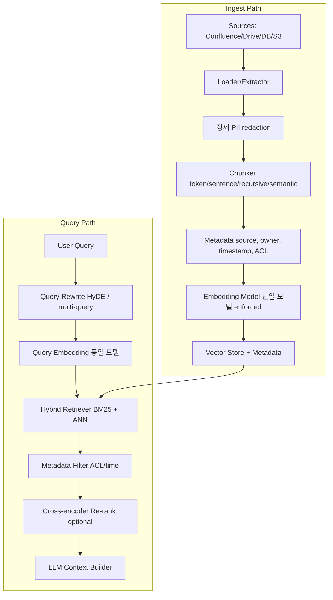
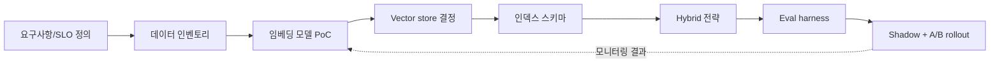

# Vector Search Architecture

## 핵심 요약

Vector 기반 검색·색인 아키텍처를 **설계**할 때 다루는 핵심 결정: ① 데이터 수집·청킹 전략 ② 임베딩 모델/차원/metric 선택 ③ vector store 선택과 인덱스 토폴로지 ④ 검색 시 query 변환·하이브리드·리랭킹 파이프라인. 운영 단계의 결정(재인덱싱·모니터링·트래픽 변동 대응)은 [[vector-search-operations]] 참조.

- **데이터 측 결정**: source(Confluence/Drive/DB) → 추출·정제 → chunking(고정 token / sentence / recursive / semantic) → 메타데이터 강화(권한·타임스탬프·소스)
- **임베딩 결정**: model(OpenAI / Cohere / Voyage / 자체 BERT) × 차원(384/768/1024/1536/3072) × distance(cosine / dot product / L2). 한 인덱스 내 단일 모델 강제
- **인덱스 토폴로지**: ANN 알고리즘(HNSW/IVF/PQ) × shard/replica × 양자화 × hot/warm tier. RAG 트래픽 패턴(쓰기 ↑/읽기 ↑) 따라 조합
- **검색 파이프라인**: query rewriting → embedding → hybrid retrieval(BM25 + vector RRF) → 메타데이터 필터 → cross-encoder re-ranker → LLM context 주입

자매 노트: OpenSearch 특화 구성은 [[opensearch-knn-vector-search]], 제품 선택은 [[vector-database-comparison]].

## 시스템 아키텍처

ingest 경로(좌측)는 데이터 소스 → 청킹·정제 → 임베딩 → vector store 적재. 검색 경로(우측)는 query → rewrite → embed → retrieve(hybrid) → filter → rerank → LLM context.

## 처리 흐름

1. **요구사항 수집**: 트래픽 패턴(QPS, doc 증가율), latency SLO, recall 목표, 권한·테넌트 모델, 비용 한도
2. **데이터 인벤토리**: source별 doc 크기·신선도·접근 권한·PII 여부 → chunking 정책 결정 근거
3. **임베딩 모델 선정**: 자사 도메인 retrieval eval suite로 모델·차원 비교. 한 번 결정하면 마이그레이션 비용 큼
4. **Vector store 결정**: 워크로드·기존 스택·운영 모델 매트릭스로 선정 → [[vector-database-comparison]]
5. **인덱스 스키마 설계**: vector field + 메타데이터 필드(권한/타임/소스/모델 버전) + 청크 텍스트 별도 보관
6. **하이브리드 전략 선택**: BM25 + vector RRF 기본. 도메인에 따라 sparse(SPLADE) + dense 또는 cross-encoder re-rank 추가
7. **eval harness 구축**: golden Q&A set + recall@k / nDCG / MRR 측정 자동화. 변경 전후 비교 가능 상태 확보
8. **점진적 rollout**: shadow index → A/B → 전체 트래픽

## 핵심 기능 및 서비스

| 결정 영역 | 옵션 | 선택 기준 |
|---|---|---|
| Chunking | fixed-token / sentence / recursive / semantic | 도메인 의미 단위, 평균 doc 길이, recall 영향 |
| Chunk overlap | 0–50 token overlap | context 잘림 완화 vs 인덱스 부피 증가 |
| Embedding model | OpenAI text-embedding-3 / Cohere embed-v3 / Voyage / 자체 모델 | 도메인 적합도, 차원, 비용, latency, 데이터 거버넌스 |
| Distance metric | cosine / dot / L2 | 학습 시 사용된 metric과 일치 |
| ANN 알고리즘 | HNSW / IVF+PQ / DiskANN | 규모, RAM 예산, recall 요구 |
| Hybrid Retrieval | BM25 + vector RRF, SPLADE+dense | lexical 정확 매칭 필요 여부 |
| Re-ranker | cross-encoder, LLM judge | top-k 품질 추가 ↑, latency cost |
| Metadata | source/owner/timestamp/ACL/model_version | 권한, 신선도 필터, 회수·rollback |
| Query rewrite | HyDE, multi-query, decomposition | 짧은 query 한계 극복 |

## 유사 기술 비교

| 항목 | BM25 only | Dense only | Hybrid (BM25 + Vector + RRF) | Hybrid + Cross-encoder |
|---|---|---|---|---|
| 정확 식별자 매칭 | 강함 | 약함 (78% recall@10) | 강함 (91% recall@10) | 강함 |
| 시맨틱 유사도 | 약함 | 강함 | 강함 | 가장 강함 |
| Latency | 낮음 | 중간 | 중간 | 높음 |
| 비용 | 낮음 | 중간 (모델 추론) | 중간 | 높음 (재추론) |
| 운영 복잡도 | 낮음 | 중간 | 중간 (RRF 내장 시) | 높음 (별도 모델 서빙) |

## 실제 사례

### LinkedIn / Microsoft 등의 hybrid + rerank 패턴
대규모 enterprise 검색에서 BM25 + dense vector + cross-encoder re-rank의 3단 구조가 사실상 표준. 단계마다 top-N을 줄여 latency 통제(예: BM25 1000 → vector 200 → rerank 20).

### RAG 프로덕션의 청킹 전략 변천
초기엔 fixed-token(예: 500 token + 50 overlap)이 표준이었으나, 도메인 의미 단위가 깨지는 문제로 sentence/recursive/semantic chunking으로 이동. 평가 결과 동일 임베딩 모델에서 청킹 전략만 바꿔도 recall이 큰 폭으로 변동.

### Anthropic Contextual Retrieval
청크 앞에 문서 요약·맥락을 LLM으로 prepend한 뒤 임베딩 → BM25와 결합하면 단순 hybrid 대비 검색 실패율 추가로 큰 폭 감소 보고. 비용은 ingest 시점 LLM 호출.

## 활용 시나리오

### 시나리오 1: 사내 docs RAG (Confluence + Drive)
Confluence v2 API + Google Drive API로 doc 수집 → ACL 메타데이터 동기화 → recursive chunking(800 token, overlap 100) → Cohere embed-v3 → OpenSearch k-NN + RRF → cross-encoder rerank. 권한 필터는 검색 시점에 user의 group을 메타데이터 필터로 강제.

### 시나리오 2: 고객 지원 chatbot RAG
KB 문서가 자주 갱신되는 워크로드 → semantic chunking + 메타데이터에 `updated_at` → 검색 시 신선도 가중. hybrid + LLM judge rerank로 정확도 보강.

### 시나리오 3: 코드 검색
함수 시그니처는 lexical match가 중요, 코드 의도는 semantic이 중요 → BM25(symbol) + code embedding model(CodeBERT/UniXcoder) + RRF. 코드 토큰화 시 punctuation 보존 필요.

## 장단점 및 트레이드오프

| 항목 | 내용 |
|---|---|
| 장점 | 결정 트리가 명확해 PoC→production 전환 용이. 모듈 단위 평가로 점진적 개선 가능. hybrid + rerank로 단일 retriever 한계 보완. |
| 단점 | 결정 인자가 많아 초기 설계 부담 큼. 임베딩 모델 변경 비용이 매우 큼(전체 reindex). 청킹·메타데이터 정책 변경 시 인덱스 재구축 필요. |
| 트레이드오프 | Chunk 크기 작음(recall↑/cost↑) ↔ 큼(context 풍부/recall↓). dim 큼(품질↑/메모리·latency↑) ↔ 작음. rerank 강도(품질↑/latency↑). |

## 함정 및 안티패턴

- **안티패턴 1: 평가 없이 모델/청킹 변경** → 후속 비교 불가, 개선 여부 불명 → eval harness를 인덱스 변경의 전제 조건으로 강제
- **안티패턴 2: 권한·신선도 필터를 클라이언트에서 처리** → 인덱스에 메타데이터로 두어 retriever 단계에서 필터링해야 latency·정확도 모두 확보
- **안티패턴 3: 단일 retriever 의존** → BM25/vector 단독은 recall 한계 → hybrid를 기본값으로
- **안티패턴 4: 청크에 텍스트 미보관** → vector만 저장하면 LLM context 생성 시 원문 복원 불가 → chunk text + metadata 동시 저장
- **안티패턴 5: 차원·metric 임의 변경** → 인덱스 전체 무효화 → 모델·dim·metric을 인덱스 이름/메타데이터에 박제(자세한 운영 절차는 [[vector-search-operations]])

## 참고 자료

- [What Matters in Production RAG (Arpit Bhayani)](https://arpitbhayani.me/blogs/rag-production/) — production RAG 설계 핵심
- [Embedding Models in Production: Selection, Versioning, and the Index Drift Problem](https://tianpan.co/blog/2026-04-09-embedding-models-production-versioning-index-drift) — 모델 선정·버전 관리
- [RAG System Architecture Production Guide (n8n)](https://blog.n8n.io/rag-system-architecture/) — RAG 아키텍처 전반
- [Hybrid Search Guide (Supermemory)](https://blog.supermemory.ai/hybrid-search-guide/) — hybrid search 설계
- [Hybrid Search BM25 + Vector + Reranking 2026 (Digital Applied)](https://www.digitalapplied.com/blog/hybrid-search-bm25-vector-reranking-reference-2026) — 결합 패턴 레퍼런스
- [Introducing RRF for hybrid search (OpenSearch Blog)](https://opensearch.org/blog/introducing-reciprocal-rank-fusion-hybrid-search/) — RRF 내장 사례

## 관련 노트

- [[vector-database-comparison]] — 7종 vector DB 제품 선택 매트릭스
- [[vector-search-operations]] — 운영 단계: reindex / alias swap / shadow / monitoring
- [[vector-search-performance-tuning]] — 4-layer 튜닝 메타 프레임워크
- [[opensearch-knn-vector-search]] — OpenSearch k-NN 단일 클러스터 hybrid 운영
- [[recall-vs-filter-tradeoff]] — ANN + 필터의 보편 한계

## 출처 fleeting

- `fl-2026-06-02-vector-search-architecture-design.md`
