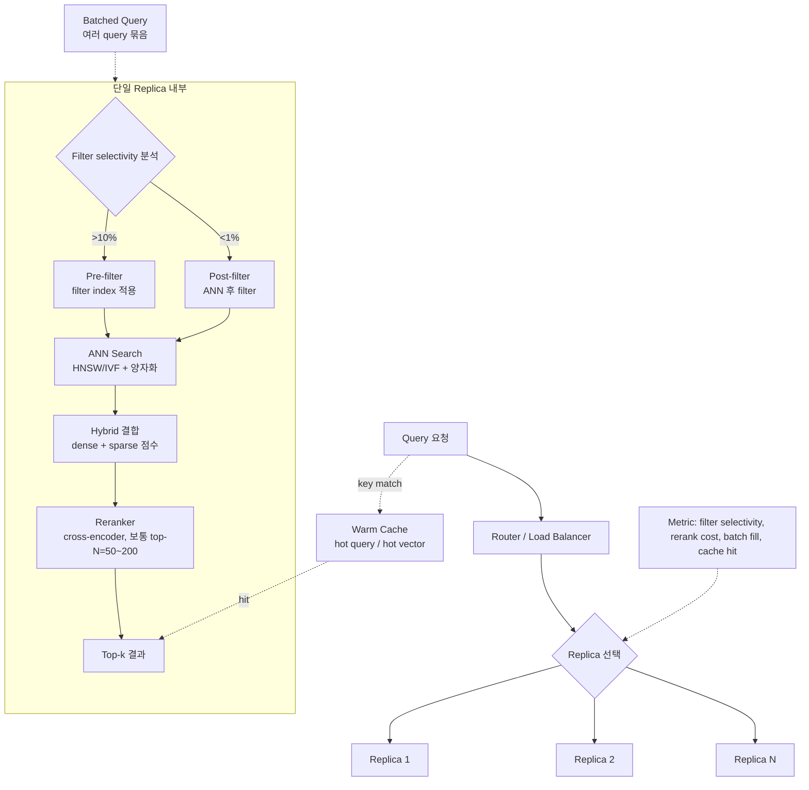
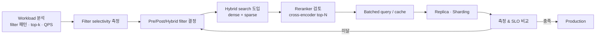

# Vector Search System & Query Tuning

## 핵심 요약

인덱스·양자화로 단일 query의 비용을 줄였다면, 시스템/쿼리 layer는 **트래픽·필터·결과 품질·throughput**을 production scale에서 다룬다. 필터링 전략(pre/post/hybrid), 하이브리드 검색(dense + sparse + rerank), batched query, replica 수평확장, warm cache가 핵심 손잡이이며, 이 layer의 결정은 인덱스 자료구조 자체를 바꾸지 않고도 latency 분포(p50 vs p99)와 QPS를 크게 흔든다.

- **Filter selectivity가 pre/post 결정의 정답 신호**: selectivity > 10%면 pre-filter, < 1%면 post-filter가 일반적 — 측정 없이는 정반대를 선택할 위험
- **Hybrid search가 production 기본값**: dense(semantic) + sparse(BM25/SPLADE) + cross-encoder rerank의 3단 구조가 2024년 이후 표준
- **Throughput 1순위라면 batching·replica**: ANN 자체는 single-query 최적화가 되어 있어 batched query·replica가 QPS의 1차 손잡이
- **Tail latency는 시스템 layer의 책임**: p50은 인덱스·양자화로, p99는 GC·캐시·쿼리 큐·replica 분산이 지배

## 시스템 아키텍처

쿼리 path 위에 필터·rerank·batch·replica가 단계적으로 적층된 구조.

## 처리 흐름

쿼리·시스템 layer 튜닝은 1) 필터링 → 2) hybrid·rerank → 3) batching/cache → 4) replica/sharding 순서로 SLO 충족 여부를 점검.

1. **Workload profiling**: filter 종류·selectivity 분포, top-k, QPS 패턴, peak 시간대를 metric으로 측정
2. **Filter selectivity 분석**: 필터 통과 비율 측정 → > 10%는 pre-filter 우선, < 1%는 post-filter, 그 사이는 vendor의 hybrid filter
3. **Hybrid search 도입**: dense 단독 recall이 fail-stop 케이스(고유명사·코드 등)에서 약하면 sparse(BM25/SPLADE) 추가, score normalization 후 결합
4. **Reranker 결정**: top-N(보통 50~200)을 cross-encoder로 재정렬해 NDCG↑. latency·cost와 SLO 영향 측정 후 도입
5. **Batched query**: 같은 collection을 향한 여러 query를 ms 단위로 묶어 throughput↑. 다만 latency 약간 증가
6. **Cache 계층**: hot query·hot vector를 in-memory cache. cache hit ratio metric으로 가치 확인
7. **Replica / sharding**: QPS 또는 corpus 크기 한계 시 replica로 read 분산, 또는 sharding으로 인덱스 분할
8. **재측정**: p50 / p95 / p99 latency, QPS, recall 모두 dashboard로 비교

## 핵심 기능 및 서비스

| 손잡이 | 의미 | 1차 영향 | 운영 비용 |
|---|---|---|---|
| Pre-filter | ANN 전에 metadata 필터로 후보 축소 | recall 보장, selectivity↑ 시 latency↓ | filter index 메모리 |
| Post-filter | ANN 후 metadata 검사 | latency 안정, selectivity↓ 시 recall 떨어질 위험 | top-N 키워야 함 |
| Hybrid filter | filter index 결과를 ANN 그래프 탐색에 통합 | 두 방식 절충 | vendor 구현 의존 |
| Dense search | embedding 유사도 | semantic recall | embedding 비용 |
| Sparse search (BM25/SPLADE) | keyword 기반 | lexical recall (고유명사·코드) | sparse 인덱스 + 갱신 |
| Cross-encoder rerank | top-N 재정렬 | NDCG·MRR↑ | 호출당 latency 큼 |
| Batched query | 여러 query 묶음 | QPS↑, throughput↑ | 약간의 latency 증가 |
| Cache (query/result) | 결과 캐싱 | hit 시 latency 0 | 메모리, cache invalidation |
| Replica | 읽기 수평확장 | QPS↑, tail↓ | 인프라 비용 |
| Sharding | 인덱스 분할 | 단일 노드 한계 돌파 | 라우팅 복잡도 |

## 유사 기술 비교

| 항목 | Pre-filter | Post-filter | Hybrid filter (filtered ANN) |
|---|---|---|---|
| 동작 | filter index → ANN | ANN → filter 검사 | filter 정보 ANN 탐색에 결합 |
| 복잡도 | O(log n + k·d) | O(n·d + m) | O(log n + b·k·d) |
| Selectivity 높음(>10%) | 효율적 | 비효율 (대부분 통과) | 효율적 |
| Selectivity 낮음(<1%) | 후보 너무 좁아 graph 탐색 효율 저하 | 효율적 (top-N만 검사) | 절충 |
| Recall 보장 | 강함 | 약함 (top-k 안 채워질 위험) | 중간 |
| 대표 vendor | Weaviate, Qdrant | 단순 구현 | Pinecone, Azure AI Search, OpenSearch |

## 실제 사례

### Azure AI Search Vector Query Filters
Azure 공식 문서가 pre/post-filter를 query option으로 명시적으로 노출하고, selectivity에 따라 어떤 모드가 latency·recall에 유리한지 가이드 제공. metadata 인덱스(scoring profile)와 vector 인덱스를 분리해 같은 query에서 결합 평가하는 패턴.

### OpenSearch Hybrid Search with Filters
OpenSearch가 hybrid search(neural + lexical) + common filter 지원을 공식 기능으로 도입. filter가 sub-query 단계에서 분배되어 dense·sparse 양쪽에 같은 조건이 적용되며, score normalization을 거쳐 결합 — production hybrid 운영의 표준 패턴.

## 활용 시나리오

### 시나리오 1: Multi-tenant filter가 dominant인 경우
- **맥락**: tenant 격리 + acl 필터 + 카테고리 필터, selectivity는 tenant별 5~30%
- **선택**: pre-filter 우선 (tenant 단위는 namespace로 물리 격리하고, acl·카테고리는 filter index)
- **이유**: selectivity > 10% 영역이므로 pre-filter가 latency·recall 모두 유리. 격리 강도도 확보

### 시나리오 2: Long-tail keyword 정확도가 중요한 RAG
- **맥락**: 고유명사·코드·약어가 자주 등장, dense만으로는 recall fail
- **선택**: Dense + Sparse(BM25 또는 SPLADE) hybrid + cross-encoder rerank (top-50)
- **이유**: lexical signal이 long-tail를 잡고, cross-encoder가 의미 일치를 미세 조정 → NDCG·MRR 크게 향상

### 시나리오 3: 고QPS·낮은 latency tail 요구
- **맥락**: 1만+ QPS, p99 < 100ms 요구
- **선택**: Replica 수평확장 + batched query + warm cache (hot top-1k queries) + monitor p99
- **이유**: ANN 단일 호출 latency는 인덱스/양자화로 이미 작음 — tail은 큐 깊이·GC·캐시 미스가 지배. replica로 부하 분산, batched로 throughput, cache로 hot path 단축

## 장단점 및 트레이드오프

| 항목 | 내용 |
|---|---|
| 장점 | 인덱스 자체를 안 건드리고도 latency·recall·QPS 크게 개선 가능. hybrid·rerank로 RAG 품질 metric(NDCG·MRR·groundedness)을 직접 끌어올림 |
| 단점 | 손잡이가 많고 서로 결합되어 측정 비용 큼 — filter selectivity·rerank 비용·cache hit ratio를 동시에 봐야 attribution 가능. rerank 모델 호출 비용이 SLA를 침해할 수 있음 |
| 트레이드오프 | **Pre vs Post filter**: selectivity / **Hybrid rerank N vs Latency**: N↑→품질↑·latency↑ / **Batching delay vs Throughput**: delay↑→QPS↑·tail↑ / **Replica 수 vs cost** |

## 함정 및 안티패턴

- **Filter selectivity 측정 없이 pre/post 결정**: 데이터 분포에 따라 정반대가 정답 → selectivity를 metric으로 emit해 분기 정책 결정
- **Post-filter + top-k 그대로**: 필터 통과 비율 5%면 top-10 결과가 0~3개 → top-k의 5~10배를 ANN에서 가져온 뒤 후처리
- **Hybrid rerank를 모든 쿼리에 적용**: cross-encoder 호출당 수십~수백 ms → SLA 영향 큰 query만 rerank, latency budget 기반 토글
- **Sparse 인덱스를 인제션 파이프라인에서 누락**: hybrid 도입했는데 dense만 갱신 → keyword recall이 stale, sparse 갱신을 paired 운영
- **Batched query를 ms 단위 delay 없이 강제**: 각 query가 batched window를 기다려 tail latency 침해 → workload별 max wait 조정
- **Cache invalidation 정책 부재**: 원본 변경 후에도 stale 결과 반환 → manifest의 indexed_at·content_sha로 cache key 구성
- **Replica 추가로만 p99 해결 시도**: tail 원인이 GC 또는 hot partition이면 replica는 효과 미미 → 원인 분석(GC pause, hot key, queue depth) 먼저
- **Filter index 없이 metadata 조건만 추가**: 풀스캔 → pre-filter가 brute force가 됨 → filter 필드는 명시적 인덱스 생성

## 참고 자료

- [Vector Query Filters (Azure AI Search, Microsoft Learn)](https://learn.microsoft.com/en-us/azure/search/vector-search-filters) — pre/post-filter 공식 가이드
- [Pre-filtering vs Post-filtering in Vector Search (apxml)](https://apxml.com/courses/advanced-vector-search-llms/chapter-2-optimizing-vector-search-performance/advanced-filtering-strategies) — selectivity 기반 분기 정책
- [Filtering (Weaviate Documentation)](https://docs.weaviate.io/weaviate/concepts/filtering) — filtered ANN의 hybrid filter 구현
- [Introducing common filter support for hybrid search queries (OpenSearch)](https://opensearch.org/blog/introducing-common-filter-support-for-hybrid-search-queries/) — hybrid + filter 결합 공식 패턴
- [Geometric Transformation for Efficient Filtered Vector Search (arXiv)](https://arxiv.org/pdf/2506.15987) — filtered ANN 최신 연구
- [How to Build Pre-Filtering (oneuptime)](https://oneuptime.com/blog/post/2026-01-30-vector-db-pre-filtering/view) — pre-filter 운영 예시

## 관련 노트

- [[vector-search-performance-tuning]] — 4-layer 튜닝의 Layer 3 (본 노트가 상세화한 영역)
- [[ann-index-parameters]] — Layer 1에서 결정된 ef_search·nprobe와 결합되는 시스템 손잡이
- [[recall-vs-filter-tradeoff]] — 필터가 recall을 무너뜨리는 보편 한계와 oversampling·rerank 보완
- [[opensearch-knn-vector-search]] — OpenSearch가 hybrid + common filter를 어떻게 구현하는지 vendor 사례
- [[vector-database-comparison]] — 제품별 hybrid·filter·rerank 노출 차이

## 출처 fleeting

- `fl-2026-06-02-vector-search-performance-tuning-system-query.md`
