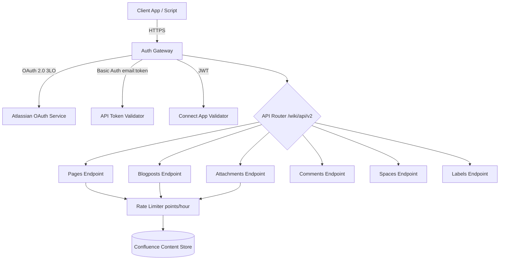
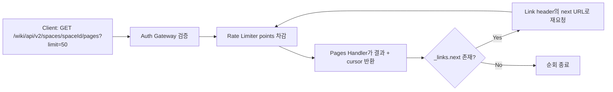

# Confluence Cloud REST API v2

## 핵심 요약

Atlassian Confluence Cloud가 제공하는 차세대 REST API. base path는 `/wiki/api/v2`이며, v1(`/wiki/rest/api/`)의 누적된 레거시 문제와 성능 한계를 해결하기 위해 2022년 experimental 공개를 시작으로 점진적으로 확장되어 왔다. v1 endpoint deprecation timeline은 Atlassian이 수차례 연장 공지를 발표해 왔으며 정확한 마감일은 공식 community 공지 기준으로 확인해야 한다.

- **Endpoint 전문화 (specialization)**: pages, blogposts, comments, attachments 등 content type별로 명확히 분리된 endpoint를 제공해 동작이 예측 가능하고 최적화하기 쉬움
- **Cursor 기반 pagination**: `start`/`limit` offset 방식을 폐기하고 `limit` + `cursor` 토큰 방식 채택. 대용량 데이터 순회 중 데이터 추가/삭제가 일어나도 누락 없이 일관성 유지
- **경량 응답 페이로드**: 기본 응답은 메타데이터 중심이며 `body-format` 등 query parameter로 필요한 필드만 명시적으로 요청. Atlassian 공식 블로그는 bulk content 조회 시 v1 대비 큰 폭의 성능 향상을 보고함
- **다양한 인증 모드**: OAuth 2.0 (3LO), API token + Basic Auth, Connect 앱용 JWT, Forge를 모두 지원

> **버전 민감 항목 flag**: v1 deprecation 마감일과 "v1 대비 N배" 성능 수치는 Atlassian 공지/블로그 시점에 따라 달라진다. 최신 값은 본 노트 하단 참고 자료의 `changelog` 및 `community announcement`로 재확인할 것.

## 형식적 정의

Confluence Cloud REST API v2는 **Atlassian Confluence Cloud SaaS의 두 번째 메이저 버전 REST API 표면**이다. 다음 세 가지로 v1과 구분된다.

1. **URL prefix**: `/wiki/api/v2/...` (v1은 `/wiki/rest/api/...`).
2. **리소스 모델**: content type을 단일 `content` 리소스로 추상화하던 v1과 달리, `pages`·`blogposts`·`comments`·`attachments` 등 type별 1급 리소스로 분리.
3. **순회 모델**: offset-based pagination(v1)이 아니라 cursor-based pagination을 사용. 응답 헤더의 `Link: <...>; rel="next"`와 본문 `_links.next`로 다음 페이지 위치를 전달.

## 시스템 아키텍처

Confluence Cloud는 site 단위(`{your-domain}.atlassian.net`)로 격리되며, REST API v2는 site 도메인 하위의 `/wiki/api/v2` 경로에 노출된다. 인증 게이트웨이가 OAuth/Token/JWT를 검증한 뒤, content-type별 endpoint handler가 요청을 처리하고 points 기반 rate limiter가 quota를 추적한다.

## 처리 흐름

대표적인 page 조회 흐름은 인증 → endpoint 라우팅 → cursor pagination → Link header를 통한 다음 페이지 fetch로 진행된다.

## 핵심 기능 및 서비스

| 기능 | 설명 |
|---|---|
| Pages | 페이지 CRUD (`/pages`, `/pages/{id}`). 생성 시 `spaceId`, `title`, `body` (storage 또는 ADF) 전달 |
| Blogposts | 블로그 포스트 전용 endpoint. page와 분리되어 명확한 의미 구분 |
| Attachments | 첨부 파일 조회 (`/attachments`, `/pages/{id}/attachments`, `/blogposts/{id}/attachments`), 썸네일 다운로드 |
| Comments | footer/inline comment 분리 endpoint |
| Spaces | space 메타데이터 조회 (`/spaces`, `/spaces/{id}`) |
| Labels | label 기반 content 조회 (`/labels/{id}/attachments` 등) |
| Custom Content | Connect/Forge 앱이 정의한 custom content type 접근 |
| Cursor Pagination | `limit` + `cursor` query param, 응답의 `_links.next` 및 Link header |
| Rate Limiting | points 기반 quota (per hour, UTC reset), 초과 시 HTTP 429 |

## 유사 기술 비교

| 항목     | Confluence Cloud REST API v2                 | Jira Cloud REST API v3        | Notion API                        | GitHub REST API             |
| ------ | -------------------------------------------- | ----------------------------- | --------------------------------- | --------------------------- |
| 특징     | content type별 endpoint 분리, cursor pagination | v2와 동일 operation + ADF 지원 강화  | block 기반 데이터 모델, 단일 versioned API | resource 중심, ETag/조건부 요청 풍부 |
| 장점     | 일관된 cursor pagination, bulk 조회 성능 향상         | Atlassian Document Format 표준화 | 단순하고 일관된 모델                       | 성숙한 생태계, 강력한 권한/scope 모델    |
| 단점     | v1 대비 일부 기능 parity 부족, deprecation 일정 변동     | Confluence보다 endpoint 수 많음    | rate limit 보수적                    | 복잡한 권한 관리, REST/GraphQL 이중  |
| 적합 케이스 | 위키/문서 자동화, 사내 docs as code                   | 이슈 트래커 자동화, ChatOps           | 협업 노트/DB 자동화                      | 코드 호스팅 통합, CI/CD            |

## 활용 시나리오

### 시나리오 1: PR 머지 시 릴리스 노트 자동 게시

GitHub Actions에서 PR merge 이벤트 발생 → 변경 로그를 Markdown으로 생성 → v2 `POST /wiki/api/v2/pages`로 release notes 공간에 페이지 생성. 인증은 service account의 API token + Basic Auth를 secret에 저장해 사용. 인증 모델에 따라 적용되는 rate limit 모델이 다를 수 있으므로 통합 트래픽 종류별로 quota 모니터링을 분리하는 것이 안전하다.

### 시나리오 2: LLM 기반 사내 검색 RAG 인덱싱

야간 배치로 v2의 `GET /wiki/api/v2/spaces/{id}/pages`를 cursor pagination으로 전체 순회하며 `body-format=storage` 또는 `atlas_doc_format`으로 본문을 추출 → 청킹/임베딩 후 vector DB에 적재. cursor 방식 덕분에 야간 사이 페이지가 추가/삭제되어도 누락/중복 없이 일관된 snapshot 확보 가능.

### 시나리오 3: 외부 SaaS의 multi-tenant Confluence 연동

Atlassian Marketplace에 등록할 Connect/Forge 앱에서 사용자 tenant의 페이지에 접근할 때 OAuth 2.0 (3LO)로 user impersonation 토큰 발급 → `read:page:confluence`, `write:page:confluence` 같은 granular scope로 최소 권한 부여. 토큰별로 quota 관리가 독립적이라 다른 고객 트래픽 영향을 최소화할 수 있다.

## 장단점 및 트레이드오프

| 항목     | 내용                                                                                                                                        |
| ------ | ----------------------------------------------------------------------------------------------------------------------------------------- |
| 장점     | content type별 endpoint로 시맨틱 명확. cursor pagination으로 대규모 sync 일관성 보장. bulk 조회 성능 개선. granular OAuth scope 지원.                              |
| 단점     | v1 대비 일부 기능(예: 다중 content property 일괄 조회, attachment trash) parity 부족 보고. community thread에서 spec 변동 호소. 마이그레이션 이중 운영 비용 발생.              |
| 트레이드오프 | offset → cursor 전환으로 임의 page index로의 random access 불가. 응답 경량화 대가로 `body-format`, `include-*` 등 query param을 명시적으로 다뤄야 해 client 복잡도 약간 증가. |

## 함정 및 안티패턴

- **안티패턴 1: v2 endpoint에 `start`/`limit` offset param 사용** → v1 query param이 silently 무시되어 incomplete result set이 반환됨(에러도 안 남) → 반드시 `limit` + `cursor`만 사용하고 `_links.next` / Link header를 따라가야 함
- **안티패턴 2: v1과 v2 응답 스키마를 혼용** → v1은 `space` object를 포함하지만 v2는 `spaceId` 필드만 반환 → 두 API를 같은 모델에 매핑하지 말고 layer를 분리하거나 v2 전용 DTO 도입
- **안티패턴 3: Connect 앱에서 user 토큰 없이 v2 호출** → 일부 v2 endpoint는 app-only context에서 동작이 제한됨 → 사용자 행위가 필요한 호출은 OAuth 2.0 (3LO) impersonation 또는 Forge `asUser()` 사용
- **안티패턴 4: 모든 통합에 동일한 rate limit 가정** → API token traffic, OAuth, Connect/Forge는 적용되는 rate limit 모델이 다를 수 있음 → 통합 종류별 quota 모델을 별도로 모니터링

## 참고 자료

- [The Confluence Cloud REST API (v2 reference)](https://developer.atlassian.com/cloud/confluence/rest/v2/) — 공식 v2 API 레퍼런스
- [Confluence Cloud REST API v2 intro](https://developer.atlassian.com/cloud/confluence/rest/v2/intro/) — 인증/페이지네이션 등 개요
- [The Confluence Cloud REST API V2 Brings Major Performance Improvements](https://www.atlassian.com/blog/development/the-confluence-cloud-rest-api-v2-brings-major-performance-improvements) — Atlassian 공식 블로그, 성능 개선 배경
- [Update to Confluence v1 API Deprecation Timeline](https://community.developer.atlassian.com/t/update-to-confluence-v1-api-deprecation-timeline/79687) — v1 deprecation 공지 (날짜는 본 공지로 최신 확인)
- [Rate limiting - Confluence Cloud](https://developer.atlassian.com/cloud/confluence/rate-limiting/) — points 기반 rate limit 공식 문서
- [OAuth 2.0 (3LO) apps - Confluence Cloud](https://developer.atlassian.com/cloud/confluence/oauth-2-3lo-apps/) — OAuth 3LO 인증 가이드
- [Basic auth for REST APIs](https://developer.atlassian.com/cloud/confluence/basic-auth-for-rest-apis/) — API token + Basic Auth 사용법
- [Confluence Cloud changelog](https://developer.atlassian.com/cloud/confluence/changelog/) — v2 신규 endpoint 릴리스 노트

## 관련 노트

- [[moc-saas-api-integration]] — 본 노트의 소속 MOC
- [[moc-rag]] — 시나리오 2(RAG 인덱싱)에서 Confluence가 데이터 소스로 활용되는 상위 토픽
