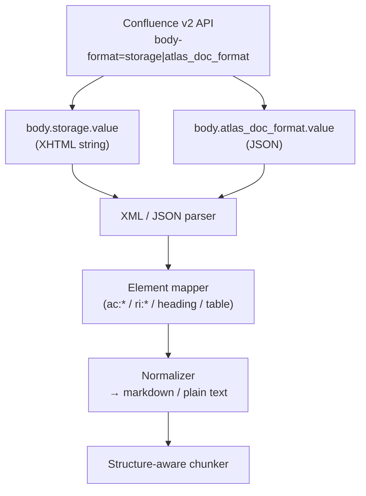
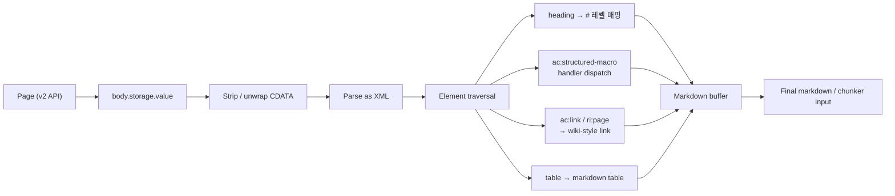

# Confluence Storage Format Parsing

## 핵심 요약

Confluence Cloud 페이지의 body는 `storage` (XHTML 기반 XML)와 `atlas_doc_format` (ADF, JSON) 두 표현을 v2 API의 `body-format` 파라미터로 선택 추출한다. storage format은 외형은 XHTML이지만 **valid XHTML이 아니라 XML 방언**으로, `<ac:*>`(Atlassian Content) · `<ri:*>`(Resource Identifier) 커스텀 element와 CDATA 섹션을 포함한다. RAG 인덱싱 파이프라인에서는 **청킹 전 단계의 정규화** — storage XHTML → markdown/plain text 변환 — 가 retrieval 품질과 토큰 비용에 직결된다.

- storage format은 **macro·panel·table·code·link** 등 Confluence 고유 시맨틱을 보존하므로 정보 손실은 작지만 파싱 복잡도가 높음
- ADF는 JSON 기반으로 LLM 처리·markdown 변환이 단순하며 Atlassian이 점진적으로 ADF로 이동 중 → 신규 RAG 파이프라인은 **ADF 우선 검토 권고**
- v2 API 호출 시 `body-format=storage,atlas_doc_format` 다중 지정 가능 (필요 표현만 선택 받기 권장)

> **버전 민감 항목 flag**: Atlassian의 ADF 마이그레이션 방향성과 신규 macro의 ADF 우선 지원 여부는 정기적으로 [Confluence Cloud changelog](https://developer.atlassian.com/cloud/confluence/changelog/)로 재확인 필요. storage format 자체 spec은 안정적이나 migration 진행 속도에 따라 권고 내용이 달라질 수 있음.

## 시스템 아키텍처

`GET /wiki/api/v2/pages/{id}?body-format=storage` 응답 → body.storage.value (XHTML 문자열) → XML/HTML 파서 (lxml, BeautifulSoup) → element traversal로 `<ac:*>` 매크로 분기 처리 → markdown 또는 plain text 정규화 → 청커로 전달.

## 처리 흐름

페이지별로 raw body 추출 → 매크로·테이블·코드 블록을 카테고리별 핸들러로 분기 → heading 계층은 markdown `#` 레벨로 보존 → 빈 매크로 / 첨부 placeholder는 metadata로 분리 → 최종 markdown 출력.

## 핵심 기능 및 서비스

| 요소 | 설명 |
|---|---|
| `<ac:structured-macro>` | 매크로 표현. `ac:name`으로 매크로 종류 (`code`, `panel`, `info`, `toc`, `html` 등) 식별 |
| `<ac:parameter ac:name="...">` | 매크로에 전달되는 파라미터 |
| `<ac:rich-text-body>` | 매크로 내부의 rich-text body — 그 자체로 valid storage format XHTML |
| `<ac:plain-text-body>` | plain-text body. CDATA 섹션으로 감싸짐 |
| `<ac:link>` + `<ri:page>` / `<ri:user>` | Confluence 내부 참조 링크. page id·user account id 등 |
| `<ac:image>` + `<ri:attachment>` | 첨부 이미지 참조 |
| 표 (`<table>`/`<tr>`/`<td>`) | 표준 XHTML — markdown table 변환 가능 |
| ADF (`atlas_doc_format`) | JSON. `type`/`content`/`marks` 트리. parser·to-markdown 변환 라이브러리 다수 |
| v2 `body-format` query param | 요청 시점에 표현 선택. 복수 형식 multi-format 응답 가능 |

## 유사 기술 비교

| 항목 | storage format (XHTML) | atlas_doc_format (ADF, JSON) | rendered HTML view |
|---|---|---|---|
| 특징 | XML 방언, Confluence 매크로 보존 | JSON 트리, type/marks 구조 | 브라우저 렌더링 결과 |
| 장점 | 정보 손실 최소, macro semantics 보존 | LLM·markdown 변환 친화, JSON parser만 필요 | 사람이 보는 그대로 |
| 단점 | XML+CDATA+`ac:*` 처리 복잡 | 일부 v2 endpoint 미완 (preview 단계 기능 있음) | layout·CSS 결합, 의미 손실 |
| 적합 케이스 | macro·테이블·정책 문서 보존 필요 | 신규 RAG 파이프라인, AI 통합 | 사람용 export, 시각 확인 |

## 실제 사례

### confluence-to-markdown-converter (highsource)

storage format → markdown을 **XSLT 변환**으로 처리. macro·table·link를 stylesheet로 매핑. 결정론적 변환, 디버그 용이.

### confluence2markdown (benkersten)

Python 스크립트로 Confluence HTML → markdown 변환. lightweight, 사내 wiki migration 도구로 자주 인용.

### parser 라이브러리 선택 (RAG 청킹)

BeautifulSoup·unstructured·markdownify 등 파서별 구현 상세는 [[confluence-storage-format-parser]] 참조.

## 활용 시나리오

### 시나리오 1: RAG 인덱싱 사전 단계 (storage 선택)

맥락: 사내 wiki RAG MVP, 매크로·테이블·정책 문서 보존이 retrieval 품질에 직결 → 선택 이유: storage format이 macro semantics를 가장 잘 보존, 청킹 ADR 4의 structure-aware 전략과 매칭 → 구체 적용: lxml로 파싱 → 매크로별 handler dispatch (`code` → fenced block, `info`/`warning` → blockquote prefix, `toc` → drop) → markdown 출력.

### 시나리오 2: RAG 인덱싱 사전 단계 (ADF 선택)

맥락: 신규 파이프라인, macro 의존 낮음, LLM 처리 단순화 우선 → 선택 이유: ADF JSON 트리를 `atlas-doc-parser` 같은 라이브러리로 직접 markdown 변환 → 구체 적용: `body-format=atlas_doc_format` 요청 → JSON 트리 root traversal → `paragraph`/`heading`/`bulletList`/`codeBlock` 노드를 markdown으로 emit.

### 시나리오 3: Multi-format 응답 활용

맥락: storage가 정확하나 일부 매크로는 ADF가 더 깔끔 → 선택 이유: `body-format=storage,atlas_doc_format` 다중 요청 → 구체 적용: macro는 storage에서, 본문 텍스트는 ADF에서 추출하여 양쪽의 강점 결합.

## 장단점 및 트레이드오프

| 항목 | 내용 |
|---|---|
| 장점 | storage format은 macro·layout 정보 손실 최소, 정확한 reproduction 가능 / ADF는 JSON으로 RAG·LLM 통합 단순 |
| 단점 | storage는 `<ac:*>`/CDATA/non-standard XHTML 처리로 파서 복잡, 일반 HTML 라이브러리 그대로 적용 불가 / ADF는 일부 매크로 표현 누락 가능 |
| 트레이드오프 | **정확성 vs 단순성**: storage는 정보 손실 최소화 위해 macro handler 다수 작성 필요. ADF는 빠른 구현이지만 일부 신호 누락 / **버전 추적**: Atlassian이 점진 ADF 이동 중 — 신규 매크로·기능은 ADF 우선 지원 가능성 |

## 함정 및 안티패턴

- **안티패턴 1**: rendered HTML view 스크래핑으로 본문 추출 → CSS·JS·layout 결합으로 텍스트 의미 손실 + 인증·세션 부담 → **대안**: 반드시 v2 API + `body-format=storage|atlas_doc_format` 사용
- **안티패턴 2**: 일반 HTML → markdown 라이브러리(markdownify 등) 직접 적용 → `<ac:*>` 미인식 element가 텍스트로 leak되거나 drop됨 → **대안**: `ac:*`/`ri:*`를 사전 정규화 또는 MarkdownConverter 서브클래싱
- **안티패턴 3**: CDATA 섹션 처리 누락 → `<![CDATA[...]]>` 내부 코드 블록 본문이 비거나 잘림 → **대안**: 파서 옵션으로 CDATA 보존, `<ac:plain-text-body>` 핸들러에서 CDATA 텍스트 추출
- **안티패턴 4**: macro 일괄 strip → 매크로 안의 정보(panel info / warning callout / code 블록)가 검색 가능성 손실 → **대안**: macro 종류별 정책 — `code`/`panel`/`info`는 markdown으로 변환, `toc`/`children-display`는 drop
- **안티패턴 5**: `<ac:link>` + `<ri:page>` 내부 참조를 raw로 두면 retrieval 결과의 citation·navigation 손실 → **대안**: `ri:content-title` 또는 page id로 canonical URL resolve 후 markdown link 작성

## 참고 자료

- [Confluence Storage Format (Atlassian official)](https://confluence.atlassian.com/doc/confluence-storage-format-790796544.html) — storage format spec, `<ac:*>` element 카탈로그
- [Atlassian Document Format (ADF)](https://developer.atlassian.com/cloud/jira/platform/apis/document/structure/) — ADF JSON 구조 공식 명세
- [The Confluence Cloud REST API v2 — Page group](https://developer.atlassian.com/cloud/confluence/rest/v2/api-group-page/) — `body-format` 파라미터 등 v2 페이지 endpoint
- [ADF vs storage format 토론 (Atlassian developer community)](https://community.developer.atlassian.com/t/confluence-rest-api-v2-create-page-with-atlas-doc-format-representation/67565) — 표현 선택 논의
- [atlas-doc-parser 문서](https://atlas-doc-parser.readthedocs.io/en/latest/01-Atlassian-Document-Format-Parser/) — ADF Python 파서, markdown 변환 예
- [confluence-to-markdown-converter (highsource)](https://github.com/highsource/confluence-to-markdown-converter) — XSLT 기반 storage→markdown 변환기
- [confluence2markdown (benkersten)](https://github.com/benkersten/confluence2markdown) — Python lightweight 변환 스크립트
- [python-markdownify](https://github.com/matthewwithanm/python-markdownify) — HTML→markdown 범용 라이브러리, `MarkdownConverter` 서브클래싱
- [html-to-markdown (PyPI)](https://pypi.org/project/html-to-markdown/1.3.1/) — markdownify 포크, 타입 안전성 강화

## 관련 노트

- [[confluence-REST-API-v2]] — v2 API 표면(인증·페이지네이션·rate limit) — 본 노트의 body-format 파라미터는 이 API 위에서 동작
- [[confluence-storage-format-parser]] — 추출된 storage format의 파서 구현 선택지(BS4/unstructured/markdownify) 및 RAG 청킹 통합 상세
- [[confluence-doc-type-classification-heuristic]] — doc_type 분기에 따라 storage format 매크로 처리 정책이 달라짐
