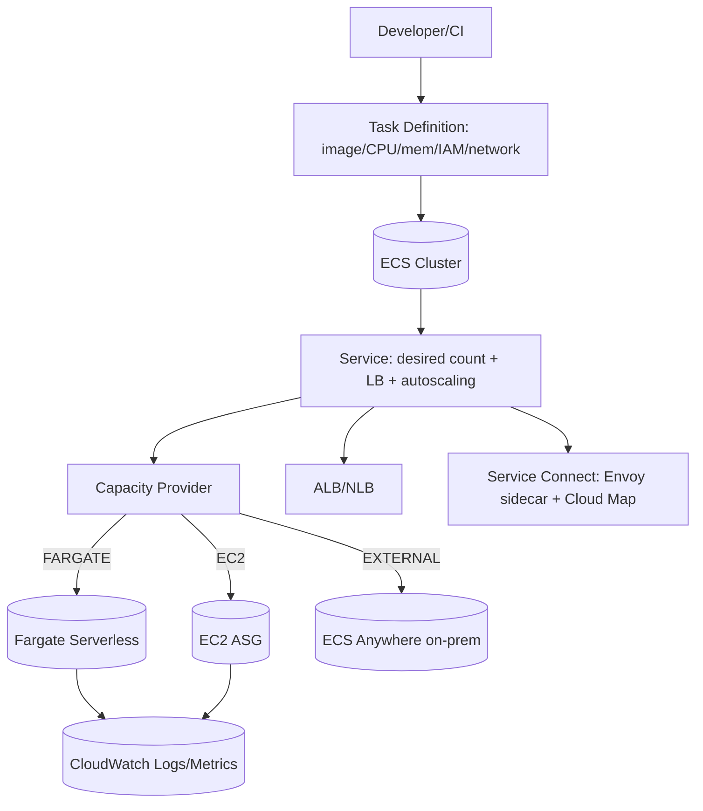
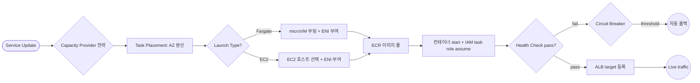

# AWS ECS (Elastic Container Service)

## 핵심 요약

AWS ECS는 2014년 출시된 AWS의 **fully managed container orchestration** 서비스로, Docker 컨테이너를 클러스터에서 배포·실행·스케일링한다. Kubernetes(EKS)와 함께 AWS의 양대 컨테이너 옵션이지만, **AWS-opinionated** 단순화로 학습 곡선·운영 오버헤드가 낮은 것이 차별점이다.

- **4가지 launch type**: **Fargate**(serverless) / **EC2**(사용자 관리 인스턴스 풀) / **External**(ECS Anywhere — 온프레미스·타 클라우드) / **ECS Managed Instances**(2026 신규 — EC2 수준 커스터마이징 + 관리 자동화). 단일 cluster에 capacity provider로 혼합 가능.
- **3단 구조**: Cluster(논리적 grouping) → Service(desired count + ALB/NLB + autoscaling + 자동 복구) → Task(Task Definition의 instantiation). Task Definition은 컨테이너 이미지·CPU·메모리·네트워크·IAM role을 정의하는 blueprint.
- **AWS 네이티브 통합**: ECR(이미지), CloudWatch Logs/Metrics, ALB/NLB, Secrets Manager, **Service Connect**(2022~ — Cloud Map + Envoy sidecar로 service mesh-lite), IAM task role(task당 권한 분리), `awsvpc` 모드(task당 ENI · security group · IAM 분리).
- **비용 우위**: ECS control plane 자체는 **무료**(EKS는 $0.10/hour). Fargate Spot으로 최대 **70% 할인**, Compute Savings Plans로 추가 절감, Graviton 활용 시 20% 비용 감소.

## 시스템 아키텍처

Control plane(ECS managed scheduler·API)이 사용자 컨테이너 워크로드를 capacity provider를 통해 Fargate/EC2/External에 dispatch하고, ALB/Service Connect가 트래픽 라우팅, CloudWatch가 관측을 담당하는 구조.

## 처리 흐름

배포 → scheduler가 capacity provider 전략에 따라 task placement → ENI 할당 + image pull + 컨테이너 start → health check → ALB target group 등록 → traffic 라우팅 → circuit breaker로 deploy 실패 자동 rollback.

## 핵심 기능 및 서비스

| 기능 | 설명 |
|---|---|
| Launch types | Fargate / EC2 / External(ECS Anywhere) / ECS Managed Instances |
| Capacity Provider | Fargate·FARGATE_SPOT·EC2 ASG를 single cluster에서 mix, weight·base 비율 지정 |
| Task Definition | 컨테이너 image·CPU·memory·network mode·IAM·secret·log 설정의 versioned blueprint |
| Service | desired count 유지, 실패 task 자동 교체, ALB/NLB 통합, blue/green via CodeDeploy |
| `awsvpc` 모드 | Task당 ENI, security group, IAM 분리 — Fargate 기본, EC2도 사용 권장 |
| IAM Task Role | task가 다른 AWS 서비스 호출 시 사용, EC2 instance role과 분리 |
| Service Connect | Cloud Map + Envoy sidecar 자동 주입, short name 호출, failover/health check 내장 |
| Service Discovery | DNS 기반(Cloud Map). 단순하지만 Service Connect와 동시 사용 불가 (같은 name 충돌) |
| ECS Exec | 실행 중 컨테이너에 SSM 기반 SSH-less shell |
| CloudWatch Container Insights | task·service·cluster 메트릭·로그 통합 |
| Capacity Optimization | Spot 70%↓, Savings Plans 최대 50%↓, Graviton 20%↓ |

## 유사 기술 비교

| 항목 | AWS ECS | AWS EKS (Kubernetes) | Kubernetes self-managed | Docker Swarm |
|---|---|---|---|---|
| 컨트롤 플레인 | AWS managed (무료) | AWS managed ($0.10/hour) | 직접 운영 (가장 무거움) | 직접 운영 (가벼움) |
| 표준 준수 | AWS 전용 | 표준 K8s, 멀티 클라우드 가능 | 표준 K8s | Docker 전용 |
| 학습곡선 | 낮음 | 매우 가파름 | 매우 가파름 | 낮음 |
| 생태계 | AWS 서비스 deep integration | Helm, CNCF 도구 광범위 | CNCF 전체 | 제한적 |
| 멀티 클라우드 | 불가 (lock-in) | 가능 | 가능 | 가능하지만 약함 |
| 적합 케이스 | AWS 중심·소규모팀(≤15명)·빠른 시작 | 표준 K8s 필요·멀티 클라우드·대규모 | 완전 통제 필요·온프레미스 | 단순 컨테이너·소규모 |

## 실제 사례

### United Airlines
하루 50만+ 고객·460개 공항. Fargate 기반으로 고객 앱을 빠르게 launch, 기상 이벤트로 인한 사용량 폭증에 자동 스케일.

### PGA TOUR
"Win/Cut Probability" ML 분석 모델을 ECS + Fargate에서 운영. 수천 개 시뮬레이션 + 약 40억 레코드 처리.

### AQR Capital Management
ECS 기반 내부 PaaS 구축. 신규 앱 빌드·런칭 시간을 **6주 → 30분**으로 단축.

### Capital One
Lambda + ECS 조합으로 비용·시간 절감. dev productivity 향상.

### Samsung·Ubisoft (AWS 공식 customer 리스트)
대규모 컨테이너 워크로드 운영 사례로 자주 인용. scalability·reliability·security가 채택 이유.

### ECS Circuit Breaker rollback 사례 (실전 운영)
DEV community 사례 — `desiredCount: 1`이면 rollback이 20분 이상 걸리지만, `desiredCount: 5`에서는 circuit breaker가 실패 패턴을 3–5분 내 감지해 자동 rollback. 운영 SLO 관점에서 task 수 결정이 중요.

## 활용 시나리오

### 시나리오 1: Fargate 기반 마이크로서비스 백엔드
컨텍스트 — 5–20명 백엔드 팀, K8s 운영 인력 없음, AWS 중심. → ECS Cluster + Fargate launch type + Service Connect로 service-to-service 통신. ALB가 외부 트래픽 라우팅, ECR로 이미지 관리, Task Definition version 으로 rollback. 운영 인력 최소화.

### 시나리오 2: 비용 최적화 — Fargate Spot 워커 풀
컨텍스트 — 배치/큐 워커, 중단 가능한 비동기 작업. → Capacity Provider 전략에 `FARGATE_SPOT` weight 4 + `FARGATE` weight 1 (안전 buffer). 70% 비용 절감, Spot 회수 시 2분 warning에 graceful shutdown. 데이터는 SQS visibility timeout으로 자동 재처리.

### 시나리오 3: 하이브리드 — EC2 + Fargate 혼합 cluster
컨텍스트 — GPU 추론(EC2 필수, p4d 인스턴스) + 일반 마이크로서비스(Fargate가 편리). → 동일 cluster 안에 두 capacity provider 등록. Task Definition의 `requires` 조건으로 GPU task는 EC2 ASG에, 일반 task는 Fargate에 배치. ECR·IAM·VPC 단일화로 운영 단순.

### 시나리오 4: 온프레미스 통합 (ECS Anywhere)
컨텍스트 — 데이터 주권 이슈로 일부 워크로드는 사내 데이터센터에 유지해야 함. → ECS Anywhere(External launch type)로 사내 서버를 ECS cluster에 등록. control plane은 AWS, data plane은 사내. AWS와 동일한 Task Definition·deployment 워크플로 적용.

### 시나리오 5: blue/green 배포 + 자동 rollback
컨텍스트 — 무중단 배포가 필수인 결제 API. → CodeDeploy + ECS Service의 deployment circuit breaker 활성화. 새 task version의 healthy 비율 미달 시 자동 rollback. `desiredCount` 충분히 크게 잡아 감지 시간 단축.

## 장단점 및 트레이드오프

| 항목 | 내용 |
|---|---|
| 장점 | AWS 네이티브 통합·learning curve 낮음 / control plane 무료 / Fargate로 인프라 0 / Spot 70% 절감 / IAM task role로 권한 정밀 분리 / Service Connect로 mesh-lite 즉시 가능 |
| 단점 | AWS lock-in (Task Definition·Service Connect 등 portable 아님) / 표준 K8s 도구(Helm·Argo CD) 사용 불가 / Fargate task당 4 vCPU·30GB 상한 / Fargate가 동등 EC2 대비 단가 비쌈 |
| 트레이드오프 | 운영 단순성(ECS) vs 이식성(EKS) / 비용 최적성(EC2+Spot) vs 운영 부담 0(Fargate) / Service Connect(자동 sidecar) vs Service Discovery(가벼움, blue/green 가능) / 빠른 시작 vs 멀티 클라우드 전략 |

## 함정 및 안티패턴

- **안티패턴 1: `latest` 태그 사용** — 어떤 이미지가 deploy됐는지 추적 불가, rollback 불가능. → 항상 immutable tag(sha256 digest 또는 semver) + Task Definition version 결합.
- **안티패턴 2: Single-AZ 배포** — AZ 장애 시 전체 서비스 다운. → Service 정의에 multi-AZ 분산 강제, ALB도 다중 AZ subnet.
- **안티패턴 3: Task role과 execution role을 하나로 통합** — 컨테이너 침해 시 모든 권한 노출. → execution role(ECR pull·logs)과 task role(앱이 사용하는 AWS API)을 명확히 분리하고 최소 권한 원칙.
- **안티패턴 4: EC2에서 IMDS 차단 안 함** — 컨테이너가 인스턴스 metadata로 instance profile 자격증명 탈취. → `ECS_AWSVPC_BLOCK_IMDS` + `ECS_ENABLE_TASK_IAM_ROLE_NETWORK_HOST` 설정.
- **안티패턴 5: `desiredCount: 1`로 운영** — circuit breaker가 실패 패턴 감지에 20분+ 소요, rollback 지연. → 최소 3–5 task로 운영, circuit breaker rollback enable.
- **안티패턴 6: 컨테이너 image bloat** — pull 시간 길고 cold start 악화. → distroless / multi-stage build, 불필요 패키지 제거.
- **안티패턴 7: Service Connect와 Service Discovery를 같은 service name으로 동시 사용** — Cloud Map 중복 등록 → 충돌. → 둘 중 하나로 선택. blue/green 필요 시 Service Discovery.
- **안티패턴 8: Fargate Spot을 stateful·장기 task에 사용** — 2분 warning으로 reclaim → 데이터 손실. → 중단 가능한 워크로드(batch·CI·dev)만 Spot, stateful은 on-demand Fargate 또는 EC2.
- **안티패턴 9: Resource over/under-provisioning** — 메모리 부족으로 OOM kill 또는 과다 할당으로 비용 폭증. → Container Insights로 실 사용량 모니터링, 65–80% utilization 목표.

## 참고 자료

- [Amazon ECS Documentation | AWS Docs](https://docs.aws.amazon.com/AmazonECS/latest/developerguide/Welcome.html) — 공식 reference
- [Amazon ECS launch types and capacity providers | AWS Docs](https://docs.aws.amazon.com/AmazonECS/latest/developerguide/capacity-launch-type-comparison.html) — Fargate / EC2 / External / Managed Instances 비교
- [Amazon ECS task definitions | AWS Docs](https://docs.aws.amazon.com/AmazonECS/latest/developerguide/task_definitions.html) — Task Definition 스펙
- [Amazon ECS services | AWS Docs](https://docs.aws.amazon.com/AmazonECS/latest/developerguide/ecs_services.html) — Service scheduler·LB 통합
- [Use Service Connect to connect Amazon ECS services | AWS Docs](https://docs.aws.amazon.com/AmazonECS/latest/developerguide/service-connect.html) — Cloud Map + Envoy sidecar 자동 주입
- [Amazon ECS task IAM role | AWS Docs](https://docs.aws.amazon.com/AmazonECS/latest/developerguide/task-iam-roles.html) — task별 권한 분리·confused deputy 방지
- [Allocate a network interface for an Amazon ECS task | AWS Docs](https://docs.aws.amazon.com/AmazonECS/latest/developerguide/task-networking-awsvpc.html) — `awsvpc` 모드 ENI·SG 분리
- [Amazon ECS best practices | AWS Docs](https://docs.aws.amazon.com/AmazonECS/latest/developerguide/ecs-best-practices.html) — 공식 best practice 가이드
- [Best practices for resilience and availability on Amazon ECS | AWS Containers Blog](https://aws.amazon.com/blogs/containers/best-practices-for-resilience-and-availability-on-amazon-ecs/) — multi-AZ·circuit breaker·rollback
- [Theoretical cost optimization: Fargate vs EC2 | AWS Containers Blog](https://aws.amazon.com/blogs/containers/theoretical-cost-optimization-by-amazon-ecs-launch-type-fargate-vs-ec2/) — 런치 타입 비용 비교 공식 분석
- [AWS Fargate Pricing | AWS](https://aws.amazon.com/fargate/pricing/) — Fargate / Fargate Spot 단가, Savings Plans
- [Migrating from AWS App Mesh to Amazon ECS Service Connect | AWS Containers Blog](https://aws.amazon.com/blogs/containers/migrating-from-aws-app-mesh-to-amazon-ecs-service-connect/) — App Mesh 단종 후 권장 경로
- [Security considerations for running containers on Amazon ECS | AWS Security Blog](https://aws.amazon.com/blogs/security/security-considerations-for-running-containers-on-amazon-ecs/) — IMDS 차단·IAM·격리
- [Amazon ECS vs Amazon EKS: making sense | AWS Containers Blog](https://aws.amazon.com/blogs/containers/amazon-ecs-vs-amazon-eks-making-sense-of-aws-container-services/) — 공식 ECS·EKS 결정 가이드
- [AWS ECS Customers | AWS](https://aws.amazon.com/ecs/customers/) — Samsung·Ubisoft·United Airlines·PGA TOUR 등 enterprise 사례
- [AQR Case Study | AWS](https://aws.amazon.com/solutions/case-studies/aqr-ecs-case-study/) — 6주 → 30분 deployment 단축 사례
- [AWS ECS로 시작하는 컨테이너 오케스트레이션 (한국어) | 44BITS](https://www.44bits.io/ko/post/container-orchestration-101-with-docker-and-aws-elastic-container-service) — 한국어 튜토리얼

## 관련 노트

- [[aws-lambda]] — 단기·이벤트 기반 워크로드용 서버리스 컴퓨트. ECS와 함께 자주 혼합 사용 (Capital One 사례)
- [[aws-eventbridge]] — ECS task를 직접 target으로 호출 가능. event-driven container 트리거 패턴
