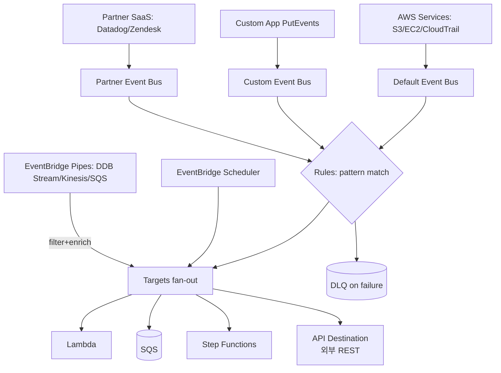
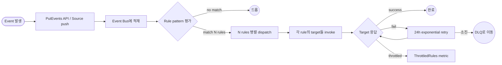

# AWS EventBridge

## 핵심 요약

AWS EventBridge는 **serverless event bus** 서비스로, 다양한 source의 이벤트를 JSON 패턴 매칭 rule로 필터·라우팅해 30+ AWS service 또는 SaaS target에 전달한다. 2019년 CloudWatch Events를 확장해 출시되었으며 (CloudWatch Events는 이제 deprecated, API는 동일 유지), 이후 **Pipes**·**Scheduler**·**Schema Registry**·**API Destinations**으로 기능 확장된 event-driven architecture의 중심 서비스.

- **3 core concept**: **events**(JSON 객체) + **rules**(event pattern 매칭 또는 schedule 트리거) + **targets**(rule 매칭 시 호출되는 endpoint, 단일 rule이 최대 5 target).
- **3종 Event Bus**: `default`(AWS 서비스 이벤트 자동 publish) / `custom`(사용자 정의) / `partner`(Datadog·Zendesk·PagerDuty·MongoDB Atlas 등 SaaS).
- **확장 기능**: **Pipes**(1:1 point-to-point, source → filter → enrich → target), **Scheduler**(시간대·flexible window·retry 정책 지원 정교 cron), **Schema Registry**(자동 schema 추출 + Java/Python/TypeScript/Go code binding).
- **과금**: custom·partner events $1.00 per 1M (첫 100K/월 free), AWS management events 무료. 64KB chunk = 1 event 환산. 24시간 retry 기본.

## 시스템 아키텍처

EventBridge는 다중 source(AWS service·SaaS·custom app)에서 들어오는 event를 bus에 적재 → rule이 pattern 매칭 → 1+ target에 fan-out하는 구조. Pipes는 별도 component로 1:1 라우팅·변환 담당, Scheduler는 시간 기반 트리거 전용.

## 처리 흐름

PutEvents 또는 source 이벤트 도착 → bus에 적재 → rule 평가 → 매칭된 rule의 target들에 동시 dispatch → 실패 시 24시간 재시도 → 한계 초과 시 DLQ.

## 핵심 기능 및 서비스

| 기능 | 설명 |
|---|---|
| Event Bus | default·custom·partner 3종. 단일 account에 다중 custom bus 생성 가능 |
| Rules | event pattern(JSON path 매칭) 또는 schedule 트리거. bus당 최대 2000개 (hard limit) |
| Targets | 30+ AWS 서비스(Lambda·SQS·SNS·SF·Kinesis·ECS task) + API Destination(외부 REST + OAuth/API key) |
| Fan-out | 1 rule이 동시에 최대 5 target에 dispatch |
| Pipes | 1:1 point-to-point: source(DDB/Kinesis/SQS/MQ/Kafka) → filter → enrich(Lambda·SF·API) → target. 순서 유지 |
| Scheduler | 200+ AWS 서비스 target, 시간대(UTC 외)·flexible time window·retry·DLQ. 1회성 + cron/rate |
| Schema Registry | discoverer가 자동으로 schema 추출 + 버전 관리. 코드 binding 생성(Go/Java/Python/TypeScript) |
| Schema Discovery | event bus에 켜두면 도착한 이벤트의 schema 자동 등록. 변경 시 새 버전 |
| API Destinations | 외부 REST endpoint에 직접 전송, OAuth·Basic·API key 관리. PrivateLink·VPC Lattice로 사설 endpoint도 가능 |
| DLQ | rule target 실패 시 SQS DLQ로 이동, 24h retry 후 |
| Replay | 보관된 archive에서 이벤트 재실행 (장애 복구·테스트) |

## 유사 기술 비교

| 항목 | EventBridge | SNS | SQS | EventBridge Pipes |
|---|---|---|---|---|
| 모델 | content-based routing event bus (1:N 매칭) | pub/sub fan-out (topic→N subscribers) | queue (1 producer→1+ consumer pull) | 1:1 point-to-point with filter/enrich |
| 필터링 | rule pattern (JSON 깊은 매칭) | message attribute filter (제한적) | 없음 (소비자가 처리) | event pattern + Lambda enrich |
| Source 종류 | AWS 서비스 + SaaS + custom | SNS publisher | SQS sender | DDB Stream/Kinesis/SQS/MQ/Kafka |
| Target 종류 | 30+ + API Destination | Lambda/SQS/HTTP/email/SMS | Lambda·EC2·ECS poll | 30+ EventBridge target |
| 처리량 | 계정 단위 throttling (증가 신청 가능) | 매우 높음 | 매우 높음 | source quota 의존 |
| 적합 케이스 | 다중 source · SaaS · 정교 라우팅 | 단순 fan-out 알림 | 비동기 queue · backpressure | Lambda 없이 stream↔target 직결 |
| 비용 | $1.00 / 1M custom event | publish + delivery 별도 과금 | API call 기반 | Pipes 별도 + source quota |

## 실제 사례

### Immutable (Web3 게임 인프라)
2022년 EventBridge 기반 event-driven 아키텍처로 6개월 만에 전환. 직원 6× 성장 처리, 신뢰성·확장성 모두 개선. AWS 공식 case study.

### Fashion Retailer — 제품 출시
제품 출시 시점 5M event를 zero manual scaling으로 처리. EventBridge의 burst capacity와 자동 throttle 관리로 운영 개입 0.

### E-commerce — 주문 처리
직접 API 호출에서 EventBridge 기반 라우팅으로 전환 후 주문 처리 latency **45% 감소**. service 결합도가 줄어 장애 격리도 개선.

### Multi-tenant SaaS — Tenant 격리 패턴
공식 권장 패턴: tenant당 custom event bus + 중앙 orchestration bus. 고객별 이벤트가 자신의 AWS account의 bus로 직접 라우팅되어 데이터 isolation 보장 + 중앙 관측가능성 유지.

### Zendesk → AWS 분석 파이프라인
Zendesk partner event source로 `TicketCreated`·`CommentCreated`·`StatusChanged` 등 이벤트를 EventBridge로 수신 → Kinesis Firehose → S3 → Athena/QuickSight로 BI·ML 활용.

### Datadog → Auto-remediation
Datadog 알림을 partner event source로 받아 rule → Lambda로 자동 복구 (예: 메모리 임계 초과 시 ASG scale-up + Slack 알림).

## 활용 시나리오

### 시나리오 1: 마이크로서비스 간 비동기 이벤트 라우팅
컨텍스트 — 주문·결제·배송 서비스가 독립 배포되며 결합도 최소화 필요. → 각 서비스가 custom event bus에 `OrderCreated`·`PaymentSucceeded`·`ShipmentDispatched` 이벤트 publish. 관심 있는 서비스는 rule로 구독. SNS 대비 정교한 pattern 매칭 + Schema Registry로 컨트랙트 관리.

### 시나리오 2: SaaS 통합 (Zendesk → 사내 시스템)
컨텍스트 — Zendesk 티켓을 사내 BI에 반영하고, VIP 고객 티켓은 Slack 즉시 알림. → Zendesk partner event source 등록 → rule 1: 모든 티켓 → Kinesis → S3, rule 2: `priority=high && customer_tier=vip` 패턴 매칭 → Lambda → Slack. 코드 변경 없이 매핑 가능.

### 시나리오 3: 스케줄 작업 (EventBridge Scheduler)
컨텍스트 — 매일 한국 시간 새벽 3시 백업 작업. CloudWatch Events는 UTC 전용이라 변환 번거로움. → EventBridge Scheduler 사용, timezone `Asia/Seoul` + `cron(0 3 * * ? *)` + flexible 5min window + retry 3회 + DLQ 설정. 200+ AWS 서비스 직접 target 가능.

### 시나리오 4: DDB Stream → 다중 sink (Pipes)
컨텍스트 — DynamoDB 변경을 검색 인덱스(OpenSearch) + 데이터 웨어하우스(Redshift) + 알림(Slack)에 동시 반영. → EventBridge Pipes로 DDB Stream을 source, filter로 특정 attribute만 통과, Lambda enrich로 ID → 상세 객체 변환, target은 custom event bus → 3개 rule로 fan-out. Lambda 작성 최소화.

### 시나리오 5: CI/CD 자동화 + 보안 모니터링
컨텍스트 — CodeCommit push → 자동 빌드·배포 + CloudTrail의 의심스러운 API 호출 자동 차단. → default bus가 자동 publish하는 이벤트에 rule 부착. 빌드 rule → CodeBuild target / 보안 rule → Lambda(자동 격리) + SNS(SRE 알림). 별도 polling 코드 0.

## 장단점 및 트레이드오프

| 항목 | 내용 |
|---|---|
| 장점 | 다중 source/target 통합 / 정교한 JSON pattern 매칭 / SaaS partner 네이티브 통합 / Schema Registry로 컨트랙트 관리 / Scheduler·Pipes로 lambda 없이도 통합 / 24h 자동 재시도 + DLQ |
| 단점 | rule bus당 2000 hard limit / 계정 단위 throttling / event 순서 보장 없음(Pipes 제외) / 무거운 payload는 64KB chunk 단위로 과금 / 디버깅·local test 어려움 / lock-in |
| 트레이드오프 | 단순 fan-out은 SNS가 비용 우위 / queue 기반 backpressure는 SQS / EventBridge는 정교 라우팅이 필요할 때만 정당화 / Pipes는 lambda 줄이지만 Pipes 자체 운영 모델 학습 필요 |

## 함정 및 안티패턴

- **안티패턴 1: 무한 loop rule** — rule action이 다시 같은 rule을 트리거(예: S3 ACL 변경 감지 → ACL 수정 → ACL 변경 이벤트 재발생). → event pattern을 정확히 좁혀 자신이 만든 변경 제외(예: `userIdentity.principalId != automation-role`).
- **안티패턴 2: DLQ 미설정** — target invocation 실패 시 24h 후 silent drop. → rule target마다 SQS DLQ 부착, alarm으로 누적 감시.
- **안티패턴 3: Imprecise event pattern** — 너무 broad 패턴으로 의도 외 이벤트 매칭 → 비용·noise 폭증. → `source` + `detail-type` + 세부 attribute 다층 필터, TestEventPattern API로 사전 검증.
- **안티패턴 4: EventBridge를 SNS/SQS로 오용** — 단순 fan-out에 EventBridge $1/1M 부담. → 단순 알림은 SNS, 단순 queue는 SQS, 정교한 라우팅·SaaS·schema 필요 시만 EventBridge.
- **안티패턴 5: Schema 관리 없이 이벤트 진화** — producer가 임의로 필드 추가/변경 → consumer가 silent fail. → Schema Registry + discovery 활성화, code binding으로 컴파일 타임 안전성.
- **안티패턴 6: rule 2000개 한계 무시** — 단일 event bus가 2000 rule hard limit. → tenant·도메인별 custom bus 분리.
- **안티패턴 7: CloudWatch Events 잔존** — 신규 기능은 EventBridge에만 추가됨. CloudWatch Events 명칭으로 만든 rule은 EventBridge UI에서 보이지만 SaaS·Schema Registry·API Destinations 등 미지원. → 점진적 마이그레이션, API는 호환되므로 신규 기능 사용 시점에 console에서 전환.
- **안티패턴 8: Scheduler 대신 cron rule 남용** — 단순 cron은 가능하지만 시간대·retry·flexible window가 필요하면 Scheduler가 정답. → 신규 schedule은 Scheduler로.
- **안티패턴 9: 64KB 초과 payload를 그대로 publish** — 큰 payload는 chunk 단위 과금 + 가독성 저하. → S3에 큰 데이터 저장 후 이벤트에는 reference(key·version)만.

## 참고 자료

- [What Is Amazon EventBridge? | AWS Docs](https://docs.aws.amazon.com/eventbridge/latest/userguide/eb-what-is.html) — 공식 reference (concept·API)
- [Amazon EventBridge Documentation | AWS](https://docs.aws.amazon.com/eventbridge/) — 전체 문서 entry
- [Event buses | AWS Docs](https://docs.aws.amazon.com/eventbridge/latest/userguide/eb-event-bus.html) — default·custom·partner bus 공식 설명
- [Rules in Amazon EventBridge | AWS Docs](https://docs.aws.amazon.com/eventbridge/latest/userguide/eb-rules.html) — rule·pattern·target 구성
- [Best practices when defining rules | AWS Docs](https://docs.aws.amazon.com/eventbridge/latest/userguide/eb-rules-best-practices.html) — bus당 2000 rule 한계·throttling·DLQ
- [Amazon EventBridge Pipes | AWS Docs](https://docs.aws.amazon.com/eventbridge/latest/userguide/eb-pipes.html) — source/filter/enrich/target 4단계 공식
- [EventBridge is the evolution of CloudWatch Events | AWS Docs](https://docs.aws.amazon.com/eventbridge/latest/userguide/eb-cwe-now-eb.html) — CloudWatch Events 호환·차이
- [Amazon EventBridge Scheduler | AWS Docs](https://docs.aws.amazon.com/scheduler/) — timezone·flexible window·retry 공식
- [Amazon EventBridge Schemas | AWS Docs](https://docs.aws.amazon.com/eventbridge/latest/userguide/eb-schema.html) — Schema Registry·discovery·code binding
- [Amazon EventBridge pricing | AWS](https://aws.amazon.com/eventbridge/pricing/) — $1/1M custom event·free tier·64KB chunk
- [Amazon EventBridge quotas | AWS Docs](https://docs.aws.amazon.com/eventbridge/latest/userguide/eb-quota.html) — 계정 throttling·rule 2000 hard limit
- [Amazon SQS, Amazon SNS, or Amazon EventBridge? | AWS Decision Guide](https://docs.aws.amazon.com/decision-guides/latest/sns-or-sqs-or-eventbridge/sns-or-sqs-or-eventbridge.html) — 공식 선택 가이드
- [Choosing between messaging services for serverless | AWS Compute Blog](https://aws.amazon.com/blogs/compute/choosing-between-messaging-services-for-serverless-applications/) — SQS·SNS·EventBridge 비교
- [Operating Lambda: Anti-patterns in event-driven architectures | AWS Compute Blog](https://aws.amazon.com/blogs/compute/operating-lambda-anti-patterns-in-event-driven-architectures-part-3/) — 이벤트 기반 architecture 안티패턴
- [Immutable case study — 6x growth with EventBridge | AWS](https://aws.amazon.com/solutions/case-studies/immutable-eventbridge-case-study/) — 6개월 전환·6배 성장 사례
- [Amazon EventBridge Integrations | AWS](https://aws.amazon.com/eventbridge/integrations/) — Datadog·Zendesk·PagerDuty 등 SaaS partner 카탈로그
- [Receiving events from a SaaS partner | AWS Docs](https://docs.aws.amazon.com/eventbridge/latest/userguide/eb-saas.html) — partner event source 셋업 공식

## 관련 노트

- [[aws-lambda]] — EventBridge rule의 가장 흔한 target. 이벤트 → 함수 패턴
- [[aws-ecs]] — ECS task를 EventBridge rule target으로 직접 실행 가능 (event-driven container)
