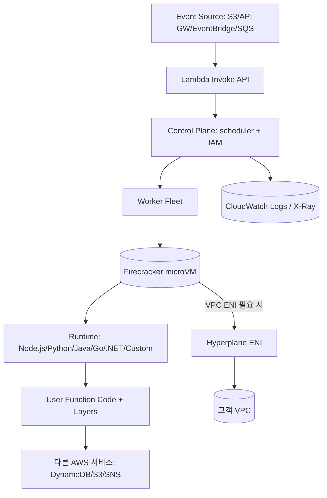
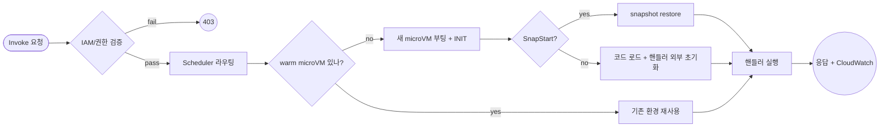

# AWS Lambda

## 핵심 요약

AWS Lambda는 2014년 출시된 AWS의 **서버리스 FaaS(Function as a Service)** 컴퓨팅 서비스로, 코드를 함수 단위로 업로드하면 인프라 관리 없이 이벤트에 응답해 자동 실행·스케일링된다. 내부적으로는 **Firecracker microVM**(자체 개발 KVM 기반 경량 VMM)에서 격리 실행되며, 200+ AWS 서비스 및 50+ SaaS와 native 통합된다.

- **이벤트 기반 트리거 + 자동 스케일**: API Gateway·S3·DynamoDB Streams·SQS·SNS·EventBridge·Kinesis 등에서 호출. 동시 실행 수만큼 microVM이 spin up, 유휴 시 0까지 scale down.
- **사용량 기반 과금**: 호출 횟수 + 실행 시간(ms) × 메모리(GB). 매월 100만 요청 + 400,000 GB-sec free tier. 1ms billing granularity. Compute Savings Plans로 최대 17% 절감.
- **실행 제약**: 최대 15분 timeout(하드 리밋), 메모리 128MB–10,240MB(1.8GB부터 vCPU 1개, 10,240MB 시 6 vCPU), 배포 zip 250MB / container image 10GB, `/tmp` ephemeral 512MB–10,240MB.
- **2026 신기능**: Durable Functions(최대 1년 stateful workflow), Lambda Managed Instances(EC2 수준 customization), .NET 10 런타임, MCP Server for Lambda.

## 시스템 아키텍처

Lambda는 control plane(API/IAM/scheduler)과 data plane(워커 fleet 위 Firecracker microVM)으로 나뉘며, 이벤트 소스가 호출하면 워커 풀에서 새 microVM이 할당(cold) 또는 재사용(warm)된다.

## 처리 흐름

invocation 도착 → routing → microVM 할당(cold or warm) → INIT → handler 실행 → 응답 + 로그. 동일 함수 동시 호출은 multiple microVM에 병렬 dispatch.

## 핵심 기능 및 서비스

| 기능 | 설명 |
|---|---|
| Event sources | API Gateway/S3/DynamoDB Streams/SQS/SNS/EventBridge/Kinesis/MQ 등 200+ 서비스 |
| 동시성 제어 | Reserved Concurrency(상한·하한), Provisioned Concurrency(pre-warmed N개 유지) |
| SnapStart | Java/Python/.NET 대상 microVM snapshot으로 cold start sub-second로 단축. Java ~10× 가속 |
| 런타임 | Node.js/Python/Java/Go/.NET/Ruby + Custom Runtime(Lambda Runtime API) |
| Lambda Layers | 공통 의존성/SDK 분리 패키징, 함수 간 재사용 |
| Container image | ECR 기반 10GB image 배포 — ML/대용량 의존성용 |
| Ephemeral `/tmp` | 512MB–10,240MB. KMS 암호화 |
| VPC 통합 | Hyperplane ENI로 VPC cold start <50ms (이전 10–15초) |
| Observability | CloudWatch Logs/Metrics + X-Ray 분산 추적 + Lambda Insights |
| Durable Functions (2026) | 최대 1년 stateful workflow, 외부 이벤트 대기 중 compute 비용 0 |
| Lambda Managed Instances (2026) | EC2 수준 커스터마이징과 GPU 등 하드웨어 가속을 lambda-style 운영으로 |

## 유사 기술 비교

| 항목 | AWS Lambda | Google Cloud Functions (2nd gen / Cloud Run-backed) | Azure Functions | Cloudflare Workers |
|---|---|---|---|---|
| 실행 모델 | Firecracker microVM | gVisor / Cloud Run container | Worker process + Premium pre-warmed | V8 isolate (서브-ms) |
| Cold start | 200–400ms(Node), 2–3s(Java; SnapStart로 sub-sec) | <200ms (Python/Node) | Consumption 유사, Premium은 0 | sub-ms (compile-once) |
| 최대 실행 시간 | 15분 | 60분 (HTTP 30분, event 9분) | Consumption 5–10분, Premium 60분 | 30s(free)/15min(paid) |
| 런타임 종 | 6+ + custom runtime | 7개 정도 (Node/Python/Go/Java/Ruby/PHP/.NET) | 6+ enterprise 친화 | JS/WASM 위주 |
| 통합 깊이 | 200+ AWS 서비스 + 50+ SaaS | GCP 중심 | Azure + 하이브리드 강함 | Cloudflare edge + 외부 fetch |
| 적합 케이스 | AWS 생태계 통합·다양한 워크로드 | GCP 친화·간단한 HTTP/event | 엔터프라이즈·하이브리드 | 글로벌 edge·저지연 |

## 실제 사례

### Netflix
업로더가 S3에 영상을 올리면 S3 이벤트 → Lambda가 자동 호출되어 비디오를 5분 청크로 split + 60개 parallel encoding stream으로 변환. 별도로 backup integrity checker Lambda가 백업 파일 검증·실패 시 source 재시작.

### Coca-Cola Freestyle
스마트 벤딩머신 라인의 주문·결제 백엔드를 Lambda 기반 serverless로 운영. 예상 30M/월 → 실제 80M req/월까지 자동 스케일. 머신당 운영 비용 $13,000 → $4,500로 절감.

### AWS 공식 customer case studies
Robinhood, BMW, Coca-Cola, iRobot, AC Nielsen 등 다수의 enterprise·소비자 서비스에서 event-driven 아키텍처와 분석 파이프라인의 핵심 구성 요소로 채택.

## 활용 시나리오

### 시나리오 1: API Gateway + Lambda 백엔드
컨텍스트 — 요청 trough/peak 편차 큰 REST API. EC2 over-provisioning 비효율. → API Gateway에 Lambda를 backing으로 연결, 핸들러는 단일 책임 함수로 분리. 평소 0 idle cost, 트래픽 폭발 시 자동 스케일. 인증은 Lambda Authorizer 또는 Cognito.

### 시나리오 2: S3 이벤트 기반 이미지/문서 처리
컨텍스트 — 사용자가 업로드한 이미지의 thumbnail 생성·EXIF 제거·OCR 등 후처리. → S3 PutObject 이벤트 → Lambda 트리거 → SQS DLQ로 실패 격리. ML 라이브러리 무거우면 container image(10GB) 배포로 의존성 수용.

### 시나리오 3: 데이터 파이프라인의 lightweight transformer
컨텍스트 — Kinesis/Kafka 스트림에서 들어오는 이벤트를 가벼운 변환·필터 후 다음 sink로. → Lambda를 Kinesis trigger에 연결, batch size·parallelization factor 조정. 무거운 transform은 Glue/EMR, 가벼운 enrichment·routing은 Lambda.

### 시나리오 4: 스케줄 작업·운영 자동화
컨텍스트 — cron으로 운영 작업(백업 검증·리포트·정리). EC2를 항상 켜두는 비용 비효율. → EventBridge schedule rule → Lambda. 5분 이내 끝나는 작업에 적합. 15분 초과 시 Step Functions로 분해.

### 시나리오 5: AI/ML 추론 백엔드 (container image)
컨텍스트 — 사내 ML 모델(수GB) 추론을 REST로 노출. zip 패키지 250MB 한계 초과. → container image 10GB 배포 + 메모리 10,240MB(6 vCPU) + Provisioned Concurrency 또는 SnapStart로 cold start 제어. GPU 필요하면 2026 Lambda Managed Instances 고려.

## 장단점 및 트레이드오프

| 항목 | 내용 |
|---|---|
| 장점 | 인프라 관리 0 / 자동 스케일링 + idle 0 cost / 1ms 단위 과금 / 200+ AWS 서비스 네이티브 통합 / SnapStart·Provisioned Concurrency 등 cold start 해결책 다양 |
| 단점 | 15분 hard timeout / cold start 잔존 (특히 Java·VPC·heavy INIT) / 로컬 디버깅·테스트 친화도 낮음 / vendor lock-in / 장기·일정 처리량 워크로드는 EC2/ECS 대비 비싸짐 |
| 트레이드오프 | 운영 단순성 vs vendor lock-in / latency(SnapStart·PC) vs 비용 / 함수 단일 책임 vs 배포 오버헤드 / 메모리 ↑ → CPU↑ + 비용↑ → 실행 시간↓ (가격 최적화는 비선형) |

## 함정 및 안티패턴

- **안티패턴 1: Lambda 모놀리스 (lift-and-shift)** — 기존 monolithic 서버 코드를 하나의 함수로 그대로 옮김. 모든 path에 대한 권한·코드가 한 곳에 → IAM 폭증·콜드 스타트 악화·배포 위험 ↑. → 한 함수 = 한 책임으로 분해, API Gateway routing으로 dispatch.
- **안티패턴 2: 동기 호출 체인 (Lambda → Lambda → Lambda)** — 호출 stack이 길어져 timeout 합산·비용 중복·디버깅 곤란. → SQS·EventBridge·Step Functions로 비동기 분리.
- **안티패턴 3: 15분 초과를 강제로 Lambda에 우겨넣기** — chunking·resume 구현 비대화. → Step Functions·ECS task·AWS Batch로 long-running 분리.
- **안티패턴 4: 핸들러 내부에서 매번 SDK·DB 클라이언트 초기화** — 모든 호출이 cold start 비용 수준. → 핸들러 외부(전역)에서 한 번만 초기화해 warm reuse.
- **안티패턴 5: VPC 통합 안 한 함수에 VPC 강제 부여** — 불필요한 Hyperplane ENI 셋업 + 인터넷 접근 차단(NAT 필요). → DB·내부 서비스 접근 필요할 때만 VPC. 외부 API 호출만 하면 VPC outside가 정답.
- **안티패턴 6: Provisioned Concurrency를 무지성 적용** — idle 시간에도 비용 발생, scale up 한계도 있음. → cold start가 실제 SLO에 영향 줄 때만, 측정으로 PC 수 결정. SnapStart로 충분하면 그 쪽이 비용 우위.
- **안티패턴 7: zip 패키지에 모든 의존성 묶기** — 250MB 한계 + cold start 시 archive 로드 비용. → 공통 의존성은 Layers, 무거운 워크로드는 container image(10GB).
- **안티패턴 8: 로그·tracing 미설계** — CloudWatch Logs만으로 분산 호출 추적 곤란. → X-Ray + structured logging + correlation id + Lambda Powertools 활용.

## 참고 자료

- [AWS Lambda Documentation | AWS Docs](https://docs.aws.amazon.com/lambda/) — 공식 reference (concept·API·튜토리얼)
- [AWS Lambda Features | AWS](https://aws.amazon.com/lambda/features/) — 공식 기능 카탈로그
- [AWS Lambda Pricing | AWS](https://aws.amazon.com/lambda/pricing/) — 1ms billing·free tier·Compute Savings Plans
- [Lambda quotas | AWS Docs](https://docs.aws.amazon.com/lambda/latest/dg/gettingstarted-limits.html) — 15분 timeout, 메모리/스토리지 한계 공식
- [Configure ephemeral storage for Lambda | AWS Docs](https://docs.aws.amazon.com/lambda/latest/dg/configuration-ephemeral-storage.html) — `/tmp` 설정·KMS 암호화
- [Improving startup performance with Lambda SnapStart | AWS Docs](https://docs.aws.amazon.com/lambda/latest/dg/snapstart.html) — Java/Python/.NET snapshot 기반 cold start 단축
- [Understanding and Remediating Cold Starts | AWS Compute Blog](https://aws.amazon.com/blogs/compute/understanding-and-remediating-cold-starts-an-aws-lambda-perspective/) — 콜드 스타트 진단·완화 가이드
- [Announcing improved VPC networking for Lambda | AWS Compute Blog](https://aws.amazon.com/blogs/compute/announcing-improved-vpc-networking-for-aws-lambda-functions/) — Hyperplane ENI로 VPC cold start <1초
- [Anti-patterns in Lambda-based applications | AWS Docs](https://docs.aws.amazon.com/lambda/latest/dg/anti-patterns.html) — 공식 안티패턴 가이드
- [Operating Lambda: Anti-patterns in event-driven architectures | AWS Compute Blog](https://aws.amazon.com/blogs/compute/operating-lambda-anti-patterns-in-event-driven-architectures-part-3/) — 이벤트 기반 architecture 안티패턴
- [AWS Lambda: Key Updates Developers Must Know in 2026 | CloudThat](https://www.cloudthat.com/resources/blog/recent-changes-to-aws-lambda-what-developers-need-to-know-in-2026) — Durable Functions·Managed Instances·.NET 10 등 2026 신기능
- [Firecracker MicroVMs: The Power Behind AWS Lambda | Northflank](https://northflank.com/blog/what-is-aws-firecracker) — Firecracker 내부 구조·성능 특성
- [AWS Lambda 10 years (한국어) | AWS 한국 블로그](https://aws.amazon.com/ko/blogs/korea/aws-lambda-turns-ten-the-first-decade-of-serverless-innovation/) — 출시 이후 진화 + 한국어 가이드
- [Lambda 1ms billing granularity (한국어) | AWS 한국 블로그](https://aws.amazon.com/ko/blogs/korea/new-for-aws-lambda-1ms-billing-granularity-adds-cost-savings/) — 1ms 단위 과금 도입 배경
- [Netflix AWS: Serverless Case Study | Dashbird](https://dashbird.io/blog/serverless-case-study-netflix/) — Netflix의 영상 인코딩·백업 Lambda 사례
- [AWS Lambda Customer Case Studies | AWS](https://aws.amazon.com/lambda/resources/customer-case-studies/) — 공식 enterprise 사례 모음

## 관련 노트

- [[aws-ecs]] — 15분 초과·일정 처리량 워크로드를 Lambda에서 분리해 보낼 후속 컴퓨트
- [[aws-eventbridge]] — Lambda의 가장 흔한 트리거. event-driven 아키텍처 결합점
