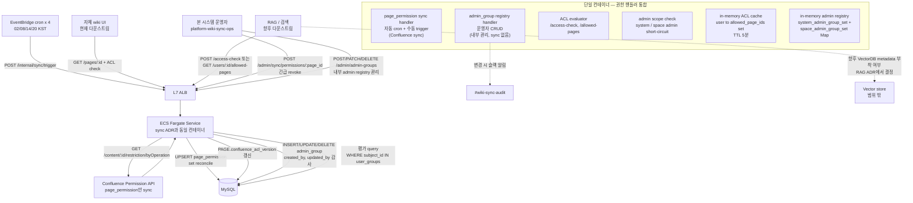
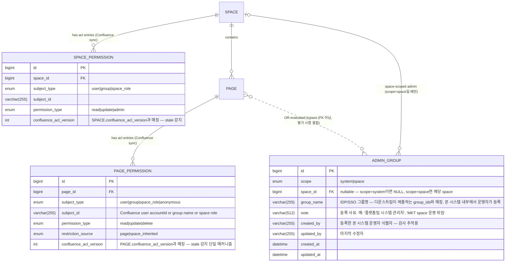

# Phase 1. 문제 이해 및 설계 범위 확정

## 기능 요구사항

본 ADR은 [[dec-2026-06-06-confluence-wiki-sync]]의 후속 결정으로, **권한 데이터의 저장·평가 책임 경계**만 다룬다. 동기화 인프라(L7 ALB · 단일 ECS Fargate service · EventBridge cron × 4 · MySQL on RDS · S3 · 컨테이너 in-memory cache · sync_log result='failure' 흡수)는 sync ADR과 동일하게 재사용하며 별도 컴포넌트를 신설하지 않는다.

- **F1. Confluence page restriction 동기화**: page-level restriction(특정 user/group만 read/update/delete 가능) 메타를 본 시스템 RDB로 동기화.
- **F2. Space-level permission 평탄화**: space 단위 permission(예: "marketing space는 marketing-team만 열람")을 page 단위로 inherit·평탄화해 단일 query로 평가 가능하게.
- **F3. 권한 평가 단일 진입점**: 자체 wiki UI(현재)와 향후 RAG/검색이 동일 `page_permission`을 SoT로 사용. 두 시스템이 권한 모델을 따로 들고 다니지 않음.
- **F4. revoke 신선도 보장**: 권한 회수(퇴사·역할 변경·page restriction 추가)가 sync lag 내 반영. 강신선도가 필요한 critical endpoint는 Confluence 직접 호출 옵션 제공. (자동 lag 목표는 §비기능 요구사항.)
- **F5. 평가 API 노출**: 다운스트림이 권한 평가를 본 시스템에 위임할 수 있는 API(`/access-check`, `/users/{id}/allowed-pages`) 제공.
- **F6. 본 시스템 자체 관리자(admin) 모델 및 평가**: 본 시스템이 **Confluence와 무관하게 자체적으로** 정의·관리하는 system 관리자와 space 관리자. Confluence permission API와 sync하지 않으며, 본 시스템 운영자가 직접 IDP/SSO 그룹명을 admin scope에 등록. 평가 시 admin scope에 해당하는 group은 page_permission row 부재와 무관하게 `allowed=true`로 short-circuit (default-deny 정책의 정상 우회 경로).
- **F7. 관리자 소속 그룹(admin group) registry — 내부 SoT**: `ADMIN_GROUP` 테이블이 system 또는 space scope를 갖는 IDP/SSO group을 보유. 본 시스템 운영자가 `/admin/admin-groups` API로 등록·수정·삭제하며 모든 변경은 감사 로그 (`created_by`, `updated_by`, `updated_at`)로 추적. Confluence의 `confluence-administrators` 등을 자동 가져오지 않음 — 필요하면 동일 group_name으로 운영자가 명시 등록.

> 범위 밖 (Out of scope):
> - VectorDB chunk metadata 부착 여부(RAG ADR로 이관)
> - 외부 PDP(Cerbos/OPA) 도입 시점
> - **user→group 멤버십 매핑 자체**(group_membership 동기화 주체는 별도 결정 — Atlassian/IDP 의존). 본 ADR은 다운스트림이 `/access-check` body에 `group_ids`를 함께 제출한다고 가정.
> - authentication(사용자 신원 확인은 본 ADR 책임 아님 — ALB OIDC·IAM·사내 SSO 별도)
> - **본 시스템 운영자 신원·권한**(`/admin/sync/*` API 호출 자격). Confluence admin과 **명시적으로 분리** — 본 시스템 운영자는 AWS IAM 또는 사내 SSO 그룹(예: `platform-wiki-sync-ops`)으로 정의하며 Confluence 권한 모델과 무관. 본 ADR은 인증 계층(ALB OIDC + 컨테이너 미들웨어)이 운영자 신원 검증 후 핸들러를 호출한다고 가정.

## 비기능 요구사항

| 항목 | 목표 | 비고 |
|---|---|---|
| **revoke 반영 lag (자동, page_permission)** | p95 < 6시간 (일 4회 sync 주기, 02/08/14/20 KST) | [[dec-2026-06-06-confluence-wiki-sync]]과 일치. 긴급 revoke는 수동 sync 또는 strict 옵션으로 보완 |
| **revoke 반영 lag (수동 trigger, page_permission)** | < 1분 | 운영자 `/admin/sync/permissions/{page_id}` 호출 후 |
| **admin scope 변경 반영 lag** | < 1분 (in-memory cache TTL 한도) | admin_group은 본 시스템 내부 관리 — `/admin/admin-groups` 호출 즉시 RDB UPSERT + in-memory registry 갱신. 다른 ECS task는 다음 TTL 만료 또는 push refresh로 수렴 |
| **평가 latency** | `/access-check` p99 < 50ms (admin short-circuit 포함) | admin scope check는 평가 1단계로 in-memory hash lookup → p99 < 5ms |
| **권한 stale tolerance** | page_permission 6시간, admin_group 1분 윈도우 | `permission_synced_at`, `admin_registry_version` 응답 노출 → 다운스트림 stale 검사 가능 |
| **외부 의존성 분리** | Confluence outage 시 평가 가능 | RDB 단독으로 평가 완결. admin_group은 애초에 Confluence 무관이므로 outage 영향 zero |
| **보안 (default-deny)** | page_permission row 없으면 *접근 거부*. admin은 명시 short-circuit 경로로 허용 | sync 누락·실패가 *과허용*이 아닌 *과제한*으로 fail-safe. admin bypass도 admin_group registry에 *운영자 명시 등록 row*가 있어야 동작 → 누락 시 admin도 접근 거부(과제한 fail-safe 유지) |
| **운영 단순성** | sync ADR의 단일 ECS Fargate service에 통합 | 별도 권한 서비스·Lambda 함수 분리 없이 같은 컨테이너 내부 핸들러로 |
| **책임 경계 명확성** | 본 시스템 운영자 ≠ ADMIN_GROUP 등록 대상 ≠ Confluence admin | 세 신원 공간이 분리 — 본 시스템 운영자만 admin_group registry를 *관리*할 수 있고, ADMIN_GROUP 등록자가 자동으로 운영자가 되지 않음 |
| **감사성** | admin_group의 모든 변경에 `created_by`, `updated_by`, `updated_at` 기록 | `/audit/admin-groups?since=...` 또는 변경 이력 view로 추적. 등록·삭제 권한이 강력하므로 감사 필수 |

## 개략적 규모 추정

> 가정: 본 ADR과 동일. pages=5K, daily_edits=100. 추가 가정 — page 중 10%가 page-level restriction 보유, space 수 10개, 사용자 수 500명, group 수 50개, 사용자 평균 소속 group 5개.

### page_permission row 수

- restricted page: `5K × 10% = 500 page`
- restriction 평균 entry/page: 3 (예: "marketing-team group + project-lead user + space-admin role")
- page-level row: `500 × 3 = 1,500 row`
- space-level inherited row (전 페이지에 space permission 평탄화): `5K × 1 = 5,000 row` (space-level permission 1개 평균)
- **총 row 수**: ~6,500 row → ~1.5 MB (row 평균 250B)
- **5년 누적** (20% YoY): ~12,000 row → ~3 MB. 무시 가능 규모.

### admin_group registry row 수

- system admin group: 플랫폼팀·플랫폼 운영팀 등 2~3개 IDP 그룹 (운영자가 등록)
- space admin group: space 10개 × 평균 1.5 admin group/space (예: `wiki-mkt-admins`, `wiki-eng-admins`) = ~15개
- **admin_group row 수**: 초기 ~17~20 row → ~7KB
- **5년 누적** (조직 성장 + space 추가): ~40 row → ~14KB. 완전 무시 가능. in-memory에 전량 캐시 가능.
- admin scope 표현: `scope ∈ {system, space}` enum + `space_id FK nullable` (system은 NULL)
- **별도 admin user 테이블 없음** — user의 admin 여부는 group 멤버십(다운스트림이 제출한 `group_ids`)을 통해 평가. 1인 admin이 필요하면 IDP에 1인 group을 만들어 ADMIN_GROUP에 등록.
- **변경 빈도**: 매우 낮음(월 1~3회 추정). 인원 변경은 IDP group 멤버십에서 흡수하므로 본 시스템 ADMIN_GROUP은 *조직 구조 변경 시점*에만 갱신.

### 평가 QPS

- 자체 wiki UI: page 조회 시마다 ACL check. 사용자 500명 × 평균 50 view/일 = 25K check/일 → ~0.3 QPS, peak ~1.5 QPS.
- 향후 RAG: 쿼리당 top-K=10 chunks → 10 ACL check. 일일 RAG query 1K 가정 → 10K check/일 → 0.12 QPS, peak 1 QPS.
- **합계 peak**: ~2.5 QPS. RDS `db.t4g.small` index lookup으로 충분 (캐시 미적용 시에도 여유).

### Confluence Permission API 호출

- page upsert와 함께 동기 호출 (`GET /content/{id}/restriction/byOperation` per page).
- sync ADR의 polling 주기(일 4회, 02/08/14/20 KST)와 동일. 변경 감지된 page에 한해 호출 → 일일 100 calls. rate limit 사용률 0.04%. 무시 가능.

---

# Phase 2. 개략적 설계안 제시 및 동의 구하기

## 개략적 설계안



## 설계안

| Component | 선택 | 이유 | 검토한 대안 |
|---|---|---|---|
| **권한 SoT (runtime)** | **RDB `page_permission` 테이블** | 자체 wiki UI + 향후 RAG가 같은 SoT 공유 / Confluence outage 무관 / latency 우수 / 관계형 query 자연 | Confluence 매 호출(rate limit·outage 의존), VectorDB metadata(SoT 분산·stale) |
| **권한 SoT (authoring)** | **Confluence** | 변경 책임자가 위키 admin·작성자이므로 원천 보유. 본 시스템은 *변경하지 않음* | (대안 없음 — 인위적으로 옮길 수 없음) |
| **VectorDB 권한 부착** | **결정 유보** | 향후 RAG ADR로 이관. 본 ADR은 RDB 계층까지 책임 한정 | 즉시 부착(defense-in-depth), 즉시 비-부착(RDB 단독) |
| **권한 모델** | **RBAC (시작)** | page-level restriction의 자연 모델. user·group·space-role 3 subject 타입 충분 | ABAC/ReBAC(현 규모에 과잉), 단순 boolean(role 차등 표현 불가) |
| **관리자(admin) 모델** | **별도 `admin_group` registry + 평가 시 short-circuit** | admin을 "모든 page에 묵시적 권한"으로 다룸 → page_permission에 admin row를 명시하면 row 폭증(5K page × admin group 수). registry는 group 단위 1 row + scope(system/space). 평가 첫 단계에서 `group_ids ∩ admin_group(scope match)` short-circuit. *page_permission row가 아닌 별도 entity*인 이유는 정책 본질이 "bypass"라서 | (a) page_permission에 admin row 명시 평탄화(row 폭증·등록 비용), (b) subject_type='admin'으로 통합(scope 표현 어색·query 복잡), (c) 외부 PDP(현 규모 과잉) |
| **관리자 소속 그룹(admin group) SoT** | **본 시스템 단독 SoT — Confluence와 무관** | wiki 콘텐츠 관리(Confluence admin)와 *본 시스템에서의 RAG/검색 접근 정책(admin scope)*은 서로 다른 책임. Confluence admin 자동 위임은 본 시스템 사용자(RAG 등)가 의도치 않은 권한 노출을 받을 수 있고, Confluence 권한 변경이 본 시스템 평가에 즉시 반영되어야 한다는 요구도 없음. 본 시스템 운영자가 IDP/SSO 그룹명을 명시 등록 — 의도된 권한만 발효 | Confluence 동기화(책임 경계 모호·Confluence 변경 시 의도치 않은 권한 부여), group_membership 자체 동기화(범위 폭증·IDP 통합 부담) |
| **본 시스템 운영자 (`/admin/*` 호출자)** | **AWS IAM 또는 사내 SSO 그룹 `platform-wiki-sync-ops`** | wiki 콘텐츠 관리자(ADMIN_GROUP 등록 대상)와 본 시스템 운영자(ADMIN_GROUP을 *관리*하는 자)는 책임이 다름. ADMIN_GROUP 등록자가 자동으로 운영 API 호출 권한을 갖지 않으며, 운영자도 page 콘텐츠 접근 권한을 자동 갖지 않음 (group_ids에 포함되지 않는 한) | ADMIN_GROUP 등록자 = 운영자 자동 매핑(책임 경계 모호·권한 escalation 경로), 본 시스템에 운영자 테이블 신설(IAM/SSO와 중복) |
| **외부 PDP** | **유예** | 정책 복잡도가 임계 미만. 앱 내부 RBAC + admin short-circuit이 RDB query로 충분 | Cerbos/OPA 즉시 도입(운영 컴포넌트·학습 비용), AWS Verified Permissions(vendor-lock-in) |
| **default 정책** | **default-deny** | page_permission row 없으면 접근 거부. admin도 admin_group registry row가 있어야 short-circuit — 누락 시 admin도 거부(fail-safe 유지) | default-allow(보안 위험), space-level fallback(복잡도 ↑), admin always-allow(registry 누락 시 모든 user에 권한 누출 위험) |
| **캐시** | **컨테이너 in-memory cache (user → allowed_page_ids set + admin_group registry 전체, TTL 5분)** | sync ADR이 ElastiCache 미도입·in-memory hash cache 채택과 일관. 현 QPS(peak 2.5)에 RDB 단독으로도 여유. admin_group registry는 ~17 row로 task 시작 시 lazy load 후 in-memory 상주. multi-task 확장 임계 도달 시 ElastiCache 재검토 | ElastiCache Redis 즉시 도입(현 규모 over-engineering·외부 컴포넌트), 캐시 없음(향후 RAG 확장 시 RDB hot path 부담), DynamoDB(latency·비용 비효율) |

## 로드밸런서

- **선택**: [[dec-2026-06-06-confluence-wiki-sync]]의 진입점(**L7 ALB + 단일 ECS Fargate service**) 재사용. 별도 ingress 신설 없음.
- **선택 이유**: 권한 평가 API(`/access-check`, `/users/{id}/allowed-pages`, `/pages/{id}/permissions`)는 sync ADR의 ECS HTTP 서버 컨테이너에 path 라우팅만 추가하면 구현 가능. ALB listener rule(`/access-check`, `/users/*/allowed-pages`, `/pages/*/permissions`)로 분기. 별도 진입점 신설은 운영 컴포넌트 분산만 야기.
- **검토한 대안**: 별도 ALB·API Gateway 분리(권한·동기화 책임 분리 명확화) — 본 시스템 규모(2.5 QPS peak)에서 분리 가치 < 운영 비용.
- **주요 설정 포인트**:
  - 신규 path: `/access-check`, `/users/{id}/allowed-pages`, `/pages/{id}/permissions`, `/admin/sync/permissions/{page_id}`
  - throttling: 다운스트림당 100 RPS soft (sync ADR과 동일), `/access-check`는 200 RPS soft(RAG 결합 부하 대응)
  - auth: sync ADR 정책 그대로 — 다운스트림은 ALB OIDC(사내 SSO) 또는 IAM SigV4. `/admin/sync/permissions/*`는 운영자 IAM + source IP allowlist. ALB 자체는 SigV4 검증 미지원이므로 컨테이너 미들웨어에서 검증.

## 레디스

> 본 절의 "레디스"는 Phase 2 표준 헤딩 명이지만, [[dec-2026-06-06-confluence-wiki-sync]]가 ElastiCache 미도입(컨테이너 in-memory hash cache 채택)을 결정한 것과 일관되게, 본 ADR도 **별도 ElastiCache Redis를 도입하지 않고 같은 ECS 컨테이너의 in-memory cache에 ACL 캐시를 추가**한다.

- **선택**: **컨테이너 in-memory cache (sync ADR의 page-hash cache와 같은 컨테이너 내부, 다른 namespace)**
- **1차 역할**: **user → allowed_page_ids set 캐시** (권한 평가 hot path)
- **선택 이유**:
  - ECS Fargate task가 상시 1개 이상 살아있으므로 in-memory 캐시가 유효 (Lambda stateless 한계 무관).
  - 현 규모(2.5 QPS peak) + 5K page 가정에 ACL set 메모리 footprint 작음. 사용자 500명 × 평균 1KB(page_id set) ≈ 500KB. 컨테이너 1GB 한도 대비 무시 가능.
  - TTL 5분으로 revoke 신선도와 캐시 효과 균형. sync 주기(6h) 대비 캐시 TTL이 훨씬 짧아 캐시가 stale window를 *늘리지 않음*.
  - sync ADR과 동일 컴포넌트(컨테이너 in-memory) → 운영 단순성·관측성 일관.
- **검토한 대안**:
  - **ElastiCache Redis 즉시 도입**: 현 규모 over-engineering + sync ADR과 불일치. multi-task 일관성 부담 임계(task >2 또는 사용자 >5K) 도달 시 재검토.
  - **캐시 없음**: 현 규모 RDB 단독으로도 충분(peak 2.5 QPS, db.t4g.small 여유). 단 향후 RAG ACL pre-filter 호출 빈도 증가 대비해 선제적으로 in-memory에 둠.
  - **Lambda /tmp 캐시**: 본 ADR이 Lambda 모델 아님 — 부적합.
- **주요 설정 포인트**:
  - 자료구조: `Map<String, AllowedPagesEntry>` — key `{user_id}` (또는 group 결합 시 `{user_id}:{group_set_hash}`) → `{page_ids: Set<bigint>, cached_at}`
  - TTL: 5분 — 만료된 entry는 다음 평가 시 lazy refresh
  - task replacement 시: cold start → 첫 호출은 RDB 직접 조회 후 entry 생성. 일 4회 sync 주기 대비 영향 미미.
  - invalidation: page_permission UPSERT 시 영향 받는 user 역추적이 group→user 매핑 부재로 복잡 → **TTL에 의존하는 게 단순**. 즉시 무효화가 필요한 critical revoke는 strict 옵션으로 우회.
  - sync ADR의 page-hash cache와 **같은 프로세스, 다른 namespace**로 운영 (예: `acl:user:*` vs `page:hash:*` prefix)
- **multi-space 확장 시 (트리거)**: (a) ECS task 수 > 2로 캐시 일관성 부담 발생 또는 (b) ACL 변경이 잦아 TTL window 내 stale 사고 빈발 시 → **ElastiCache Redis 도입 재검토**. 키 schema가 단순 string→set이므로 마이그레이션 부담 작음.

## 사용자 데이터베이스

- **선택**: [[dec-2026-06-06-confluence-wiki-sync]]의 MySQL 8.0 (RDS db.t4g.small, region `ap-northeast-2`) 재사용. 본 ADR은 `page_permission` 테이블 추가만 담당.
- **선택 이유**: 본 ADR의 PAGE 테이블과 외래키 관계로 자연 join. 별도 DB 인스턴스·sharding 불필요.
- **검토한 대안**:
  - **별도 권한 DB 분리**: 권한과 콘텐츠 책임 명확화 가능하나 운영 컴포넌트 분산. 현 규모에 과잉.
  - **DynamoDB**: 단일 키 조회는 강하나 `WHERE subject_id IN (...) AND permission_type = ?` 같은 set 쿼리·관계형 join에 제약.
- **주요 설정 포인트**:
  - 신규 테이블: `page_permission`
  - PAGE 테이블에 `confluence_acl_version INT` 컬럼 추가 (CDC 트리거)
  - 선택 추가 테이블: `space_permission` (space-level inheritance 분리 저장 시), `group_membership` (IDP 통합 시 — 현재 범위 밖)
  - 인덱스: `(page_id, subject_type, subject_id)` UK, `(subject_id, permission_type)`, `(synced_at)`

## API 설계

[[dec-2026-06-06-confluence-wiki-sync]]의 ECS HTTP 서버에 path 추가.

- **선택**: REST (OpenAPI 3.1) on **ALB + 단일 ECS Fargate service** (sync ADR의 HTTP 서버 컨테이너 내장 라우터에 path 추가)
- **선택 이유**: sync ADR과 동일 client·인증·throttling 체계 재사용. 컨테이너 내부 HTTP 라우터(Express / FastAPI / Spring 등)에 핸들러 등록만으로 신규 path 노출.
- **주요 엔드포인트**:
  - `GET /pages/{id}/permissions` — page의 권한 메타 조회 (관리·디버깅용). 응답에 page_permission row + 해당 page가 속한 space의 system/space admin_group 목록도 동봉(투명성)
  - `POST /access-check` body `{user_id, group_ids, page_id, permission_type='read'}` → `{allowed: bool, decision_path: 'page_acl'|'space_acl'|'system_admin'|'space_admin'|'default_deny', evaluated_at, permission_synced_at}` — 다운스트림 평가 위임 옵션. 응답 헤더에 `X-Permission-Synced-At`, `X-ACL-Cache-Hit`, `X-Admin-Bypass` 동봉. `decision_path`로 admin short-circuit 가시화
  - `POST /access-check?strict=true` — Confluence Permission API 직접 호출 (강신선도 옵션, latency ~300ms). admin 평가는 strict 모드에서도 본 시스템 admin_group registry 사용 (Confluence가 admin 정보를 단일 API로 노출하지 않으므로)
  - `GET /users/{id}/allowed-pages?space=&label=&permission=read&limit=&cursor=` — 사용자가 볼 수 있는 page 집합 (RAG ACL pre-filter용). admin인 사용자는 결과에 모든 page(또는 scope 내 모든 page)가 포함. 응답에 `permission_synced_at`, `is_system_admin`, `space_admin_in: [space_keys]` 헤더 동봉
  - `GET /admin/admin-groups?scope=&space=` — ADMIN_GROUP registry 조회 (운영·감사용, 운영자 한정)
  - `POST /admin/admin-groups` body `{scope, space_key?, group_name, note}` — ADMIN_GROUP **등록**. `created_by`는 인증된 운영자 식별자로 자동 채움. 등록 즉시 in-memory registry refresh broadcast (multi-task 환경)
  - `PATCH /admin/admin-groups/{id}` body `{note?}` — note 수정만 허용. scope·space_id·group_name 변경은 새 row 등록 + 기존 row 삭제로 처리 (감사 추적 단순화)
  - `DELETE /admin/admin-groups/{id}` — ADMIN_GROUP 제거. 즉시 in-memory registry refresh
  - `GET /admin/admin-groups/audit?since=&limit=&cursor=` — admin_group 변경 이력 (감사 로그 추출용)
  - `POST /admin/sync/permissions/{page_id}` — 단건 page_permission 강제 재동기화 (운영자용, 동기 처리 < 10s, sync ADR의 `/admin/sync/pages/{id}`와 동일 패턴)
- **인증**: sync ADR 정책 그대로 — 다운스트림 API는 ALB OIDC 또는 IAM SigV4, `/admin/*`은 **본 시스템 운영자 IAM/SSO 그룹(`platform-wiki-sync-ops`) + source IP allowlist**. ADMIN_GROUP에 등록된 group의 멤버라는 사실만으로 `/admin/*` 호출 권한이 부여되지 *않음* (두 신원 공간 분리).
- **rate limit**: `/access-check` 다운스트림당 200 RPS soft (자체 wiki UI · RAG 결합 부하 대응), `/admin/sync/permissions/*`는 운영자당 60 req/h soft, `/admin/admin-groups POST·PATCH·DELETE`는 운영자당 30 req/h soft (변경 빈도 낮음 + 감사 추적)

## 데이터모델



**PAGE 테이블 변경**:
- `confluence_acl_version INT` 컬럼 추가 — Confluence가 page restriction 변경 시 증가시키는 값. sync handler가 이 값으로 권한 변경 여부 감지(content_hash와 별개). **PAGE_PERMISSION의 `synced_at`을 제거**한 대신 본 컬럼과 PAGE_PERMISSION.confluence_acl_version의 매칭이 stale 감지의 단일 메커니즘 (PAGE.synced_at은 sync ADR이 보유).

**ADMIN_GROUP의 SoT 위치 (중요)**:
- **본 시스템 내부 단독 SoT** — Confluence permission API와 무관. Confluence의 `confluence-administrators` group 등을 *동기화하지 않음*.
- `group_name` 은 사내 IDP/SSO(Okta 등) 그룹명. 다운스트림이 `/access-check` 호출 시 제출하는 `group_ids`와 동일 namespace.
- 등록·수정·삭제는 본 시스템 운영자(`platform-wiki-sync-ops`)가 `/admin/admin-groups` API로 수행. 자동 sync 없음 → `synced_at` 무의미 → 제거.
- 결과적으로 본 시스템에는 **두 개의 admin 신원 공간**이 분리되어 운영됨:
  1. **본 시스템 운영자**: `/admin/*` API 호출 자격. AWS IAM 또는 사내 SSO 그룹 `platform-wiki-sync-ops`.
  2. **wiki 콘텐츠 administrator (ADMIN_GROUP)**: 자체 wiki UI·RAG에서 평가 시 bypass 자격. IDP/SSO 그룹명으로 표현.
- Confluence의 admin과는 **완전히 무관** — Confluence가 누군가를 admin으로 지정해도 본 시스템 ADMIN_GROUP에 등록되지 않으면 평가 시 일반 사용자.

**ADMIN_GROUP 인덱스·제약**:
- UK `(scope, space_id, group_name)` — 동일 scope·space에 같은 group 중복 등록 방지
- 보조 인덱스 `(group_name)` — 평가 시 다운스트림 `group_ids` set과 빠른 매칭
- `scope='system'` row의 `space_id`는 NULL 강제 (CHECK constraint 또는 application-level)
- 본 시스템에 `admin_user` 테이블은 두지 않음 — admin 여부는 group 멤버십(다운스트림 제출 `group_ids`) 경유로만 결정. 개별 user 직접 admin 부여가 필요하면 1인 group을 IDP에 만들어 ADMIN_GROUP에 등록.

**Access pattern**:

| 패턴 | 쿼리 형태 | 인덱스 |
|---|---|---|
| 단건 평가 | `SELECT 1 FROM page_permission WHERE page_id = ? AND permission_type = 'read' AND subject_id IN (?, ?, 'anonymous') LIMIT 1` | UK `(page_id, subject_type, subject_id)` + 보조 `(subject_id, permission_type)` |
| 집합 (allowed-pages) | `SELECT DISTINCT page_id FROM page_permission WHERE permission_type = 'read' AND subject_id IN (...)` | `(subject_id, permission_type, page_id)` covering |
| 권한 메타 조회 | `WHERE page_id = ?` | PK + page_id index |
| 미해결 sync 추적 | `WHERE page_permission.confluence_acl_version != page.confluence_acl_version` (view 권고) | join 인덱스 |
| **admin scope 매칭 (system)** | `SELECT 1 FROM admin_group WHERE scope='system' AND group_name IN (?, ?, ...) LIMIT 1` — 다운스트림이 제출한 `group_ids` 중 system admin group 존재 여부 | `(group_name)` 인덱스. ★ 실제로는 task 시작 시 admin_group 전량을 in-memory에 load → MySQL 호출 없이 set lookup |
| **admin scope 매칭 (space)** | `SELECT 1 FROM admin_group WHERE scope='space' AND space_id=? AND group_name IN (...) LIMIT 1` | UK + in-memory map `space_id → Set<group_name>` |
| admin_group 변경 감사 | `WHERE updated_at > ?` (감사 로그 추출용) | `idx_updated_at` |

**Row size 추정**:
- `page_permission` ≈ 230B (synced_at 8B 제거). 6,500 row × 230B ≈ **1.5 MB**.
- `space_permission` ≈ 동일. 50 row 미만 → 미미.
- `admin_group` ≈ 350B (note·created_by·updated_by varchar 평균 100B). 초기 ~20 row × 350B ≈ **7KB**. 5년 누적 ~40 row → ~14KB. in-memory 상주.
- **현재 누적**: < 2 MB. **5년 누적**: < 5 MB. 무시 가능.

> **space-level inheritance 평탄화 vs 분리 저장**: 두 옵션 모두 유효. 본 ADR은 `space_permission` 별도 테이블 + 평가 query 시 union 방식 채택 — 권한 평가는 두 테이블 union, 저장은 정규화. 평탄화(`page_permission`에 inherited row 폭증)는 row 5K→25K로 증가하나 query 단순. 분리는 query 복잡하나 정규화·동기화 단순. PoC 후 재평가.

---

# Phase 3. 상세 설계

## 중요 구성요소별 규모 확장성 및 대안

### 3.1 권한 동기화 흐름 — Confluence Permission API → page_permission reconcile

- **문제 상황**: page upsert 시점에 권한 메타를 함께 동기화해야 본 시스템이 다운스트림에 정확한 ACL을 노출할 수 있다. Confluence Permission API 응답 구조(`/content/{id}/restriction/byOperation`)는 page 단위 `read`/`update` operation별 user/group set으로 분리되어 있어 평탄화·reconcile 로직이 필요하다.
- **확장 전략**:
  - **sync handler 통합**: [[dec-2026-06-06-confluence-wiki-sync]]의 ECS 컨테이너 내부 sync handler(자동 cron × 4 + 수동 trigger)가 page upsert(`content fetch`)와 동일 트랜잭션에서 `GET /content/{id}/restriction/byOperation` 호출 → 응답 파싱.
  - **set reconcile**: 현재 page_permission row 집합 ↔ Confluence 응답 집합의 set diff → 신규 INSERT, 사라진 row DELETE, 변경 없는 row UPDATE skip. 동일 PAGE id 트랜잭션 내 처리.
  - **acl_version 갱신**: 응답에 마지막 변경 시점 또는 hash를 기반으로 `confluence_acl_version` 산정 → PAGE 컬럼에 저장 (sync ADR이 PAGE.confluence_acl_version 컬럼 신설을 선언함).
  - **space-level**: page 응답의 ancestors 또는 별도 `GET /space/{key}/permission` 호출로 space_permission 동기화. 일 1회 cron(예: 02:00 KST 자동 sync에 piggyback)으로 충분 (space 변경 빈도 낮음).
  - **anonymous 처리**: Confluence가 "Anyone can view"로 설정한 page는 `subject_type='anonymous'`, `subject_id='*'`로 평탄화.
  - **실패 처리**: sync ADR의 `sync_log` 테이블에 `result='failure'` 행 기록. DLQ 미사용 — 다음 cron 자동 재시도 또는 운영자 `/admin/sync/permissions/{page_id}` 수동 trigger로 흡수.
- **검증 지표**:
  - `permission_sync_lag_seconds` p95: PAGE.confluence_updated_at ~ page_permission.synced_at 차이. 목표 < 21,600s(6h, 일 4회 polling 주기 한도) — 평균은 ~3h.
  - `permission_reconcile_error_rate`: set diff 처리 실패율. 목표 < 0.1%.
  - `acl_version_mismatch_count`: PAGE.confluence_acl_version ≠ page_permission.confluence_acl_version row 수. 목표 = 0 (stale 감지용).

### 3.2 평가 query 패턴 — 단건·집합·user-set 분리

- **문제 상황**: 자체 wiki UI는 *단건* page 평가가 주, RAG는 *집합* allowed-pages 또는 *N개 chunk의 page 집합 평가*가 주. 각 패턴이 다른 인덱스·query 형태를 요구한다.
- **확장 전략**:
  - **단건 평가** (`/access-check`):
    ```sql
    SELECT 1 FROM page_permission
    WHERE page_id = ?
      AND permission_type = 'read'
      AND subject_id IN (?user_id, ?group_ids..., 'anonymous')
    LIMIT 1
    ```
    인덱스: UK `(page_id, subject_type, subject_id)`. p99 < 10ms.
  - **집합 — allowed-pages** (`/users/{id}/allowed-pages`):
    ```sql
    SELECT DISTINCT page_id FROM page_permission
    WHERE permission_type = 'read'
      AND subject_id IN (?user_id, ?group_ids..., 'anonymous')
    UNION
    SELECT page_id FROM page WHERE space_id IN (
      SELECT space_id FROM space_permission
      WHERE permission_type = 'read' AND subject_id IN (...)
    )
    ```
    인덱스: `(subject_id, permission_type, page_id)` covering. 응답 cursor 페이지네이션 필수.
  - **RAG ACL pre-filter용 — chunk 집합 평가**: top-K=10 chunk의 page_id 10개 → 단건 평가 10회 (batched query 가능):
    ```sql
    SELECT page_id FROM page_permission
    WHERE page_id IN (?, ?, ..., ?)
      AND permission_type = 'read'
      AND subject_id IN (...)
    ```
- **검증 지표**:
  - `access_check_p99_latency_ms`: < 50ms (캐시 hit 시 < 5ms)
  - `allowed_pages_p99_latency_ms`: < 200ms (cursor 페이지네이션 100 page/page)
  - `cache_hit_rate (acl)`: 컨테이너 in-memory `acl:user:*` namespace hit율. 목표 > 80%

### 3.3 revoke 신선도·stale 보호 — sync lag와 강신선도 옵션

- **문제 상황**: 권한 *회수*(퇴사·역할 변경·page restriction 추가)가 다운스트림에 늦게 반영되면 *과허용*(이미 권한 잃은 사용자가 접근 가능)이 발생해 보안 사고가 된다. sync ADR이 자동 polling을 일 4회(6h)로 결정했으므로 **자동 경로 최악 stale = sync 6h + 캐시 TTL 5분 ≈ 6h 5분**. critical 경로는 strict 옵션·운영자 수동 trigger로 보완해야 한다.
- **확장 전략**:
  - **일반 경로 (자동 sync 6h + in-memory cache 5분)**: 대부분 use case에 허용 — 본 시스템은 사내 wiki 동기화로 *분단위 revoke 보장*이 요구되지 않음. revoke 평균 lag ~3h, 최악 ~6h 5분.
  - **운영자 수동 trigger (`/admin/sync/permissions/{page_id}`)**: 긴급 revoke(퇴사·incident) 시 운영자가 단건 호출 → < 1분 내 반영. ACL 캐시 entry도 함께 invalidate.
  - **강신선도 옵션 (`/access-check?strict=true`)**: critical 보안 endpoint(예: 외부 sharing, 감사 추적)는 Confluence Permission API에 직접 위임 호출 → 항상 최신. latency 추가 (~300ms) 수용.
  - **응답 헤더에 `permission_synced_at` 노출**: 다운스트림이 stale threshold 검사 후 자체 판단(예: 1h 이상 stale이면 strict로 재호출 또는 거부) 가능.
  - **revoke 즉시 반영 future work**: Confluence webhook 중 permission 변경 이벤트는 deprecated에서 제외되는 경우가 있음 → 도입 시 자동 6h → 거의 실시간 revoke 전파. 단 sync ADR이 webhook deprecated 경로 회피를 채택했으므로 본 ADR도 동일 입장.
  - **fail-safe default-deny**: page_permission row 없으면 거부. sync 실패·누락이 *과허용*이 아닌 *과제한*으로 fail.
**대안 비교**:

| 항목 | 자동 6h + cache 5분 (선택) | + 수동 trigger | Confluence runtime 매 호출 (strict) | 즉시 webhook 동기화 |
|---|---|---|---|---|
| revoke lag (평균) | ~3h | < 1분 | 0 | 0~수초 |
| revoke lag (최악) | ~6h 5분 | < 1분 | 0 | < 수초 |
| 평가 latency | < 50ms | < 50ms | ~300ms | < 50ms |
| Confluence outage 영향 | 없음 (캐시된 권한 사용) | 없음 | 직접 영향 | 후속 stale |
| 운영 복잡도 | 낮음 | 낮음 (수동 1 API) | 낮음 | 높음 (webhook 인프라·deprecated 리스크) |
| **결론** | 선택 — 일반 경로 | 선택 — 긴급 revoke | strict 옵션의 backend | future work (deprecated 리스크 해소 후) |

- **검증 지표**:
  - `revoke_propagation_p95_seconds`: 권한 회수가 page_permission에 반영되기까지 시간. **자동 경로 목표 < 21,600s (6h), 수동 trigger 경로 목표 < 60s**.
  - `strict_check_call_rate`: `/access-check?strict=true` 호출 비율. 추세가 높으면 polling 주기 단축(예: 일 8회) 또는 webhook 도입 신호.
  - `manual_revoke_trigger_rate`: `/admin/sync/permissions/{page_id}` 호출 빈도. 높으면 자동 주기 조정 신호.
  - `default_deny_rejection_count`: page_permission row 없어 거부된 횟수. 비정상 sync 신호 detection.

### 3.4 관리자 권한 평가·등록 라이프사이클 — 내부 SoT admin_group registry + short-circuit

- **문제 상황**: admin을 "모든 page에 묵시적 권한"으로 다루려면 (a) admin group 수 × 5K page row 폭증을 피해야 하고, (b) admin의 의도(bypass)와 일반 ACL row의 의미를 분리해야 하며, (c) 본 시스템 운영자(`/admin/*` 호출자)와 admin 권한 보유자(콘텐츠 bypass 권한)를 분리해야 한다. 또한 본 시스템은 Confluence와 무관하게 *자체 정책*으로 admin 범위를 결정해야 하므로 — Confluence admin이 본 시스템 RAG/검색까지 자동 bypass하는 것은 의도된 동작이 아님 — admin SoT는 *본 시스템 내부*에 두어야 한다.
- **확장 전략**:
  - **admin_group registry 라이프사이클 (sync 없음, 내부 관리)**:
    - **등록**: 본 시스템 운영자가 `POST /admin/admin-groups` 호출 — body `{scope, space_key?, group_name, note}`. `created_by`에 운영자 식별자 자동 기록.
    - **수정**: `PATCH /admin/admin-groups/{id}` — `note`만 수정 가능. scope/space/group_name 변경은 등록·삭제 조합으로 처리해 감사 이력 단순화.
    - **삭제**: `DELETE /admin/admin-groups/{id}` — 즉시 in-memory registry refresh broadcast.
    - **검증 정책**: 등록 시 `group_name`이 IDP/SSO에 실존하는지는 *본 시스템 책임 아님* (외부 검증 또는 운영 절차로). 단 동일 `(scope, space_id, group_name)` 중복은 UK로 차단.
    - **감사 로그**: `created_by`, `updated_by`, `created_at`, `updated_at` 컬럼으로 변경 흐름 추적. `/admin/admin-groups/audit`로 노출. 보존 기간은 sync ADR의 `sync_log`와 동일하게 90d 권고.
    - **변경 빈도**: 매우 낮음 (월 1~3회 추정 — 조직 구조 변경 시점에만).
  - **평가 단계 (단건 `/access-check`)**:
    1. **system admin check** (in-memory): 다운스트림이 제출한 `group_ids` ∩ in-memory `system_admin_group_set` ≠ ∅ → `allowed=true, decision_path='system_admin'` 즉시 반환.
    2. **space admin check** (in-memory): page → space_id 조회 후 `group_ids` ∩ `space_admin_group_set[space_id]` ≠ ∅ → `allowed=true, decision_path='space_admin'`.
    3. **page_permission check**: 위 2단계 fail 시 §3.2 평가 query로 진행.
    4. **default-deny**: 모두 fail 시 `allowed=false, decision_path='default_deny'`.
  - **평가 단계 (집합 `/users/{id}/allowed-pages`)**:
    - system admin이면: 전 page id stream 반환 (`SELECT id FROM page WHERE status='active'`).
    - space admin이면: 해당 space의 모든 page + 다른 space의 page_permission 매칭 결과 union.
    - 둘 다 아니면: §3.2 집합 query.
  - **in-memory cache 구조**: `admin_group` 전량을 task 시작 시 eager load → 두 자료구조 유지:
    - `system_admin_group_set: Set<String>` (group_name)
    - `space_admin_group_set: Map<bigint, Set<String>>` (space_id → group_names)
    - 등록·수정·삭제 호출 시 호출 task는 atomic swap, 다른 ECS task는 cache TTL 1분 후 자동 refresh 또는 SNS/EventBridge push refresh(향후 옵션).
    - 변경 빈도 낮으므로 TTL 만료 풀링이 cost-effective.
  - **3개 신원 공간 분리 (중요)**:
    - **본 시스템 운영자** (`/admin/*` 호출 자격): AWS IAM 또는 사내 SSO `platform-wiki-sync-ops` 그룹. ADMIN_GROUP을 *관리*하지만 자동으로 admin 권한을 갖지 않음.
    - **wiki 콘텐츠 admin** (ADMIN_GROUP 등록 group의 멤버): page 평가 시 short-circuit으로 모든 (또는 space 내) page에 접근. 그러나 `/admin/*` 호출 권한은 없음.
    - **Confluence admin**: 본 ADR 시스템과 무관. 본 시스템 ADMIN_GROUP에 등록되지 않은 한 일반 사용자로 평가됨.
    - 세 공간은 의도적으로 분리되어 있으며, 운영자가 같은 사람을 세 공간 모두에 등록하면 결과적으로 통합 권한을 갖게 되지만 그건 *명시적 운영 결정*이지 자동 위임이 아님.
**대안 비교**:

| 항목 | 내부 admin_group registry + short-circuit (선택) | Confluence admin sync | page_permission에 admin row 평탄화 |
|---|---|---|---|
| SoT 위치 | 본 시스템 내부 | Confluence | page_permission에 분산 |
| admin 범위 결정권 | 본 시스템 운영자 (의도된 정책) | Confluence admin (위키 도구 관리자) | Confluence + 평탄화 로직 |
| row 수 (admin group 5개 × 5K page) | ~20 row | ~20 row | 25,000 row |
| admin 추가 시 갱신 비용 | 1 INSERT (수동) | sync 대기 + reconcile | 5,000 INSERT |
| Confluence outage 영향 | 없음 | sync 중단 | 평가 영향 없음 (이미 평탄화됨) |
| 평가 latency | < 5ms (in-memory) | < 5ms (in-memory) | < 10ms (UK lookup) |
| bypass 의도 가시성 | 명확 (`decision_path`) | 명확 | row 의미 혼재 |
| **결론** | 선택 — 정책 자율성 + 단순성 | 책임 경계 모호 + 의도치 않은 권한 부여 위험 | row 폭증 |

- **검증 지표**:
  - `admin_registry_refresh_lag_seconds`: `/admin/admin-groups` 호출 후 다른 ECS task의 in-memory registry가 반영되기까지 시간. 목표 < 60s (TTL 한도).
  - `admin_bypass_rate`: `/access-check` 응답 중 `decision_path ∈ {system_admin, space_admin}` 비율. 비정상적으로 높으면 admin scope 과잉 부여 의심.
  - `admin_group_total_count`: ADMIN_GROUP row 수. 누적 추세 모니터링.
  - `admin_group_change_rate`: `/admin/admin-groups` POST/PATCH/DELETE 호출 빈도. 갑작스러운 증가는 권한 변경 incident 신호.
  - `ops_vs_admin_group_overlap`: 본 시스템 운영자 식별자와 ADMIN_GROUP 등록 group 멤버 교차 비율 — 책임 경계 모니터링 (정보성, 외부 IDP 조회 필요).

---

# Phase 4. 마무리

### 수용한 주요 트레이드오프

- **runtime SoT를 RDB에 둠 (vs Confluence runtime 위임)**: 권한 모델을 본 시스템에 복제하는 부담을 수용하고 latency·outage 의존성을 분리. Atlassian Permission API 호출은 sync 시점에 한정 → rate limit·outage 영향 최소화.
- **VectorDB 권한 부착 결정 유보**: 향후 RAG ADR로 이관. 현 시점에 부착·비-부착을 결정하면 RAG VectorDB 선택과 결합도 발생 → 분리 결정이 유연성 ↑.
- **RBAC 시작·PDP 유예**: 정책 복잡도가 임계 미만이라 외부 PDP의 ROI가 아직 미달. ABAC/ReBAC 필요 시 Cerbos·OPA·AWS Verified Permissions로 전환. 본 결정으로 초기 인프라·학습 비용 0.
- **default-deny**: sync 실패·누락이 *과허용*이 아닌 *과제한*으로 fail. 운영 가시성 ↑ (page 조회 안 됨 → 즉시 발견), 보안 risk ↓.
- **자동 6h sync + in-memory cache 5분 = 최악 ~6h 5분 revoke 지연**: critical endpoint는 strict 옵션, 긴급 revoke는 운영자 수동 trigger(< 1분)로 보완. 대부분 use case에 허용. 즉시 반영이 일상적으로 critical해지면 polling 주기 단축(일 8회) 또는 webhook 도입 후속.
- **컨테이너 in-memory ACL cache 채택 (vs ElastiCache Redis 신규 도입)**: sync ADR이 ElastiCache 미도입을 결정한 것과 일관. 외부 캐시 컴포넌트·VPC 운영 부담을 감수하지 않고, 사이즈·hot path 모두 task 메모리 내 처리. multi-task 일관성 부담 발생 시 재검토 — 키 schema가 단순해 마이그레이션 비용 작음.
- **단일 ECS Fargate service에 권한 핸들러 통합 (vs 권한 전용 서비스 분리)**: 책임 분리 명확성보다 운영 단순성·관측 통합을 우선. peak 2.5 QPS 규모에 별도 service의 가치 < 운영 비용. 향후 RAG·다운스트림 폭증으로 service-level 격리가 필요해지면 별도 ECS service로 분리하되 같은 RDS 인스턴스의 `page_permission` 테이블은 그대로 SoT.
- **admin을 `admin_group` registry + short-circuit으로 분리 (vs page_permission에 admin row 평탄화)**: page_permission의 의미를 "explicit ACL"로 좁히고, admin의 본질인 *bypass*는 별도 entity로 표현. row 폭증(admin 5 × 5K page = 25K row) 회피 + admin 추가/제거 시 1 INSERT/DELETE만으로 갱신. `decision_path` 응답으로 admin 우회를 가시화해 감사·디버깅도 단순.
- **ADMIN_GROUP은 본 시스템 단독 SoT — Confluence와 무관**: "위키 콘텐츠 관리자(Confluence admin)"와 "본 시스템 RAG/검색에서의 admin scope"는 다른 책임. Confluence admin을 자동 sync하면 (a) Confluence에서 누군가를 admin으로 지정하는 순간 본 시스템 RAG에 의도치 않은 권한 노출, (b) Confluence 권한 변경이 본 시스템 평가 정책을 강제, (c) Confluence outage가 admin 정책 신선도에 영향 — 세 가지 모두 본 시스템의 정책 자율성을 훼손. 본 시스템 운영자가 IDP/SSO 그룹명을 직접 등록하는 모델로 의도된 권한만 발효되도록 함. 대신 운영자가 두 admin 체계(Confluence admin + 본 시스템 ADMIN_GROUP)를 별도로 관리해야 하는 비용 수용.
- **3개 admin 신원 공간 분리 (본 시스템 운영자 / ADMIN_GROUP 등록자 / Confluence admin)**: 통합하면 단순해 보이지만 "sync 시스템 운영"·"본 시스템 콘텐츠 bypass"·"Confluence 자체 관리"는 책임이 다름. 한쪽 권한 노출 사고가 다른 쪽으로 전파되지 않음. 같은 인원에 세 역할을 동시 부여하는 것은 가능하나 *명시적 운영 결정*이어야 함.
- **admin도 default-deny 원칙 유지**: ADMIN_GROUP registry row가 없으면 admin도 일반 사용자로 평가됨. "admin이라면 어떤 경우에도 통과시켜야 한다"는 운영 직관과 충돌하지만, registry 누락·운영 실수가 *모든 사용자에 권한 노출*로 이어지는 시나리오를 차단함. break-glass 절차는 별도 (오픈 이슈 참조).
- **PAGE_PERMISSION의 `synced_at` 제거 (stale 감지 단일화)**: 동기화 신선도는 PAGE.confluence_acl_version ↔ PAGE_PERMISSION.confluence_acl_version 매칭과 PAGE.synced_at(sync ADR이 보유)로 충분히 추적 가능. 컬럼 1개 제거로 row size·write amplification 감소. 동기화 증분 query(`synced_at > ?`)는 PAGE 테이블 기반으로 대체.

### 현 설계의 한계·확장 어려운 부분

- **ABAC/ReBAC 미지원**: page-level RBAC만 다룸. "특정 시간대만 접근", "특정 프로젝트 멤버만" 같은 동적 정책은 외부 PDP 도입 필요.
- **revoke 6h 윈도우 (자동 경로)**: 퇴사 즉시 revoke 같은 강요구는 운영자 수동 trigger 또는 strict 옵션으로 보완. 이 운영 패턴이 빈번해지면 polling 주기 단축 또는 webhook 도입 검토.
- **in-memory ACL cache의 task 간 비일관성**: ECS task 수 > 1이 되면 동일 user의 ACL이 task별로 다른 시점 entry를 들 수 있음. 현 baseline 1 task + autoscale 2에서는 TTL 5분 윈도우 내 수렴이라 허용. 다중 task가 일상화되면 ElastiCache 도입 또는 sticky session.
- **group membership 의존**: 본 ADR은 *page_permission* + *admin_group registry*만 동기화. user→group 매핑은 Atlassian/IDP(Okta 등)에 의존. admin 평가도 다운스트림이 `group_ids`에 admin group을 정확히 포함해 호출해야 동작. 다운스트림이 admin group을 누락하면 admin이 일반 사용자로 평가됨 — *fail-safe 방향이지만 운영 가시성 필요*.
- **space-level inheritance 평탄화 부담**: space 변경이 잦으면 일 1회 cron(자동 sync 02:00 KST piggyback)으로 부족. 본 PoC 단계에서는 변경 빈도 낮다고 가정.
- **anonymous 처리 모호성**: Confluence "Anyone can view" 설정의 의미가 organization 정책에 따라 다름. fail-safe로 anonymous를 별도 subject로 명시.
- **admin 평가가 group_ids 신뢰에 의존**: 다운스트림이 자체 IDP 조회 결과로 `group_ids`를 제출하는데, 이 값이 위조·오류면 admin bypass가 잘못 발동. 본 시스템은 다운스트림과 ALB OIDC/IAM SigV4로 채널 신뢰를 보장하나, *group_ids 내용 검증*은 본 시스템 책임 밖. 향후 group_membership 자체 동기화 도입 시 본 시스템이 직접 user → group 조회로 전환 가능.
- **nested group / dynamic group 미지원**: IDP가 group의 nested membership(group A가 group B의 멤버)을 지원해도 본 시스템은 평면적 group 집합으로만 평가. nested admin group이 일반화되면 group_membership 동기화 + 재귀 해소 로직 필요.
- **admin scope 세분화 한계**: 현 모델은 system / space 2단계. page-level admin이 필요하면 PAGE_PERMISSION `permission_type='update'`로 표현 → admin bypass 대신 일반 RBAC 경로로 처리.
- **ADMIN_GROUP의 group_name 외부 검증 없음**: 본 시스템은 등록된 `group_name`이 IDP/SSO에 실존하는지 확인하지 않음. 오타·삭제된 group을 등록해도 row가 생성되며, 다운스트림 `group_ids`에 해당 group이 절대 포함되지 않아 *무효 admin*이 된다. fail-safe 방향이지만 운영자가 인지 못 할 수 있음 — 등록 절차에 IDP 조회를 결합하는 운영 룰 필요.
- **운영자 신원 공간 자체에 대한 의존**: `platform-wiki-sync-ops` 그룹 권한이 노출되면 누군가가 자신의 IDP 그룹을 ADMIN_GROUP에 등록해 콘텐츠 admin이 될 수 있는 escalation 경로 존재. 감사 로그(`created_by`)와 알림(슬랙·이메일)으로 *변경 가시성*을 확보해 완화하나 권한 자체의 분리는 아님. 향후 4-eye approval(2인 승인) 도입 검토.

### 다음 단계 (PoC·통합 시점)

- **PoC (본 ADR과 묶음 2주)**: Confluence Permission API 응답 spec 확인 (Cloud REST API v1 `/content/{id}/restriction/byOperation` 실 응답 구조 검증) · PAGE_PERMISSION + ADMIN_GROUP 스키마 검증 · page_permission set reconcile 로직 + admin short-circuit 평가 로직 단위 테스트 · ADMIN_GROUP 등록·삭제 API 감사 로그 동작 확인.
- **자체 wiki UI 통합**: `/access-check` 엔드포인트 client 통합 → page 조회 시 ACL check. admin인 사용자에 대해 `decision_path='system_admin'|'space_admin'` 응답이 정상 동작하는지 회귀 테스트.
- **본 시스템 운영자 IAM/SSO 그룹 정의**: `platform-wiki-sync-ops` (또는 조직 정책에 따른 이름) 그룹 생성·`/admin/*` API 인증 미들웨어 결합. 본 시스템 운영자 ≠ ADMIN_GROUP 등록 대상 ≠ Confluence admin의 세 신원 공간 분리 문서화.
- **초기 ADMIN_GROUP seed**: 플랫폼팀·서비스 운영팀·각 space 책임 그룹을 운영자가 `POST /admin/admin-groups`로 등록. 등록 절차 가이드에 IDP group 실존 확인 단계 포함.
- **RAG 통합 시점 결정**: 향후 RAG ADR 작성 시 VectorDB metadata 부착 여부·`/users/{id}/allowed-pages` 활용 패턴(admin은 전 page stream)·`/access-check` 배치 호출 패턴 결정.
- **모니터링 셋업**: CloudWatch dashboard에 `access_check_p99_latency_ms`, `revoke_propagation_p95_seconds` (자동/수동 분리), `manual_revoke_trigger_rate`, `default_deny_rejection_count`, `strict_check_call_rate`, `cache_hit_rate (acl)`, `admin_registry_refresh_lag_seconds`, `admin_bypass_rate`, `admin_group_total_count`, `admin_group_change_rate`, `ops_vs_admin_group_overlap` 추가. [[dec-2026-06-06-confluence-wiki-sync]] 대시보드에 패널 추가 형태로 통합.
- **알림**: ADMIN_GROUP POST/PATCH/DELETE 발생 시 슬랙(`#wiki-sync-audit`) 자동 알림 — 권한 변경 가시성 확보.
- **회고 예정일**: **2026-07-06** ([[dec-2026-06-06-confluence-wiki-sync]]와 동일 — 묶음 회고). PoC 결과·revoke lag 실측·default-deny 사고율·strict 호출 빈도·수동 trigger 빈도·6h sync 주기 적정성·admin bypass 비율·세 신원 공간 분리 운영 마찰 확인.

### 오픈 이슈 / 추가 의사결정 필요

- **VectorDB chunk metadata 부착 여부**: 향후 RAG ADR로 이관. defense-in-depth 가치 vs reindex 비용·stale 위험 비교.
- **외부 PDP 도입 트리거**: 정책 복잡도 임계 정의 (예: ABAC 규칙 5개 이상, ReBAC 그래프 도입 시). 임계 도달 시 별도 ADR.
- **그룹 멤버십 동기화 주체**: Confluence/Atlassian admin/IDP(Okta) 중 어디서 가져올지. 본 ADR은 *page_permission* + *admin_group registry*만 책임이므로 user→group 매핑은 외부 의존. group_membership 테이블 도입 여부. 도입 시 admin 평가도 다운스트림 `group_ids` 의존에서 본 시스템 직접 조회로 전환 가능.
- **anonymous 접근 정책**: 사내 wiki에서 anonymous(로그인 안 한 사용자)를 어떻게 다룰지. 조직 정책 결정 후 본 ADR `subject_type='anonymous'` 처리 spec 확정.
- **`/access-check` 호출 폭증 대응**: RAG 도입 후 호출 빈도가 예상 초과하면 batch endpoint(`POST /access-check/batch` body `[{user, page}, ...]`) 추가 검토. 캐시도 함께 ElastiCache 전환 검토.
- **page-level 외 첨부 권한**: 첨부파일도 page restriction을 inherit하는지, 별도 권한 모델인지 — Confluence 동작 확인 후 [[dec-2026-06-06-confluence-wiki-sync]]의 S3 presigned URL 정책과 정합.
- **webhook 도입 시점**: Confluence permission webhook이 deprecated 제외 경로에 있는지 확인 후 revoke 즉시 반영 필요 시점에 도입 결정. (sync ADR이 webhook deprecated 회피를 채택했으므로 본 ADR도 동일 — 도입 결정은 두 ADR 공동.)
- **자동 polling 주기 조정**: 운영 실측 후 `strict_check_call_rate`·`manual_revoke_trigger_rate`가 높으면 일 4회(6h) → 일 8회(3h) 또는 일 12회(2h) 단축 검토. sync ADR과 cron 동시 조정 필요.
- **ADMIN_GROUP 변경 거버넌스**: 등록·삭제 권한이 *모든 콘텐츠 접근 부여*에 해당하므로 강력한 권한. 4-eye approval(2인 승인), 정기 리뷰(분기 1회 리스트 검증), 비활성 group 알림 같은 거버넌스 룰 도입 시점·방식.
- **group_name 외부 검증 결합**: 등록 시 IDP/SSO API로 group 실존·멤버 수 확인을 본 시스템이 직접 할지, 운영 절차로만 보장할지. PoC 단계에선 운영 절차, 누적 사고 시 결합.
- **nested / dynamic admin group 처리**: IDP가 동적 group 또는 nested membership을 지원하면 본 시스템이 admin scope를 어떻게 해소할지. 단순화 위해 평면적 group 가정을 유지할지, group_membership 동기화 + 재귀 해소를 도입할지.
- **본 시스템 운영자 권한 세분화**: `/admin/sync/*` (콘텐츠 sync), `/admin/admin-groups` (admin registry 관리), `/admin/sync/logs` (감사 조회)를 같은 그룹이 모두 호출 가능하게 둘지, role 세분화(`sync-ops`, `auth-ops`, `auditor`)할지. ADMIN_GROUP 관리는 권한 escalation 경로이므로 우선 분리 검토 가치 높음.
- **break-glass 절차**: 모든 ECS task 장애 또는 ADMIN_GROUP 일괄 실수 삭제 시 긴급 접근 경로(예: RDS 직접 read-only credential, 운영자 임시 admin group 빠른 등록 절차). 본 시스템이 default-deny이므로 *모든 접근 불가*가 될 수 있는 시나리오 대비. RDS snapshot 복구·운영자 콘솔 직접 INSERT 등 옵션 정리.
- **자체 wiki UI의 페이지 관리(content admin) 권한 분리**: ADMIN_GROUP의 admin scope는 *접근(read)* bypass 의도. *편집·삭제 admin*도 같은 ADMIN_GROUP에 묶을지, 별도 enum(`bypass_scope ∈ {read, write, manage}`)으로 분리할지. 현 PoC는 read bypass만 가정, write 요구 시 분리.
