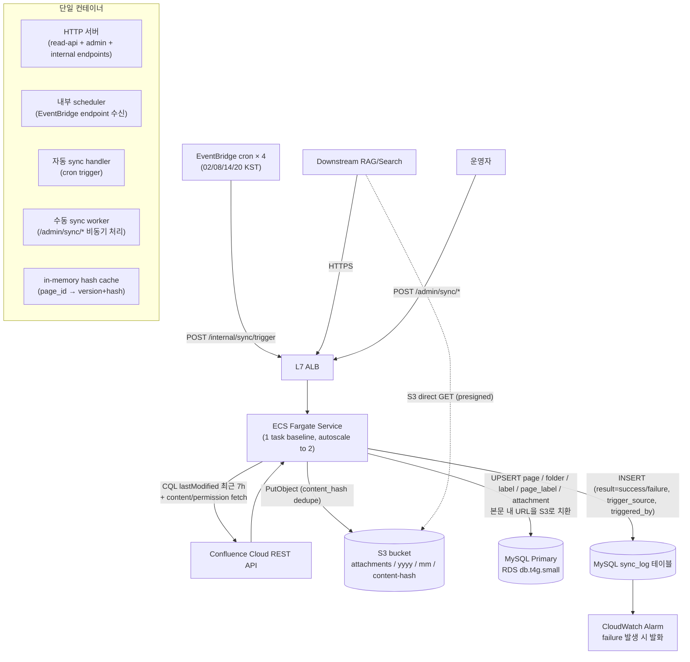
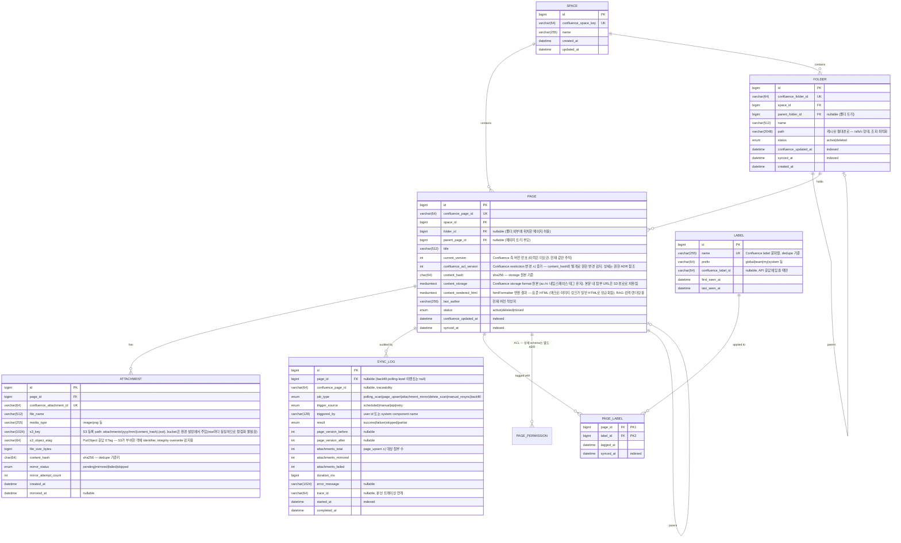

# Phase 1. 문제 이해 및 설계 범위 확정

## 기능 요구사항

본 시스템의 책임은 **Confluence wiki 원본을 사내 MySQL에 단방향으로 신선하게 동기화**하는 것이다. 다운스트림 RAG/검색 시스템은 이 MySQL을 read replica·REST API로 조회해 자체 임베딩·인덱스를 구성한다. **임베딩 생성과 Vector DB 적재는 본 시스템 범위에서 제외**한다.

- **F1. Confluence → MySQL 단방향 동기화**: 페이지·버전·첨부·폴더·라벨 메타데이터 원본을 RDB에 적재
- **F2. 증분 동기화 (CDC-like)**: 변경된 페이지만 식별·갱신. full snapshot 회피
- **F3. 삭제·이동 감지**: tombstone 또는 soft-delete로 다운스트림이 인지 가능하도록 표시 (페이지·폴더 모두)
- **F4. 다운스트림 노출 REST API**: `/pages`, `/pages/{id}`, `/changes?since=...`, `/folders`, `/labels` 형태로 변경 스트림 + 분류 메타 제공
- **F5. 첨부 이미지 자체 S3 미러링**: page 본문이 참조하는 Confluence 첨부 URL을 다운로드 → 본 시스템 소유 S3 버킷에 업로드 → MySQL에 영구 S3 경로 저장. 본문 내 이미지 참조도 S3 경로로 치환해 다운스트림이 Confluence 인증 없이 직접 fetch 가능
- **F6. 폴더 계층 동기화**: Confluence Cloud의 Folder(페이지 트리와 별개의 1급 컨테이너)를 트리 구조로 동기화. page는 소속 folder를 참조
- **F7. 라벨 동기화**: 페이지에 부착된 Confluence label을 정규화된 RDB 모델(label + page_label junction)로 적재. 다운스트림이 라벨 기반 필터·분류 가능

> 범위 밖 (Out of scope): chunking, embedding 생성, vector DB 적재, 양방향 sync, conflict resolution. 첨부파일 중 binary asset(PDF, 동영상)에 대한 정책은 §Phase 4 오픈 이슈 참조.

## 비기능 요구사항

| 항목 | 목표 | 비고 |
|---|---|---|
| **신선도 (freshness, 자동)** | sync lag p95 < 6시간 (일 4회 polling 주기) | 업무 시간 fresh 시점 4회 보장. 5분 polling 대비 RAG 답변 신선도 낮으나 비용·운영 단순성 우선 |
| **신선도 (수동 trigger)** | 수동 sync 호출 후 단건 < 1분, backfill 5K page < 30분 | 긴급 변경·revoke·실패 재처리 운영 경로 |
| **고가용성** | 99.5% 월간 가용성 | ECS Fargate task baseline 1 + autoscale to 2. sync 실패는 sync_log `result='failure'` 기록 + 다음 cron 자동 재시도 또는 운영자 수동 trigger |
| **비용 효율** | Confluence API 호출 ≤ 5% of rate limit (자동+수동 합산), S3 storage < $5/mo | 일 4회 polling으로 호출 빈도 자체가 낮음. 첨부는 content_hash 기반 dedupe로 재업로드 방지 |
| **일관성** | 삭제 페이지가 다운스트림 검색에 노출되지 않음, 본문↔첨부 S3 경로 정합 | tombstone 전파 + 첨부 mirror_status 추적. 강한 일관성은 불필요(eventual OK) |
| **첨부 무결성** | S3 미러 성공률 ≥ 99%, 미러 실패 시 본 시스템이 fallback 경로 노출 | failed status는 다운스트림 알 수 있도록 응답에 포함 |
| **운영 단순성** | 단일 컨테이너·단일 deploy·통합 로그/메트릭 | Lambda × N 분할 대비 운영 가시성·디버깅 우선 |

## 개략적 규모 추정

> 가정: pages=5K, daily_edits=100, peak_factor=5 (작업시간 집중), Confluence Cloud REST API rate limit ≈ 5000 req/h, **polling 주기 6시간(일 4회)**, 운영자 수동 sync 일 5~10회.

### Trigger 빈도 및 ECS 활용

- **자동 polling**: EventBridge cron × 4 (예: 02:00 / 08:00 / 14:00 / 20:00 KST)
- **수동 sync**: 단건 일 5~10회 + 가끔 backfill (1회/주)
- **ECS task baseline**: 1 task 상시 (read-api 트래픽 + 내부 scheduler), peak 2 task (수동 backfill 진행 중 자동 cron 겹칠 때)
- **idle 시간**: 24h 중 sync 활동 ~30분, 나머지는 read-api만. 단일 task가 두 워크로드 흡수

### Write/Read QPS

- `QPS_write_mysql = 100 / 86400 ≈ 0.0012 QPS` (평균). 일 4회 cron 시점에 burst — 1회당 ~25 page 일괄 UPSERT 약 1~2분
- `Confluence API calls/일 = 자동 (search 4 + page_detail ~100) + 수동 ~50 = ~154 calls/일`
  - rate limit 사용률: **< 1%** — 매우 안전한 마진
- `Downstream API QPS (가정)`: 다운스트림 RAG ingest 작업 시 bulk read → `5K pages / 1h ≈ 1.4 QPS`, 평시 < 0.5 QPS — read-api endpoint가 24/7 처리

### 데이터 규모

**MySQL**:

- page (metadata 320B + content_storage avg 10KB + content_rendered_html avg 10KB ≈ 20.3KB): `5K × 20.3KB ≈ 100MB`
- attachment metadata (s3_key·etag·hash·status, s3_bucket 컬럼 제거): `25K × 0.35KB ≈ 9MB`
- folder + label + page_label: `≈ 2MB`
- sync_log (90d retention, ~213 rows/일): `≈ 10MB`
- **MySQL 현재 누적**: ≈ **121MB**. **5년 누적** (20% YoY 페이지 증가 + sync_log 누적): ≈ **280MB**
- MySQL primary 단독 구성 (read replica 초기 미배치, multi-space 확장 시 추가): 운영 디스크 `≈ 280MB`. RDS `db.t4g.small`로 여유 (revision 이력 미보관 결정으로 이전 추정 ~1.4GB 대비 80% 감소).

**S3 (첨부 미러)**:

> 가정: page당 첨부 평균 5개, 이미지 위주(avg 200KB, p99 1MB), dedupe(같은 이미지 재사용) hit rate 30%.

- 첨부 raw 총량: `5K pages × 5 × 200KB = 5GB`
- dedupe 후 실저장: `5GB × (1 - 0.3) = 3.5GB`
- **5년 누적** (20% YoY): ≈ **9GB** (S3 Standard 약 $0.20/mo, Intelligent-Tiering 시 절반 이하)
- bucket 구조: `s3://{bucket}/attachments/{yyyy}/{mm}/{content_hash}.{ext}` (region `ap-northeast-2`) — 콘텐츠 해시 기반 단일 저장으로 dedupe 자연 성립

### 대역폭

- **ingest (Confluence → sync worker)**: text 변경 peak `50 pages × 10KB / 5min = 1.67 kbps` — 무시 가능
- **첨부 다운로드 (Confluence → 본 시스템 → S3)**:
  - daily: `100 pages × 5 × 200KB = 100MB/day` → 평균 `9 kbps`
  - 초기 backfill: `5GB one-shot` (Confluence egress 무료, 본 시스템 ingress 무료, S3 PUT 25K × $0.005/1K = $0.13 one-time)
- **downstream egress (REST API + S3 direct)**: REST `~112 kbps` + S3 GET은 다운스트림이 직접 호출 (CloudFront 미사용 시 S3 egress 비용 발생 — 사내망이면 무시 가능)

### 캐시 (컨테이너 in-memory)

- 일 4회 polling이면 ElastiCache Redis는 over-engineering — **ECS 컨테이너 in-memory 캐시로 충분**.
- hot page hash: `5K × 100B = 500KB` — Node.js Map / Java ConcurrentHashMap 등 메모리 자료구조에 저장
- task replacement 시 캐시 손실 — 다음 cron에서 MySQL `SELECT id, version, hash FROM page WHERE space_id=?` 한 번으로 재구성 (~수 ms). 일 4회 polling이라 cold restart 영향 작음
- multi-space 확장 시: 캐시 키에 `space_id` namespace 포함. task 수가 늘면 sticky session 또는 외부 캐시(ElastiCache) 재검토

### 컴퓨팅 (ECS Fargate) 자원

- baseline: 1 task × 0.5 vCPU × 1GB 메모리 (`region ap-northeast-2`)
- 비용: `0.5 × $0.04048/h × 720h + 1 × $0.00444/h × 720h ≈ $17.7/mo`
- Fargate Spot 적용 가능 영역(자동 sync cron 시간만): ~70% 할인 → 부분 적용 시 ~$12/mo
- autoscaling: queue depth(없음) 대신 CPU utilization 70% threshold로 1~2 task

> 결론: **컴퓨팅·스토리지·대역폭 모두 Small 규모로 single-AZ ECS task 1개 + RDS db.t4g.small로 충족**. Confluence API rate limit 사용률은 일 4회면 <1%로 매우 여유. 운영 단순성을 위해 단일 ECS Fargate service로 모든 워크로드(read-api + 자동 sync + 수동 sync) 통합 관리.

---

# Phase 2. 개략적 설계안 제시 및 동의 구하기

## 개략적 설계안

## 설계안

| Component | 선택 | 이유 | 검토한 대안 |
|---|---|---|---|
| 컴퓨팅 | **단일 ECS Fargate service (1 task baseline + autoscale 2, region ap-northeast-2)** | read-api(24/7 트래픽) + 자동 sync(일 4회 cron) + 수동 sync(일 5~10회) 세 워크로드를 단일 컨테이너로 통합. cold start 무관, Lambda 15분 한도 무관, 코드 모놀리식 단순 deploy, 운영 가시성 단일. 일 4회 polling에선 idle 시간이 길지만 read-api 트래픽이 채움 | Lambda × 3(함수 분리로 디버깅 분산·cold start·15분 한도), Lambda × 2 + self-invoke chain(backfill 분할 부담), ECS 3 service 분리(운영 컴포넌트 과잉), EC2(가용성 직접 관리) |
| Ingress | **L7 ALB** | ECS Fargate와 자연 결합(target group·health check·rolling deploy). path 라우팅(`/pages/*` vs `/admin/*` vs `/internal/*`)을 ALB listener rule로 분리. WAF·CloudFront 연동 가능. 고정 비용 ~$16/mo는 ECS service와 함께 운영하면 합리적 | API Gateway HTTP API(ECS와 결합 시 VPC Link 추가 복잡도), REST API Gateway(OpenAPI v3 기능 과잉), Lambda Function URL(ECS와 결합 부자연) |
| Cache | **컨테이너 in-memory hash cache** | 일 4회 polling이면 ElastiCache는 over-engineering. ECS task 메모리(500KB ~ 5K page 기준)에 page_id → (version, content_hash) Map 보관. task replacement 시 cold restart → 다음 cron에서 MySQL 1회 query로 재구성 (~수 ms) | ElastiCache Redis(일 4회면 hot path 가속 효과 작음 + 외부 컴포넌트), MySQL 직접 비교(매 polling마다 5K row SELECT — 현 규모 OK이나 in-memory가 더 단순) |
| Origin store | **MySQL (RDS db.t4g.small, region ap-northeast-2)** | RDB 트랜잭션·관계형 모델·운영 익숙. Vector DB는 범위 외. ECS 컨테이너 connection pool로 직접 접근(RDS Proxy 불필요) | PostgreSQL(팀 표준이 MySQL), DynamoDB(관계형 쿼리 빈도 높음), Aurora Serverless v2(현 규모에 비용 비효율) |
| Attachment store | **S3 (자체 버킷)** | Confluence 의존성 분리·다운스트림 인증 불필요·content_hash dedupe | Confluence URL 직접 참조(인증 의존·링크 만료 리스크), EFS(비용·SLA 과잉) |
| External API | **REST (OpenAPI)** | 다운스트림이 미정 다수, 표준·캐시 친화 | gRPC(외부 노출 부담), DB 직결(스키마 결합도), Event stream(현 규모 과잉) |
| Async backbone | **컨테이너 내 in-process worker (asyncio/coroutine) + sync_log `result='failure'` 행 기록** | 일 4회 + 수동 워크로드는 단일 컨테이너 내 background worker로 충분. SQS 외부 큐 없이 메모리 큐(또는 동기 처리). 실패는 sync_log 기록 + CloudWatch metric → `v_open_failures` view + 수동 재처리 API | SQS + Lambda event source(컴포넌트 분산), 별도 sync_failure 테이블(책임 중복) |
| Scheduler (자동) | **EventBridge cron × 4 → ALB → ECS `/internal/sync/trigger`** | EventBridge가 ECS 내부 endpoint를 HTTP로 호출 → 컨테이너 background task로 자동 sync 진행. 02/08/14/20 KST 기본 (조정 가능) | 컨테이너 내부 scheduler(EventBridge 대비 가시성·재시도 약함), Step Functions(현 규모에 과잉) |
| Trigger (수동) | **운영자 → ALB → ECS `/admin/sync/*` 비동기 처리** | 단건은 동기 처리(< 10s), backfill은 background task에 enqueue 후 즉시 202 Accepted 반환 → `GET /admin/sync/jobs/{id}` 폴링으로 상태 확인 | 별도 worker pool 분리(운영 컴포넌트 과잉) |

## 로드밸런서

- **선택**: **AWS Application Load Balancer (L7, region ap-northeast-2)**
- **선택 이유**:
  - 단일 ECS Fargate service와 자연 결합 — target group·health check·rolling deploy 표준 패턴.
  - path 기반 listener rule로 진입점 분리: `/pages/*`·`/changes`·`/folders`·`/labels` (다운스트림) / `/admin/*` (운영자 IAM 인증) / `/internal/sync/trigger` (EventBridge → VPC 내부 only).
  - ACM 통합 TLS 종단으로 컨테이너 단순화.
  - WAF·CloudFront 연동 가능. p95 < 200ms NFR을 위해 keep-alive·HTTP/2 활용.
  - 고정 $16/mo + LCU는 ECS service와 함께 운영하면 합리적 — Lambda × N 모델로 가면 API Gateway가 유리하지만 단일 ECS면 ALB가 자연.
- **검토한 대안**:
  - **API Gateway HTTP API**: ECS와 결합하려면 VPC Link 추가(~$7/mo) + ALB 대비 path routing 제약. Lambda × N 모델에선 우월하지만 ECS 단일 service에는 ALB가 단순.
  - **L4 NLB**: HTTP path routing 불가, 본 요구와 매칭 안 됨.
  - **REST API Gateway**: OpenAPI v3 import·request validation 풍부하지만 ECS와 결합 시 비용·복잡도 과잉.
- **주요 설정 포인트**:
  - listener rules:
    - `/pages/*`·`/changes`·`/folders`·`/labels` → ECS target group (다운스트림)
    - `/admin/sync/*` → 같은 target group + AWS WAF rule로 운영자 source IP/IAM 인증 강제
    - `/internal/sync/trigger` → 같은 target group + listener rule에서 EventBridge source 검증 (또는 별도 internal LB)
  - health check: `/healthz` 200, interval 30s, threshold 3 (ECS task 자동 교체)
  - idle timeout: 60s (다운스트림 bulk pull 대응) / 수동 backfill은 202 Accepted 비동기로 회피
  - WAF: rate limit per source IP, `/admin/*` source IP allowlist
  - 인증: ALB OIDC integration(사내 SSO) 또는 ALB authenticate-cognito, 또는 컨테이너 내부 미들웨어
  - rolling deploy: ECS service `min healthy=100%`, `max=200%` 무중단
- **multi-space 확장 시**: ALB 단일 endpoint 유지, listener rule에 `Host` 헤더 또는 path `/space/{key}/*`로 라우팅. ECS service autoscaling으로 task 증설.

> **Confluence webhook deprecated 대응**: 본 절은 진입점만 처리. Confluence → 본 시스템 ingest는 webhook 없이 **EventBridge cron × 4 → ALB → ECS `/internal/sync/trigger`** 방식 → Phase 3 §1 상세.

## 레디스

> 본 절의 "레디스"는 Phase 2 표준 헤딩 명이지만, 본 시스템 규모(일 4회 polling + 5K page + 단일 ECS service)에서는 **별도 ElastiCache Redis를 도입하지 않고 컨테이너 in-memory 캐시로 충분**하다고 결정. 이 절은 캐시 전략 결정의 근거를 다룬다.

- **선택**: **컨테이너 in-memory cache (Map / ConcurrentHashMap 등 자료구조)**
- **1차 역할**: **증분 감지용 page hash/version 캐시**
- **선택 이유**:
  - ECS Fargate task가 상시 1개 이상 살아있으므로 in-memory 캐시가 *Lambda 대비 유효 (Lambda stateless 한계 없음)*.
  - 5K page × 100B = ~500KB → 컨테이너 메모리(1GB) 대비 무시 가능.
  - 일 4회 polling이므로 task replacement(deploy·autoscale·장애 복구) 시 cold restart 발생해도 다음 cron에서 MySQL 1회 SELECT(~수 ms)로 자연 재구성. 외부 캐시의 운영 부담·비용 대비 가치 작음.
  - 단순화: ElastiCache·VPC peering·subnet·security group 운영 컴포넌트 제거.
- **검토한 대안**:
  - **ElastiCache Redis (single-node)**: cache.t4g.micro ~$13/mo + ENI·subnet 운영. task 다중화·multi-space 확장 임계 도달 시 재검토. 현 규모 over-engineering.
  - **MySQL 자체 비교**: 매 cron마다 5K row SELECT — 현 규모 무리 없으나 in-memory가 더 단순·빠름.
  - **DynamoDB on-demand**: hot small set에 latency·비용 모두 in-memory 우월.
- **주요 설정 포인트**:
  - 자료구조: `Map<String, PageHash>` — key `{space_id}:{page_id}` → `{version, content_hash, last_synced_at}`
  - 최대 크기: 5K → 50K 확장 시 ~5MB. 컨테이너 메모리 1GB 한도 내.
  - 동기화: ECS task 시작 시 MySQL에서 1회 lazy load (background thread). 첫 cron 도착 전 완료 보장 (cold start < 30s).
  - eviction: 현 규모 불필요. multi-space로 page 수가 늘면 LRU 정책 도입.
- **multi-space 확장 시 (트리거)**: (a) page 수 > 50K 또는 (b) ECS task 수 > 2로 캐시 일관성 부담 발생 또는 (c) cold restart 영향이 NFR을 위협할 때 → **ElastiCache Redis 도입 재검토**. 키 schema·access pattern은 이미 in-memory에서 같은 형태(`{space_id}:{page_id}`)로 운영되어 마이그레이션 부담 작음.

## 사용자 데이터베이스

- **선택**: **MySQL 8.0** (Amazon RDS, single-AZ, region `ap-northeast-2` (Seoul))
- **선택 이유**:
  - 동기화 대상 모델이 page ↔ attachment ↔ folder ↔ label의 관계형 구조. JOIN 빈도 높음 (특히 `/changes` 응답 시 라벨·폴더 함께 join).
  - 다운스트림 REST API의 `/changes?since=...` 쿼리는 `WHERE synced_at > ?` 인덱스 스캔으로 단순 (`synced_at` ≠ `confluence_updated_at`, §데이터모델 참조). RDB 강점.
  - 팀 표준 스택. 운영·백업·모니터링 도구 기존 자산 활용.
  - **revision 이력 미보관** + **Vector DB / embedding 범위 외**이므로 RDB 단일 store로 충분.
- **검토한 대안**:
  - **PostgreSQL**: 기능적으로 동등하나 팀 표준에 MySQL이 채택되어 운영 일관성 우선.
  - **DynamoDB**: 단순 GetItem 패턴엔 강하나 `WHERE updated_at > ? ORDER BY` 같은 secondary index 쿼리·관계형 JOIN에 제약.
- **주요 설정 포인트**:
  - 인스턴스: `db.t4g.small` (현 규모 충분, 수직 확장 여유. revision 미보관 결정으로 디스크 압박 없음)
  - 백업: 자동 7d snapshot + binlog 보존 3d
  - **ECS → RDS 접근**: 컨테이너 내부 connection pool(HikariCP / pg-pool / mysql2 등) 직접 관리, max connection 20. Lambda burst 시나리오가 아니므로 **RDS Proxy 불필요**
  - timezone: UTC 고정 (Confluence 응답이 ISO8601 UTC)
  - read replica: 초기 미배치(현 read QPS < 1.4로 primary 단독 가능), multi-space 확장 시 ECS service에서 read/write 라우팅 분리
  - **권한 테이블 추가**: 동일 RDS 인스턴스에 `page_permission`(+ optional `space_permission`) 테이블 추가. 상세는 [[dec-2026-06-06-confluence-wiki-permission-store]]. 본 시스템 데이터 모델은 PAGE.confluence_acl_version 컬럼만 신설

## API 설계

다운스트림 RAG/검색 시스템이 동기화된 MySQL을 조회하는 프로토콜.

- **선택**: **REST (OpenAPI 3.1)** on ALB + 단일 ECS Fargate service (HTTP 서버 컨테이너 내장)
- **선택 이유**:
  - 다운스트림 다수·미정 → 표준·언어 중립 필요.
  - `/changes?since=...` 응답을 ETag·`Last-Modified` 헤더로 캐시 친화적으로 노출 → 다운스트림 client 캐시 활용.
  - OpenAPI spec으로 다운스트림 client 코드 자동 생성, 계약 변경 추적.
  - 컨테이너 내부 HTTP 라우터(Express / FastAPI / Spring 등)로 path 분기 → 다운스트림·운영자·EventBridge 모두 동일 진입점.
- **검토한 대안**:
  - **gRPC**: 내부 마이크로서비스 한정이면 좋지만 외부 노출에 부담.
  - **DB 직접 쿼리 (read replica 공유)**: 스키마 결합도가 높아 향후 변경 어려움.
  - **Event stream**: 현 규모(일일 100 변경)에서 운영 오버헤드 대비 이득 적음.
- **주요 설정 포인트**:
  - 엔드포인트:
    - `GET /pages?space={key}&folder={id}&label={name}&limit=&cursor=` — 페이지 목록(폴더·라벨 필터 + 커서 페이지네이션)
    - `GET /pages/{id}` — 단건 상세 (현재 content + labels + folder_id, 본문 내 첨부 URL은 S3 경로로 치환된 상태). 이전 버전 본문은 Confluence 원본 API 참조
    - `GET /changes?since={iso8601}&limit=` — 증분 변경 스트림 (라벨·폴더 소속 변경 포함)
    - `GET /pages/{id}/attachments[?ttl=900]` — 첨부 메타 + 동적 발급 presigned URL(`download_url`, `download_url_expires_at`) + `mirror_status`. TTL 기본 900s, 최대 3600s (`/admin/*`에서는 최대 86400s)
    - `GET /folders?space={key}&parent={id}` — 폴더 트리 / `GET /folders/{id}` — 단건
    - `GET /labels?prefix={p}&since={iso8601}` — 라벨 정의 목록·증분
    - `POST /admin/sync/pages/{id}` — **단건 강제 재동기화** (운영자용, 동기 처리 < 10s)
    - `POST /admin/sync/backfill?space={key}&since=` — **범위 재동기화** (운영자용, 비동기 202 Accepted + job_id 반환)
    - `GET /admin/sync/jobs/{id}` — backfill job 진행 상태 폴링
    - `GET /admin/sync/logs?result=failure&since=&limit=` — **sync_log 조회** (운영자용, 미해결 실패는 `v_open_failures` view 활용)
    - `POST /internal/sync/trigger` — **EventBridge cron 진입점** (VPC 내부 only, IAM 인증, 자동 sync 트리거)
  - 인증: 다운스트림 API는 ALB OIDC 또는 IAM SigV4, `/admin/*`은 별도 IAM 권한(사내 운영자만 + source IP allowlist), `/internal/*`은 VPC 내부 + EventBridge source 검증
  - rate limit: 다운스트림당 100 RPS soft, `/admin/*`는 운영자당 60 req/h soft + backfill 1 concurrent only

## 데이터모델

**Access pattern**:

| 패턴 | 쿼리 형태 | 인덱스 |
|---|---|---|
| 다운스트림 증분 pull | `SELECT * FROM page WHERE synced_at > ? ORDER BY synced_at LIMIT ?` | `idx_synced_at` |
| 단건 조회 | `SELECT ... FROM page WHERE confluence_page_id = ?` | UNIQUE `confluence_page_id` |
| 삭제 감지 | `WHERE status = 'deleted' AND synced_at > ?` | composite `(status, synced_at)` |
| polling worker upsert | `INSERT ... ON DUPLICATE KEY UPDATE` | PK + UNIQUE |
| attachment dedupe lookup | `SELECT s3_key, s3_object_etag FROM attachment WHERE content_hash = ? LIMIT 1` | `idx_content_hash` |
| 첨부 미러 실패 조회 | `WHERE mirror_status = 'failed' ORDER BY mirrored_at` | composite `(mirror_status, mirrored_at)` |
| 특정 page 이력 추적 | `SELECT * FROM sync_log WHERE page_id = ? ORDER BY started_at DESC LIMIT ?` | composite `(page_id, started_at)` |
| 시간대별 sync 통계 | `SELECT job_type, result, COUNT(*), AVG(duration_ms) FROM sync_log WHERE started_at BETWEEN ? AND ? GROUP BY ...` | composite `(result, started_at)` |
| 미해결 실패 page 조회 (sync_failure 대체) | `WITH last AS (SELECT page_id, MAX(started_at) FILTER (WHERE result='success') AS ok, MAX(started_at) FILTER (WHERE result='failure') AS fail FROM sync_log WHERE started_at > NOW() - INTERVAL 7 DAY GROUP BY page_id) SELECT page_id FROM last WHERE fail > COALESCE(ok, 0)` (view로 노출 권고: `v_open_failures`) | composite `(page_id, result, started_at)` |
| 수동 트리거 감사 | `WHERE trigger_source = 'manual' AND triggered_by = ?` | composite `(trigger_source, triggered_by, started_at)` |
| 폴더별 page 목록 | `SELECT * FROM page WHERE folder_id = ? AND status = 'active'` | composite `(folder_id, status)` |
| 폴더 트리 조회 | `SELECT * FROM folder WHERE parent_folder_id = ?` (또는 `path LIKE '/a/b/%'`) | `idx_parent_folder_id`, `idx_path` (prefix) |
| 라벨 기반 page 검색 | `SELECT p.* FROM page p JOIN page_label pl ON p.id = pl.page_id WHERE pl.label_id = ?` | PK `(page_id, label_id)` + 보조 `(label_id, page_id)` |
| 라벨 dedupe lookup | `SELECT id FROM label WHERE name = ? LIMIT 1` | UNIQUE `name` |
| 라벨 증분 동기화 | `SELECT * FROM page_label WHERE synced_at > ?` | `idx_synced_at` |

**Row size 추정**:
- page ≈ 20.3KB (metadata 320B + content_storage avg 10KB + content_rendered_html avg 10KB). 5K rows ≈ **100MB**
- attachment metadata ≈ 350B (s3_key·etag·hash·status 포함, s3_bucket 컬럼 제거로 ~50B 절감). 25K rows ≈ 9MB
- folder ≈ 600B (path 캐시 포함). 5K page 기준 폴더 추정 ~500개 → 300KB. 5년 누적 ~1MB
- label ≈ 200B. 통상 사내 라벨 어휘 ~1K → 200KB
- page_label ≈ 50B. page당 평균 3 라벨 → 15K rows ≈ 750KB
- sync_log ≈ 500B. polling 12회/h × 5K page 후보 = 60K events/일이 아니라, **polling_scan 단위 1 row + 실제 변경된 page만 page_upsert/attachment_mirror 기록** 정책. 추정: 일일 (12 polling + 100 page_upsert + 100 attachment_mirror + 1 delete_scan) ≈ 213 rows/일 ≈ 110KB/일 ≈ 40MB/년. **Retention 90일** (그 이후 자동 purge 또는 S3 cold archive). 정상 운영 시 ~10MB 유지.

> **sync_failure 테이블 제거**: 별도 실패 추적 테이블을 두지 않고 sync_log의 `result='failure'` row가 그 책임을 흡수한다. "현재 미해결 실패 page" 조회는 위 access pattern의 `v_open_failures` view로 노출 — 같은 page에 더 최신 `result='success'` row가 있으면 자연 resolved로 간주. 시계열 immutable log의 본질과 부합하며 별도 상태기계·purge cron 불필요. CloudWatch metric filter는 sync-worker가 emit하는 `sync.failure` structured log를 카운트해 alarm 발화.

> **revision 이력 미보관**: Confluence가 native로 page revision을 유지하므로 본 시스템은 현재 버전(`current_version` + `content_storage`)만 추적. 다운스트림이 이전 버전 본문이 필요하면 Confluence 원본 API(`GET /content/{id}/history` 또는 `/content/{id}?version=N`)를 직접 호출. 본 시스템 MySQL 디스크 사용량을 500MB 절감하고 nightly purge cron도 제거.

> sync_log는 운영 감사·디버깅·통계용. partitioning(month-based) 또는 별도 archive table 분리는 row 수 100K 초과 시 도입. 현 규모에서는 단일 테이블 + `idx_started_at`로 충분.

---

# Phase 3. 상세 설계

## 중요 구성요소별 규모 확장성 및 대안

### 3.1 Confluence webhook deprecated 대응 — polling/CDC 전략

- **문제 상황**: Confluence Cloud의 webhook(content_updated 등)이 deprecated 경로에 진입했고, 신규 시스템에서 webhook 의존 설계는 lifecycle 리스크가 크다. push 기반 이벤트 전달 없이 pull 기반으로 신선도 NFR(자동 6h, 수동 < 1분)을 달성해야 한다.
- **확장 전략**:
  - **EventBridge cron × 4 (02/08/14/20 KST) → ALB → ECS `/internal/sync/trigger`**.
  - ECS 컨테이너 내부 sync handler가 Confluence REST `GET /wiki/rest/api/content/search?cql=lastModified >= "{now-7h}" AND space = "{key}"` 호출 (6h 윈도우 + 1h overlap으로 경계 변경 누락 방지).
  - 응답에서 `(pageId, version)` 목록 추출 → **컨테이너 in-memory hash cache**와 일괄 비교 → 실제 변경된 페이지 목록만 background task queue에 전달.
  - 같은 컨테이너의 background worker(asyncio·coroutine)가 `GET /content/{id}?expand=body.storage,body.view,version,ancestors,metadata.labels` 로 본문(storage + rendered HTML) + 라벨 + 폴더 ancestor 일괄 fetch → MySQL upsert + in-memory cache 갱신.
  - **수동 sync 통합**: 같은 background worker가 `/admin/sync/pages/{id}` (단건 동기) 및 `/admin/sync/backfill` (비동기 job)도 동일 코드 경로로 처리. mode 파라미터로 분기.
  - **삭제 감지**: 일일 별도 EventBridge cron(매일 17:00 UTC = 02:00 KST 자동 sync와 동시) → `/internal/delete-scan` endpoint → `cql=space="{key}"` 전체 페이지 목록 ↔ MySQL `status=active` 차집합 비교 → 차집합 page는 `status=deleted` 전환 (tombstone).
  - **multi-space 확장**: EventBridge schedule group을 space별로 분리 또는 단일 cron에서 enabled space 리스트 순회. ECS service autoscaling으로 task 증설.
- **대안 비교**:

  | 항목 | 일 4회 polling + EventBridge + 수동 (선택) | 5min polling | 일 1회 polling | Confluence App webhook (deprecated) | Confluence Data Pipeline (Premium) |
  |---|---|---|---|---|---|
  | 자동 신선도 | 6h | 5분 | 24h | 수초 | 시간 단위 |
  | 긴급 신선도 | 수동 trigger 시 < 1분 | N/A | 수동 trigger 시 < 1분 | 자동 수초 | 없음 |
  | 의존성 리스크 | 낮음 (REST API) | 낮음 | 낮음 | 높음 (deprecate) | 라이선스·plan 의존 |
  | 운영 복잡도 | **낮음** (단일 ECS service) | 높음 (Lambda × N + SQS + Redis) | 낮음 (단일 batch) | 낮음 (push 받기만) | 낮음 |
  | rate limit 사용 | **<1%** (자동+수동) | 12% | <0.1% | 0% (event push) | 거의 0% |
  | revoke 신선도 | 6h (수동 보완) | 5분 | 24h (수동 보완) | 수초 | 시간 단위 |
  | **결론** | 선택 — 운영 단순성·신선도·비용 최적 균형 | over-engineering | RAG 답변 freshness 약 | 신규 채택 불가 | plan 의존성 |

- **검증 지표**:
  - `sync_lag_seconds` p95: Confluence `updated_at`과 본 시스템 `synced_at` 차이. 목표 < 6h (21600s) — 자동 cron 한정.
  - `manual_sync_latency_seconds` p99: 수동 trigger 후 sync_log 기록까지 시간. 목표 단건 < 10s, backfill 페이지당 < 5s.
  - `confluence_api_quota_usage_pct`: rate limit 대비 실제 호출률. 목표 < 5%.
  - `polling_overlap_dedup_rate`: 7h 윈도우 → 6h cron의 중복 감지 비율. in-memory hash cache로 dedup, 비용 0.

### 3.2 증분 감지 일관성 — hash 캐시·삭제 감지·재시도

- **문제 상황**: polling 결과 page 목록에 신뢰만 의존하면 (a) version 동일하나 content가 갱신된 sneak update, (b) 워커 장애로 일부만 처리되어 Redis와 MySQL 불일치, (c) Confluence API 일시 5xx로 silently skip 되는 페이지가 발생한다. 일관성 NFR(삭제 페이지가 다운스트림에 노출되지 않음 + content와 hash 일치) 보장이 어렵다.
- **확장 전략**:
  - **이중 키**: Redis에 `version`과 `content_hash` 모두 저장. version 같아도 hash 다르면 재처리. 비교 순서: `version → hash`.
  - **Idempotent upsert**: MySQL `INSERT ... ON DUPLICATE KEY UPDATE WHERE confluence_updated_at < VALUES(confluence_updated_at)` — out-of-order 메시지 멱등 처리.
  - **삭제 감지 nightly job**: 매일 17:00 UTC (= 02:00 KST, Confluence 한국 운영 시간대 저부하 구간), 별도 EventBridge cron → `Lambda: delete-scanner` 호출 → `cql=space="{key}"` 전체 page id 목록 vs DB `status=active` 차집합 → tombstone. 다운스트림 `/changes`에 `status=deleted` 노출.
  - **재시도 정책 (DLQ·SQS·sync_failure 모두 미사용)**: ECS 컨테이너 내부 sync handler가 page 단위로 **3회 exponential backoff** (30s → 2m → 10m). 3회 모두 실패 시 → `sync_log` 테이블에 `(page_id, job_type, result='failure', error_message, attempt_count)` INSERT + structured log emit → CloudWatch metric filter가 `sync.failure` 카운트해 alarm 발화. 다음 cron(6h 후) 자동 재시도 또는 운영자가 `/admin/sync/pages/{id}` 즉시 재처리. 단일 컨테이너 상시 운영이라 SQS·DLQ 인프라 자체 불필요.
  - **수동 재처리 인터페이스**: `POST /admin/sync/pages/{id}`로 단건, `POST /admin/sync/backfill?space=...&since=...`로 범위 재동기화. 성공 시 같은 page_id로 더 최신 `result='success'` row가 sync_log에 INSERT되므로 `v_open_failures` view에서 자동으로 빠짐.
  - **트랜잭션 경계**: MySQL upsert 성공 → in-memory hash cache 갱신. cache 갱신 실패는 컨테이너 내부에서 즉시 처리(같은 프로세스), 또는 다음 cron에서 자연 복구.
- **대안 비교**:

  | 항목 | Hash 캐시 + nightly delete scan (선택) | DB만 사용 (Redis 없음) | Confluence audit log API |
  |---|---|---|---|
  | 미변경 skip 효율 | 즉시 (O(1) Redis) | O(N) DB read | 변경 push만 받음 |
  | 삭제 감지 정확도 | 24h 지연 (nightly) | 동일 | 거의 실시간 (premium 한정) |
  | 운영 복잡도 | 중 | 낮 | 높 (API plan + parser) |
  | Cold start 영향 | TTL 만료된 페이지만 재계산 | 매번 DB 비교 | 영향 없음 |
  | **결론** | 선택 — 효율·정확도 균형 | DB QPS·비용 증가 | plan 의존성·복잡도 과대 |

- **검증 지표**:
  - `hash_cache_hit_rate`: 미변경 skip 비율. 목표 > 95%.
  - `open_failures_count` (`v_open_failures` view): 미해결 실패 page 수. 목표 = 0 (지속 > 0 시 CloudWatch alarm → Slack).
  - `tombstone_lag_hours`: 삭제 후 `status=deleted` 반영까지 시간. 목표 < 24h.
  - `manual_resync_per_week`: 운영자가 수동 재처리 API를 호출한 빈도. 추세가 증가하면 자동 재시도 정책 재검토 신호.

### 3.3 MySQL 스키마·인덱스 — page/attachment 모델링

- **문제 상황**: 장문 page content를 어디에 둘지, revision을 본 시스템이 보관할지 위임할지, 다운스트림 증분 쿼리(`/changes?since=...`)에 적합한 인덱스가 무엇인지 명확히 해야 한다. 잘못 결정하면 MySQL 디스크가 빠르게 차거나 증분 쿼리가 full scan으로 떨어진다.
- **확장 전략**:
  - **현재 버전만 보관 (revision 이력 미보유)**: Confluence가 native로 page revision을 영구 보관하므로 본 시스템에서 별도 history 테이블을 두면 책임 중복·운영 부담만 증가. PAGE 테이블 단일 row가 현재 시점 본문(`content_storage`) + 메타를 모두 담는다. 이전 버전 본문이 필요한 다운스트림은 Confluence 원본 API를 직접 호출. → 별도 purge cron·revision 보존 정책 모두 불필요.
  - **content_storage 컬럼은 `MEDIUMTEXT`** (Confluence storage format, 최대 16MB; 실측 평균 10KB, 99p ~ 200KB). PAGE 단일 테이블에 통합.
  - **buffer pool 영향 완화**: `content_storage`는 `LONGTEXT`/`MEDIUMTEXT`로 InnoDB가 off-page 저장 → 인덱스·메타 컬럼만 buffer pool에 상주해 hot index 캐싱 효율은 유지됨. 단, `SELECT *` 시 본문까지 fetch되므로 다운스트림 client에는 `/pages/{id}` 단건 endpoint에서만 본문 반환, `/pages?...` 목록 endpoint는 본문 제외하고 metadata만 반환하도록 분리.
  - **첨부파일 바이너리는 본 시스템 S3 미러**(§3.4 참조). attachment metadata는 PAGE와 별 테이블.
  - **필수 인덱스**:
    - `UNIQUE (confluence_page_id)` — upsert 단건 조회
    - `INDEX (synced_at)` — `/changes?since=...` 다운스트림 증분 핵심
    - `INDEX (space_id, status, synced_at)` — space별 active page 페이지네이션
    - `INDEX (confluence_updated_at)` — 디버깅·관측용
- **대안 비교**:

  | 항목 | 단일 PAGE 테이블 + 현재 버전만 (선택) | PAGE_REVISION 분리 + N개 보존 | content_storage in S3 + MySQL link |
  |---|---|---|---|
  | 조회 단순도 | 단일 쿼리 | join 또는 추가 쿼리 | S3 GetObject 추가 round-trip |
  | 디스크 사용량 (5년) | ~180MB | ~1.4GB (revision 500MB+) | ~50MB DB + S3 분리 |
  | 운영 부담 | 최소 (cron 불필요) | revision purge cron·관계 관리 | S3 lifecycle·integrity 별도 |
  | revision 조회 | Confluence 원본 API 위임 | 본 시스템에서 직접 | 별도 versioning 필요 |
  | 본문 검색 | LIKE 가능 | 동일 | 불가 |
  | **결론** | 선택 — 책임 단순화·Confluence 원본 활용 | 본 시스템 책임 과대 | 50K+ 페이지 시 재검토 |

- **검증 지표**:
  - `mysql_buffer_pool_hit_rate`: 인덱스·hot page metadata 상주. 목표 > 99%.
  - `changes_endpoint_p99_latency_ms`: `/changes?since=...` 응답. 목표 < 200ms.
  - `mysql_storage_used_gb`: 5년 추정(~180MB) vs 실측. 분기별 검토.
  - `page_list_endpoint_payload_size_bytes`: `/pages?...` 응답에 본문이 누락 없이 메타만 포함됨을 검증.

#### 3.3.1 폴더·라벨 동기화 흐름

- **폴더**: page upsert 시 응답의 `ancestors` 또는 별도 `GET /folder/{id}`에서 추출 → `folder` 테이블 upsert(`confluence_folder_id` UNIQUE 기준) → page.folder_id 연결. 폴더 자체 삭제는 nightly delete scan에 page와 동일 패턴으로 포함. `path` 컬럼은 parent 체인을 따라 계산해 캐시 → 다운스트림 폴더 트리 조회 시 join 비용 절감.
- **라벨**: page upsert 시 `GET /content/{id}/label` 응답 파싱 → label 테이블 `name` 기준 upsert(INSERT IGNORE 또는 ON DUPLICATE KEY UPDATE `last_seen_at`) → `page_label` junction에 현재 라벨 set으로 reconcile (delete diff + insert new). 라벨 동기화는 page 단위로 멱등 처리.
- **증분 노출**: 다운스트림은 `/changes?since=...` 응답에 page metadata + 현재 라벨 list + 소속 folder_id를 함께 받음. 별도 `/labels?since=...` 엔드포인트는 라벨 정의 변경(prefix·name) 추적용으로 분리.

### 3.4 첨부 이미지 S3 미러링 — Confluence URL → 자체 S3 재호스팅

- **문제 상황**: page 본문에 포함된 첨부 이미지는 기본적으로 `https://{tenant}.atlassian.net/wiki/download/attachments/...` 형태로 Confluence에 호스팅되며 인증 토큰이 필요하다. 다운스트림(RAG/검색)이 이미지를 가져가려면 매번 Confluence 인증을 거쳐야 하고, Confluence URL 만료·정책 변경 리스크에 직접 노출된다. 본 시스템에서 한 번 다운로드 → 영구 S3 경로로 재호스팅하면 다운스트림 의존성이 끊긴다.
- **확장 전략**:
  - **content_hash 기반 dedupe 저장**: 다운로드 후 sha256 계산 → key path `attachments/{yyyy}/{mm}/{content_hash}.{ext}`로 PutObject. 버킷명은 환경 설정(`ATTACHMENT_BUCKET`)에서 주입돼 row마다 동일하므로 컬럼화하지 않고, 저장은 `s3_key`(path) + `s3_object_etag`(PutObject 응답 ETag) 두 컬럼만. 동일 이미지가 여러 페이지·여러 attachment id로 등록돼도 S3 객체는 1개만 존재. dedupe lookup 인덱스(`attachment.content_hash`)로 재업로드 회피.
  - **본문 URL 치환**: ECS sync handler가 Confluence storage format(`body.storage`) 및 rendered HTML(`body.view`)을 각각 파싱 → `<ac:image><ri:attachment ri:filename="X"/></ac:image>` (storage) / `` (view) 패턴을 식별 → 해당 attachment의 S3 경로(`{cdn-or-bucket-base}/{s3_key}`)로 치환한 본문을 `page.content_storage` 및 `page.content_rendered_html`에 각각 저장. 다운스트림은 별도 처리 없이 S3 직접 fetch.
  - **mirror_status 상태기계**: `pending` → 다운로드 시도 → 성공 시 `mirrored` + `s3_object_etag` 채움, 실패 시 `failed` + `mirror_attempt_count++`. 같은 attachment에 대해 최대 3회 시도 후 sync_log `result='failure'` 기록.
  - **부분 실패 허용**: 첨부 1개 mirror 실패가 page 전체 sync를 막지 않음. 본문 내 해당 이미지만 Confluence 원본 URL을 fallback으로 유지하고, `attachment.mirror_status='failed'`를 응답에 노출 → 다운스트림이 인지.
  - **삭제 동기화**: page가 `status=deleted` 되면 연관 attachment row도 soft-delete. 단, S3 객체는 즉시 삭제하지 않고 lifecycle policy로 30일 후 `Glacier Deep Archive` 전환, 1년 후 자동 삭제 (recovery window 확보).
  - **다운스트림 접근 — S3 Presigned URL 정책**:
    - **발급 주체**: read-api Lambda가 `/pages/{id}` 또는 `/pages/{id}/attachments` 응답 직렬화 시점에 AWS SDK `getSignedUrl(GetObjectCommand, ...)`로 동적 발급. MySQL에 URL을 저장·캐시하지 않음 (만료 관리·재발급 복잡도 회피).
    - **권한**: bucket policy로 외부 public access 차단(default). read-api Lambda execution role에만 `s3:GetObject` on `arn:aws:s3:::{bucket}/attachments/*` 부여. 운영자·관리 API는 별도 role.
    - **만료 (TTL)**: 기본 **15분** (`X-Amz-Expires=900`). 사용 패턴:
      - 다운스트림 단건 조회·검색 결과 fetch: 15분 충분
      - bulk backfill (다운스트림 RAG ingest): 응답에 `?ttl=3600` 쿼리 파라미터 옵션 → 최대 **1시간** 허용
      - `/admin/*`에서 직접 다운로드 시: 최대 **24시간** (운영자 권한 한정)
    - **응답 직렬화 규약**: attachment 객체의 `download_url` 필드는 `mirror_status='mirrored'`이고 발급 직전 생성된 presigned URL이 들어가며, 같은 응답에 `download_url_expires_at` (ISO8601 UTC) 동봉. `mirror_status='failed'` 또는 `pending`이면 `download_url=null` + `mirror_status` 노출 → 다운스트림이 재시도 또는 skip 결정.
    - **CloudFront 대안 (향후)**: 다운로드 비용·latency 압박 발생 시 CloudFront + signed cookie로 전환. 현 규모(100MB/일 egress)에서는 presigned URL이 단순·충분.
    - **보안 가드**: presigned URL은 IP·user-agent 제한 미포함 (S3 presigned 자체 한계). 짧은 TTL + 다운스트림 신뢰 모델로 보완. 외부 다운스트림 추가 시 IP-bind 가능한 CloudFront signed URL로 재검토.
- **대안 비교**:

  | 항목 | 자체 S3 미러 (선택) | Confluence URL 직접 참조 (이전 설계) | CloudFront proxy |
  |---|---|---|---|
  | 다운스트림 인증 | 불필요 (S3 presigned 또는 사내 IAM) | Confluence 토큰 필요 | proxy 인증 |
  | Confluence 정책 의존 | 없음 | 강함 (URL 만료·deprecation) | 강함 |
  | dedupe 효과 | content_hash로 자연 dedupe | 없음 | 없음 |
  | 스토리지 비용 | ~$0.20/mo (5년 9GB) | $0 | proxy 운영비 |
  | 초기 backfill | one-time 5GB 다운로드·업로드 | 없음 | 없음 |
  | 가용성 | S3 11x9 | Confluence SLA | proxy SLA |
  | **결론** | 선택 — 의존성 분리·다운스트림 단순화 | 인증·만료 리스크 | 의존성 끊지 못함 |

- **검증 지표**:
  - `attachment_mirror_success_rate`: `mirror_status='mirrored'` / 전체 attachment. 목표 ≥ 99%.
  - `attachment_dedupe_rate`: `(전체 attachment row - 고유 content_hash 수) / 전체 attachment row`. 가정 30% 검증.
  - `s3_storage_used_gb`: 추정 9GB(5년) vs 실측. lifecycle 정책 효과 확인.
  - `attachment_mirror_lag_seconds`: page upsert 완료 ~ 모든 첨부 mirror 완료. 목표 p95 < 60s (page 평균 5 attachments × 200KB).
  - `s3_put_4xx5xx_rate`: PutObject 실패율. 목표 < 0.1%.

---

# Phase 4. 마무리

### 수용한 주요 트레이드오프

- **신선도 vs 의존성 리스크**: webhook 실시간성 대신 일 4회 polling(6h 주기)으로 자동 freshness를 양보 + 수동 sync로 긴급 경로 확보. Confluence API 변경 lifecycle에 덜 노출되어 시스템 수명 연장.
- **인프라 right-sizing (단일 ECS Fargate service)**: 일 4회 + 수동 sync + 24/7 read-api 세 워크로드를 단일 컨테이너로 통합. Lambda × N 모델 대비 — cold start 무관, Lambda 15분 한도 무관, 코드 모놀리식 단순 deploy, 운영 가시성(단일 로그/메트릭). 비용 ~$15/mo(Fargate 1 task)는 Lambda 모델 ~$5 대비 약간 높으나 운영 단순성 가치가 큼. SQS·ElastiCache 모두 제거 — 일 4회 워크로드에 외부 큐·캐시는 over-engineering. in-memory hash cache로 충분.
- **범위 축소 (임베딩·Vector DB 제외)**: 본 시스템은 "정합성 있는 원본 RDB + 첨부 S3 미러"만 책임. 다운스트림이 chunking/embedding을 자유롭게 선택·교체 가능. 결과적으로 본 시스템 변경 빈도가 낮아지고 책임 경계가 선명해짐.
- **revision 이력 미보관**: Confluence native revision API에 위임. MySQL 디스크 ~500MB 절감 + nightly purge cron 제거. 단점: 다운스트림이 과거 버전 본문 필요 시 Confluence 호출 1회 추가.
- **첨부 S3 미러링 채택**: 스토리지 비용 ~$0.2/mo 추가 부담을 수용하고 다운스트림의 Confluence 인증 의존성·링크 만료 리스크를 제거. content_hash dedupe로 실저장량 30% 절감 + 본문 URL 치환으로 다운스트림 단순화.
- **content_storage + content_rendered_html 둘 다 보관**: page당 ~10KB 추가 저장 부담을 수용해 다운스트림이 Confluence 전용 파서를 들고 다닐 필요를 제거. RAG chunking·검색 인덱싱이 표준 HTML 기반으로 단순화.
- **DLQ·sync_failure 모두 미사용, sync_log + 수동 재처리로 통합**: 일일 100건 규모에 DLQ 인프라·alarm 별도 운영은 과잉. 별도 sync_failure 테이블도 시계열 sync_log와 책임 중복이므로 제거. `result='failure'` row + `v_open_failures` view + `/admin/sync/*` API + CloudWatch metric으로 모든 실패 추적·재처리 흐름 통일 → 운영 관점 단일 진실 원천.
- **삭제 감지 nightly (24h 지연)**: 일관성 NFR을 부분 양보. 5분 polling으로 실시간 감지하려면 전체 페이지 목록 비교 부하 발생. 24h 지연은 RAG 답변 품질에 허용 가능한 수준으로 판단.

### 현 설계의 한계·확장 어려운 부분

- **다중 space / 다중 tenant 확장**: 현 sync handler는 단일 space 가정. space 수가 늘면 EventBridge schedule group 분리·rate limit 분배·tenant isolation·ECS task autoscaling 모두 재설계 필요.
- **polling 주기 단축의 한계**: 일 4회 → 일 24회(시간당 1회)로 단축 시 in-memory 캐시 유효성·ECS task 부하 영향 작음. 시간당 미만 freshness가 필요하면 EventBridge polling 모델 대신 컨테이너 내부 long-polling 또는 webhook 도입 검토.
- **단일 ECS task의 가용성 한계**: baseline 1 task는 SPOT/AZ 장애 시 다운타임 가능. NFR 99.5% 충족엔 대부분 충분하나 더 높은 가용성 요구 시 baseline 2 task + 캐시 일관성 처리(외부 캐시 도입) 필요.
- **첨부 binary 타입 확장**: 현 미러링은 이미지 위주 가정. PDF·동영상 등 대용량 binary가 본문에 자주 등장하면 S3 멀티파트 업로드·전송 비용·OCR/parsing 책임 분담 재설계 필요.
- **sync_log row 폭증 대비**: 현 정책은 단일 테이블 + 90일 retention. polling 주기 단축이나 multi-space 확장 시 row 수가 빠르게 늘어 partitioning(월 단위) 또는 별도 archive store(S3 + Athena) 분리 필요.
- **양방향 sync 불가**: 다운스트림 편집 결과를 Confluence로 반영하는 흐름은 conflict resolution·권한 모델·content format 변환이 모두 추가 필요. 본 설계 범위 밖.

### 다음 단계 (PoC·부하 테스트·모니터링)

- **PoC (2주)**: 단일 space, 200 페이지로 일 4회 cron → MySQL upsert + 첨부 S3 미러 end-to-end 검증. in-memory hash cache hit rate·첨부 dedupe 비율 측정. 수동 sync trigger 동작 검증.
- **부하 테스트**: 5K 페이지 + ~25K 첨부 cold start (full backfill, `POST /admin/sync/backfill`) 소요 시간, Confluence API quota 영향, S3 PutObject 비용·실패율 측정.
- **모니터링 셋업**: CloudWatch dashboard — `sync_lag_seconds`, `manual_sync_latency_seconds`, `confluence_api_quota_usage_pct`, `hash_cache_hit_rate`, `open_failures_count` (v_open_failures), `attachment_mirror_success_rate`, `manual_resync_per_week`, `ecs_task_cpu_utilization`, `ecs_task_memory_utilization`. Slack alert 라우팅.
- **운영 매뉴얼**: `/admin/sync/*` 수동 재처리 시나리오 (단건/범위/v_open_failures 흡수) + ECS rolling deploy 절차 + sync_log 조회 쿼리 모음 문서화.
- **OpenAPI spec 확정**: 다운스트림 client 스텁 생성, 1개 다운스트림(RAG ingest)과 contract test.
- **회고 예정일**: **2026-07-06** (today + 30d) — PoC 결과·polling 주기·캐시 hit rate·첨부 미러 성공률 실측 비교.

### 오픈 이슈 / 추가 의사결정 필요

- **장문 content 저장**: storage + rendered_html 합산 시 99p ~400KB MEDIUMTEXT로 시작하나, 단일 페이지 1MB(합산 2MB) 초과가 빈번해지면 content를 S3 offload 전환 필요. 기준선·전환 트리거(예: row 당 500KB 초과 비율 > 5%) 결정 필요.
- **권한·visibility 동기화 범위**: **결정됨** → runtime SoT는 본 시스템 RDB의 `page_permission` 테이블, authoring SoT는 Confluence. VectorDB metadata 부착 여부는 향후 RAG ADR로 이관, 외부 PDP는 유예. 상세 spec·평가 query 패턴·revoke 신선도 전략은 [[dec-2026-06-06-confluence-wiki-permission-store]] 참조. 본 ADR은 PAGE 테이블에 `confluence_acl_version` 컬럼만 추가하여 권한 변경 CDC 트리거 제공.
- **첨부 S3 presigned URL vs CloudFront signed URL**: 현재 presigned URL(TTL 15분 default)로 시작. 외부 다운스트림 추가·IP 제한·대규모 egress 발생 시 CloudFront signed URL(IP-bind 가능 + edge cache) 전환 검토. presigned URL은 발급된 URL을 가진 누구나 TTL 동안 접근 가능한 점이 한계. **첨부 S3 객체 권한 모델은 [[dec-2026-06-06-confluence-wiki-permission-store]]의 page-level ACL과 정합** — 첨부 fetch 전에 read-api가 부모 page의 `/access-check`를 통과한 경우에만 presigned URL 발급.
- **첨부 binary 타입 정책**: 이미지 외 PDF·동영상·zip 등 어디까지 미러링할지, 크기 상한(예: 10MB 이상은 skip)을 둘지 결정 필요.
- **S3 객체 lifecycle 세부**: 30일 후 Glacier 전환·1년 후 삭제가 정책에 부합하는지 법무·컴플라이언스 검토. 다운스트림 cold archive 접근 요구사항 확인.
- **sync_log retention 정책**: 기본 90일 + S3 archive로 시작하지만, 감사·법무 요구사항이 있으면 retention 연장 또는 immutable WORM 저장소 검토.
- **OpenAPI auth scheme**: 다운스트림 API는 API Gateway 키 vs IAM SigV4 vs OAuth client credentials — 다운스트림 소속(사내/제휴/외부) 확정 후 선택. `/admin/*`은 사내 운영자 SSO 연동 별도 결정.
- **historical backfill 트리거**: 신규 다운스트림 추가 시 전체 데이터를 다시 읽을지, `/changes?since=0` 로 흡수할지 운영 절차 명문화 필요.
- **폴더 이동 추적 정밀도**: 페이지가 폴더 간 이동 시 `folder_id` 갱신은 즉시 반영되나 폴더 자체 rename·이동은 nightly path 재계산 cron 필요. 실시간 path 갱신이 필요해지면 폴더 변경 이벤트도 polling 주기에 포함시킬지 결정 필요.
- **라벨 정규화 정책**: Confluence는 띄어쓰기·대소문자 차이로 유사 라벨 난립 가능. 본 시스템에서 lowercase normalize 적용 여부, prefix별 namespace 분리(global vs team) 노출 방식 결정 필요.
